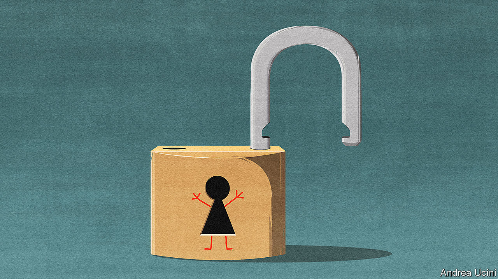

## The kids are not all right

# When easing lockdowns, governments should open schools first

> The costs of keeping them closed are too high

> Apr 30th 2020

Editor’s note: The Economist is making some of its most important coverage of the covid-19 pandemic freely available to readers of The Economist Today, our daily newsletter. To receive it, register [here](https://www.economist.com//newslettersignup). For our coronavirus tracker and more coverage, see our [hub](https://www.economist.com//coronavirus)

COVID-19 HAS shut the world’s schools. Three in four children live in countries where all classrooms are closed. The disruption is unprecedented. Unless it ends soon, its effect on young minds could be devastating.

During some epidemics keeping children at home is wise; they are efficient spreaders of diseases such as seasonal flu. However, they appear to be less prone to catching and passing on covid-19. Closing schools may bring some benefit in slowing the spread of the disease, but less than other measures. Against this are stacked the heavy costs to children’s development, to their parents and to the economy (see [article](https://www.economist.com//international/2020/04/30/closing-schools-for-covid-19-does-lifelong-harm-and-widens-inequality)).

A few countries, such as Denmark, are gradually reopening schools. Others, including Italy, say they will not do so until the autumn. In America, despite recent calls from President Donald Trump for schools to open, most states plan to keep their classrooms closed for the rest of the academic year—and possibly longer. That is a mistake. As countries ease social distancing, schools should be among the first places to unlock.

Consider the costs of barring children from the classroom. No amount of helicopter parenting or videoconferencing can replace real-life teachers, or the social skills acquired in the playground. Even in the countries best prepared for e-learning, such as South Korea, virtual school is less good than the real thing.

Poorer children suffer most. Zoom lessons are little use if your home lacks good Wi-Fi, or if you have to fight with three siblings over a single phone. And whereas richer families often include well-educated parents who prod their offspring to do their homework and help when they get stuck, poorer families may not.

In normal times school helps level the playing field. Without it, the achievement gap between affluent and working-class children will grow. By one estimate, American eight-year-olds whose learning stopped altogether with the lockdown could lose nearly a year’s maths by autumn, as they fail to learn new material and forget much of what they already knew.

School matters for parents, too, especially those with young children. Those who work at home are less productive if distracted by loud wails and the eerie silence that portends jam being spread on the sofa. Those who work outside the home cannot do so unless someone minds their offspring. And since most child care is carried out by mothers, they will lose ground in the workplace while schools remain shut.

In poor countries the costs are even greater. Schools there often provide free lunches, staving off malnutrition, and serve as hubs for vaccinating children against other diseases. Pupils who stay at home now may never return. If the lockdown pushes their families into penury, they may have to go out to work. Better to re-open schools, so that parents can earn and children can study.

The obvious rejoinder is that shutting schools brings benefits. Covid-19 can be deadly. Parents do not want their children to catch it or to give it to grandma.

In fact, though children are highly susceptible to flu, covid-19 is different. Two studies from China that trace the contacts of infected people find that children are at worst no more likely to catch the disease than adults—and possibly less so. If they do get it, they are 2,000 times less likely than someone over 60 to die.

Nor is there evidence that children who do end up catching the disease are silent spreaders who pass it on to their families. Researchers in Iceland and the Netherlands have not found a single case in which a child brought the virus into their family. The European Centre for Disease Prevention and Control, the European Union’s public-health agency, said last week that child-to-adult transmission “appears to be uncommon”.

Some of these conclusions are based on small samples. Perhaps children have not been seen to transmit the disease because schools were shut early rather than because they pose no special threat. Perhaps they will start to spread it in the playground.

Schools should thus re-open in stages. The youngest children should return first, to crèches and primary schools. They have the thirstiest brains and seem to be the least at risk. They also demand the most of their parents, since few have grasped the principles of self-directed learning. Little children are unlikely to keep their distance from anyone. Classes should be split in half so that they can attend on alternate days.

Those facing exams should come next. Several countries have cancelled important tests; others have postponed them. Older students may be more at risk than the youngest ones but they are also more able to follow new protocols. Social distancing is possible in high schools, particularly if class sizes are reduced.

School openings will need to be monitored. Scientists should adjust the rules if necessary. Children who must stay at home should be contacted directly by the school. Teachers will need support. Those most vulnerable to infection, such as diabetics, should be able to teach remotely. The rest will need guidance on hygiene and social distancing. They should be tested regularly for covid-19.

Governments are understandably wary of being called bossy: no politician wants to give orders that may be widely disobeyed. France is considering reopening schools but making attendance voluntary. The trouble with this approach is that it may entrench educational inequality. A recent poll there suggests that 48% of well-off families would send their children back; only 17% of poor ones would. Under Britain’s lockdown, more than 500,000 vulnerable children have been allowed to go to school, including those with special needs; just 5% have turned up.

The best approach would be to apply attendance rules sensitively. Insist that education is compulsory, but don’t fine frightened parents willy-nilly—especially if they have extra reasons to fear infection. As classes return, parents will see that it is safe, and come round to the idea of sending their own children. Governments should help children make up for lost lessons with free summer schools, shorter holidays and longer school days.

Reopening schools may feel like a rash experiment with young lives. In fact it is an exercise in risk-balancing. Schools are the most powerful engines of social mobility in any society. Let the children in, and let them learn. ■

Dig deeper:For our latest coverage of the covid-19 pandemic, register for The Economist Today, our daily [newsletter](https://www.economist.com//newslettersignup), or visit our [coronavirus tracker and story hub](https://www.economist.com//coronavirus)

## URL

https://www.economist.com/leaders/2020/04/30/when-easing-lockdowns-governments-should-open-schools-first
