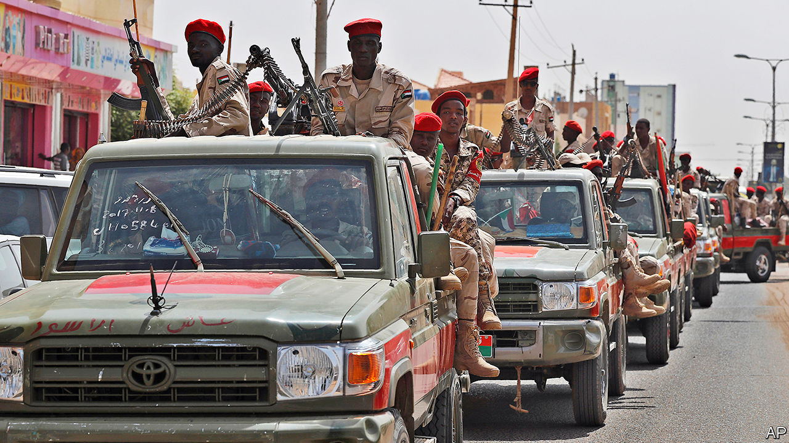

## Technical foul

# How Sudan’s warlords buy their gun trucks

> Despite the carmakers’ objections, it is not hard

> Apr 30th 2020

THE TOYOTA HILUX is a sturdy vehicle. That makes it especially popular in Africa. It outsells all other pickup trucks, or “bakkies”, in South Africa. In Mali and Niger smugglers transporting people and goods across the Sahara will accept no alternative, since they can cram 30 people onto one and can still climb a sand dune. It is also a familiar sight in African war zones, as the vehicle of choice for anyone who wants to create a “technical”—a pickup truck with a machine gun mounted on the back.

This is not the kind of publicity that Toyota craves. The firm says it has “a strict policy” not to sell vehicles to those “who may use or modify them for paramilitary or terrorist activities”. But this is hard to enforce. Buyers do not say: “I’m going to mount a gun on it.”

On April 5th Global Witness, a watchdog, published a study showing how at least one paramilitary group, Sudan’s Rapid Support Forces (RSF), a semi-official band of thugs with roots in the Darfur conflict, bought more than 1,000 Toyota Hiluxes and Land Cruisers to convert into technicals. Many such were seen at roadblocks last year after a bloody massacre of civilian protesters. The purchases hint at the worrying way in which power in Sudan is still a function of access to money and weapons, a year after the revolution that overturned the 30-year dictatorship of Omar al-Bashir.

Global Witness acquired a spreadsheet that seems to have been made by the RSF to track its purchases. By checking pictures of RSF technicals on social media, ship manifests and satellite imagery, Global Witness claims it was able to corroborate the information in it. The organisation claims that the RSF bought Toyota pickup trucks in the Gulf through two RSF front companies that are also linked to gold trading. This is a business in which the RSF’s commander, Mohamed Hamdan Dagalo (known as “Hemedti”), has a big interest. Despite the militia’s official status the money used to pay for the vehicles seems not to have come from the Sudanese state.

Mr Bashir’s government was built almost entirely on violence and patronage. Many hope that his fall will lead to a civilian-led government and democracy. But the transition remains fragile. Real power, which grows out of the barrels of guns mounted on technicals, is still in the hands of the army and RSF.

## URL

https://www.economist.com/middle-east-and-africa/2020/04/30/how-sudans-warlords-buy-their-gun-trucks
