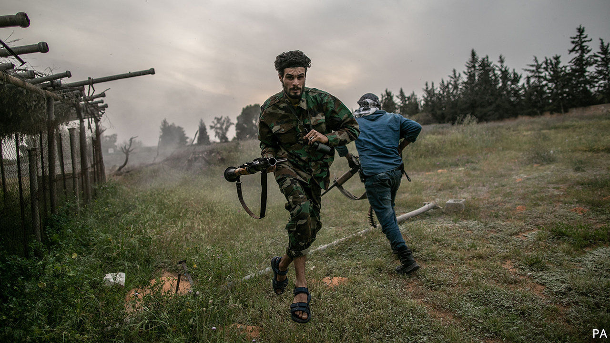
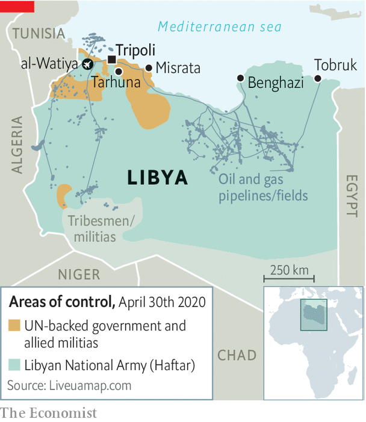

## A warlord in trouble

# Khalifa Haftar is losing ground and lashing out in Libya

> The government in Tripoli has made big gains against the rebellious general

> May 2nd 2020

KHALIFA HAFTAR’S self-styled Libyan National Army (LNA) says it will cease fire for what remains of the holy month of Ramadan. But friends of General Haftar say he is doubling down on the civil war he started six years ago. His year-long siege of Tripoli, seat of the UN-backed Government of National Accord (GNA), has intensified of late. Groups loyal to him have messed with the city’s power and water supplies. The LNA’s shells have hit hospitals. “It’s hard to believe it’s not deliberate,” says a diplomat. In the east General Haftar is trying to consolidate his power. On April 27th he claimed a “popular mandate” for his LNA and placed the region under military rule.

These moves cannot hide the fact that, for the first time in a while, General Haftar is on the back foot. Militias aligned with the GNA and backed by Turkey have regained a string of cities connecting Tripoli to the Tunisian border. They have hemmed the LNA inside al-Watiya air base, its headquarters for western operations, and are besieging Tarhuna, one of its strongholds (see map). The loss of these positions could doom General Haftar’s campaign in the west and lead to Libya’s partition.

Until recently General Haftar had the edge, thanks to covert backing from Egypt, France, Russia and the United Arab Emirates (UAE). But Recep Tayyip Erdogan, the president of Turkey, is challenging their influence in the eastern Mediterranean. In November he signed a pact with the GNA’s prime minister, Fayez al-Serraj, committing to defend Tripoli in exchange for gas-exploration rights in Libya’s waters. Since then Turkish arms and intelligence, as well as 4,000 fighters from Turkish-controlled parts of Syria, have shifted the balance on the ground in Libya. From the sky Turkish drones have been striking General Haftar’s long supply lines.

In January forces loyal to General Haftar seized Libya’s eastern oil terminals, blocking exports, which account for almost all state revenues. But this has put a strain on him, too. The central bank, which collects the revenues, pays consumer subsidies and the salaries of government workers across Libya. Officials in the east say their coffers may be empty by June. “The general is holding a gun to his own head,” says Tim Eaton of Chatham House, a think-tank based in London.

In the east General Haftar stokes fear of a Turkish-backed Islamist threat. But Tripoli is 1,000km away. Many of the east’s 2m or so people, though hungry for more autonomy, grumble about the high cost of the war. The LNA consumes a third of the east’s budget. Some 7,000 of its men have been killed in the past year. “Every family has lost someone,” says Muhammad Eljarh, an analyst in the city of Tobruk. Most are too scared of the general’s goons to criticise. But on April 23rd Aguila Saleh, a powerful politician in the east, unveiled a peace plan endorsed by the UN. Four days later General Haftar made his announcement.

The general’s backers sound tired of him, too. “We do not approve the statement that Field-Marshal Haftar will now single-handedly decide how the Libyan people should live,” said Sergei Lavrov, Russia’s foreign minister. Russia and others are preoccupied with covid-19 and may be questioning whether access to Libya’s oil is worth all the trouble given lower prices. Still, Russia has sent mercenaries to fight the GNA, and the UAE’s support for General Haftar is increasing.

The warlord is unlikely to receive a knockout blow. The militias that support the GNA are too quarrelsome and undisciplined to mount a sustained campaign. Misrata, home to some of the most powerful armed groups, supports the GNA but is a separate centre of power.

Meanwhile, the head of the UN mission in Libya, Ghassan Salame, bowed out in March. “I can no longer continue with this level of stress,” he said. His successor, as yet unnamed, will be the fourth person to hold the job since 2014. Trying to put Libya back together is an exhausting task. 

Correction (May 11th 2020): A previous version of the map in this article showed the al-Watiya air base in the wrong place. This has now been corrected. Sorry.

## URL

https://www.economist.com/middle-east-and-africa/2020/05/02/khalifa-haftar-is-losing-ground-and-lashing-out-in-libya
