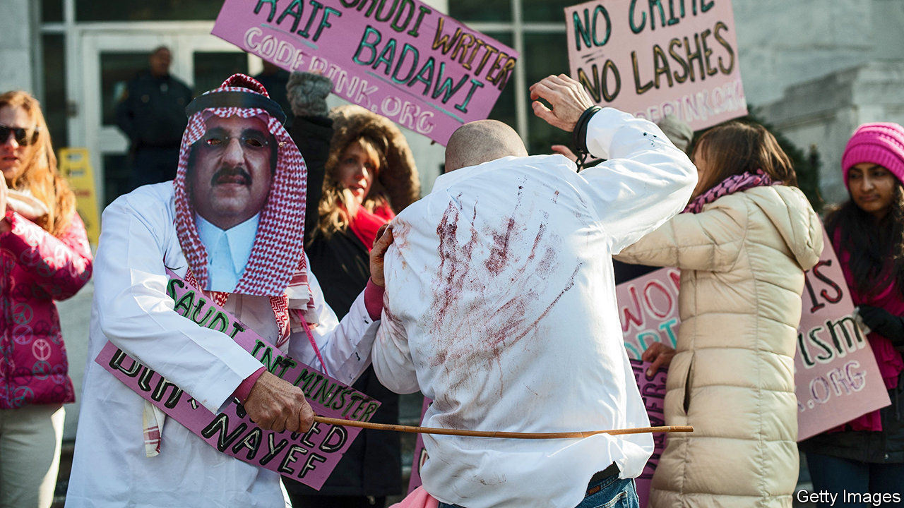

## Reform, Saudi style

# Saudi Arabia stops flogging

> And vows no longer to execute people for crimes committed as children

> May 2nd 2020

“THE FORNICATRESS and the fornicator—flog each of them with a hundred stripes; and do not let pity for them hold you back from carrying out God’s law.” So says the Koran, which dates back to the seventh century. Prince Muhammad bin Salman, the de facto ruler of Saudi Arabia, is trying to drag the kingdom into the 21st. So on April 25th the government banned flogging as a punishment, to the relief of blasphemers, adulterers and liberals. A day later it said it would stop executing people for crimes committed when they were children.

This is merely Prince Muhammad’s latest push to modernise. Since his elderly father, Salman, became king in 2015, the crown prince has curbed the morality police, allowed women to drive and lifted a ban on cinemas. The public is pleased; clerics, not so much.

The new decrees challenge the clerics in an area where they may be reluctant to take orders: the implementation of sharia (Islamic law). Since the kingdom was founded in 1932 they have administered justice based on their knowledge of scripture. Prince Muhammad, though, is mulling a plan to codify penal law. Eventually he may even allow the appointment of judges who consider a woman’s testimony equal to that of a man, instead of worth half as much, as is currently the case. Some clerics are quietly calling the prince an enemy of Islam.

Liberals may cheer, but Prince Muhammad is concentrating ever more power in his own hands—and compassion is not his strong suit. He has thrown thousands of people into jail, including an uncle and a cousin (a potential rival for the throne), as well as campaigners for democracy and women’s rights. Minors may be spared, but the rate of executions has doubled on the prince’s watch. The kingdom set a record last year with 184. (The number of extrajudicial killings is unknown.)

Capital punishment is falling out of favour in much of the world, but not in the Middle East. Last year Iran, Iraq and Saudi Arabia carried out over 80% of all executions outside China, says Amnesty International, a watchdog. Executions in Iraq increased by 92%. In Saudi Arabia, convicts will no longer be sentenced to flogging, but some are still beheaded with a sword.