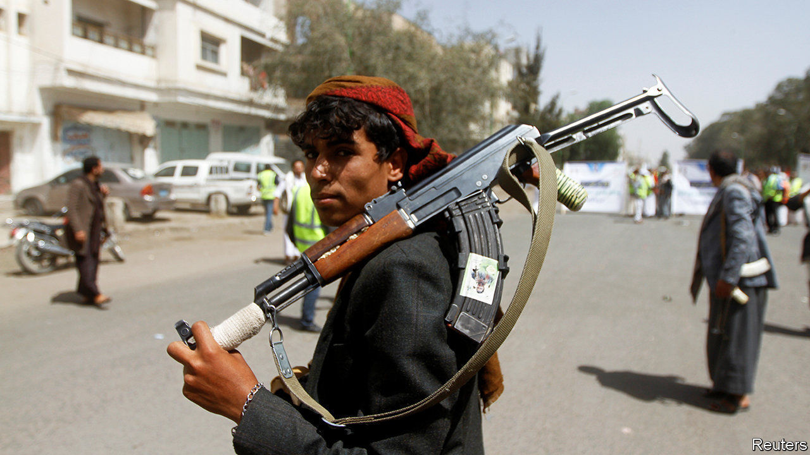
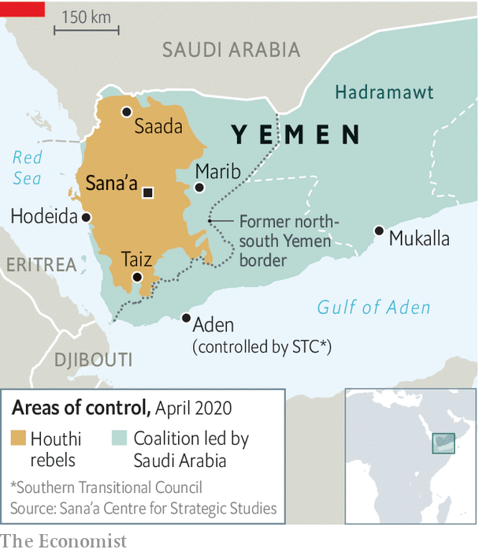

## The war within a war

# Separatists and Yemen’s government are at it again

> Ostensible allies continue to tussle over Aden

> May 2nd 2020BEIRUT

WHEN IT INTERVENED in Yemen’s civil war, Saudi Arabia hoped to make quick work of the Houthis, an Iranian-backed group that had swept down from the northern highlands to seize the capital, Sana’a. Five years later the Houthis are still in control—and Saudi Arabia cannot even corral its own allies. One is the government, which the Saudis are trying to restore. Another is the Southern Transitional Council (STC), a separatist group, which declared “self-administration” in southern Yemen on April 25th.

Exactly what the council meant is unclear. Fighters seized government offices, including the central bank, and drove through the streets waving the flag of South Yemen, a sovereign state until 1990. But the governors of several nearby provinces, including Hadramawt, the south’s largest, rejected the idea of renewed autonomy. The STC’S declaration will probably spark more infighting among erstwhile partners.

The south has long had a restive streak. Britain set up a base in Aden, a refuelling stop on the passage to India, and ruled it until 1967, when a local rebellion forced it out. After winning independence South Yemen became the Arab world’s only formally communist state. But unification with the north in 1990 created new grievances. Many southerners came to resent the government in Sana’a for its corruption and perceived bias. Money and power flowed north while Aden, the former capital of the south, was neglected. Its disrepair was clear in mid-April, when heavy rains caused floods that killed at least 14 people.

Still, the STC aligned itself with the Saudi-led coalition. The Houthis enjoy little support in the south, where they are seen as interlopers from a different religious and tribal background. The United Arab Emirates (UAE), which led the fighting in the south, put separatist fighters on its payroll. But last summer, tired of the long campaign, the UAE withdrew most of its troops.

The STC took advantage of the vacuum to seize Aden, then controlled by the government. A peace deal in November, brokered by the Saudis, tried to end the rift. It nominally put the southern forces under the command of Abd Rabbo Mansour Hadi, the exiled president. Like most peace agreements in Yemen, though, the deal was longer on symbolism than substance. The council says that its fighters have not been paid in months and that supplies of weapons and food are scarce on the front lines. Public anger over the floods may have informed its decision to break away, which could be a ploy to squeeze the kingdom.

Officially Saudi Arabia still wants a united Yemen led by Mr Hadi. Quietly, though, some Saudis wonder if southern secession would be acceptable, given local hostility towards the Houthis. One problem is that the STC does not enjoy universal support outside Aden: local tribes might chafe at its rule, as might the Giants’ Brigade, a powerful Salafist-led militia.

Even if the STC could consolidate power, secession would further immiserate the north. The southern provinces hold Yemen’s modest oil reserves, its Arabian Sea coastline and much of its arable land. The north would keep its long, porous border with Saudi Arabia—and gain another reason for hostility towards the kingdom. ■

## URL

https://www.economist.com/middle-east-and-africa/2020/05/02/separatists-and-yemens-government-are-at-it-again
