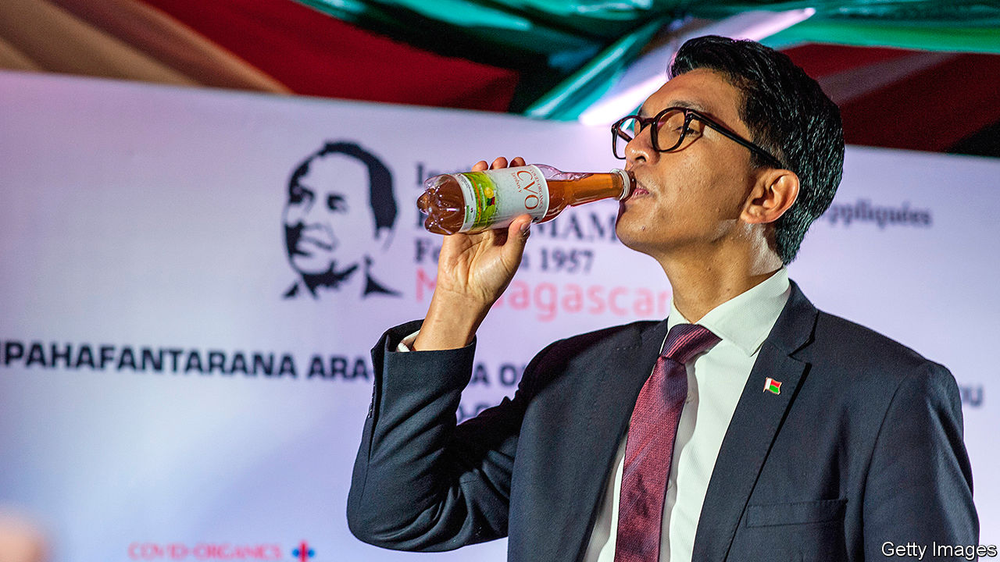

## Leaders and misleaders

# Some African politicians risk spreading covid through quackery

> Most follow the science, but some have turned to herbs or prayer

> Apr 30th 2020JOHANNESBURG

Editor’s note: The Economist is making some of its most important coverage of the covid-19 pandemic freely available to readers of The Economist Today, our daily newsletter. To receive it, register [here](https://www.economist.com//newslettersignup). For our coronavirus tracker and more coverage, see our [hub](https://www.economist.com//coronavirus)

MANY AFRICAN politicians are fighting covid-19 with tools prescribed by science. South Africa’s president, Cyril Ramaphosa, surrounds himself with top-notch boffins. Salim Abdool Karim, the government’s chief adviser on the pandemic, is often likened to Anthony Fauci, America’s voice of reason on the subject.

George Weah, Liberia’s president, is trying hard to disseminate public-health tips in ways that are both easy to understand and memorable. The former football star has released a ballad about covid-19, featuring medically accurate lyrics such as: “People catch the virus when they touch their infected hands to their mouth, nose or eyes.” In the accompanying video, Mr Weah dresses in sepulchral white and sways to a funky beat. In a country where many people are illiterate, setting medical advice to music makes a lot of sense.

Some other Big Men’s approaches do not. Andry Rajoelina (pictured), Madagascar’s president, says the island of 26m people has a herbal remedy that will “change the course of history”. Covid-organics, as the herbal potion is known, is meant to cure covid-19. But scientists doubt it. “It’s likely that it could actually harm the health of the population,” says Marcel Razanamparany, the spoilsport president of the country’s Academy of Medicine.

In Guinea, President Alpha Condé recommends drinking hot water and inhaling menthol. Nairobi’s governor, Mike Sonko, has distributed miniature bottles of Hennessy, or as he calls it, “throat sanitiser”. (Hennessy has felt obliged to deny that its brandy has antiviral qualities.)

Some leaders trust in God to stop the virus. John Magufuli of Tanzania insists that “we are not closing places of worship. That’s where there is true healing.” Burundi needs no lockdown “because it is a country that has put God first,” says a spokesman for the president, Pierre Nkurunziza.

On the plus side, no African president has recommended injections of disinfectant or suggested that scientists investigate whether doses of ultraviolet light inside the body can kill the virus. But bad advice from clueless Big Men may still cost lives. It will also undermine commerce. On April 29th it was reported that the implementation of the African Continental Free Trade Agreement was being postponed from the scheduled date of July 1st. If some countries fail to control the virus there could be further delays. That would then make it harder for African countries to sell goods to one another—including not only herbal remedies but also useful products. ■

Dig deeper:For our latest coverage of the covid-19 pandemic, register for The Economist Today, our daily [newsletter](https://www.economist.com//newslettersignup), or visit our [coronavirus tracker and story hub](https://www.economist.com//coronavirus)

## URL

https://www.economist.com/middle-east-and-africa/2020/04/30/some-african-politicians-risk-spreading-covid-through-quackery
