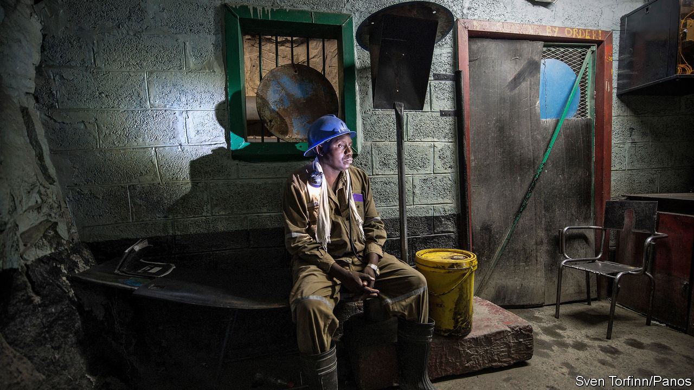

## Lungu’s largesse

# Zambia was already a case study in how not to run an economy

> Then came covid-19

> May 2nd 2020JOHANNESBURG

“I FEEL YOUR PAIN,” said Edgar Lungu in a televised address on April 24th. The president of Zambia claimed that covid-19 had “thrown into disarray” the country’s finances. He mused about whether the government could afford to pay for pensions, civil-service salaries and medicine. “Where will the money come from?”

It is a good question. Zambia is arguably the developing country facing the biggest debt crisis in the era of covid-19 (see [article](https://www.economist.com//briefing/2020/05/02/which-emerging-markets-are-in-most-financial-peril)). Nearly half of its tax revenues go towards debt service; add the public wage bill and there is little left. In 2019 its budget deficit was 10.9% of GDP. Investors are now pricing its sovereign bonds for default. Though the pandemic has worsened these problems, it did not cause them. Rather, it is Mr Lungu’s profligate politics that have weakened Zambia.

Before his party, the Patriotic Front (PF), took power in 2011, Zambia’s economy was doing rather well. Over the previous two decades the Movement for Multi-party Democracy (MMD) had unpicked the one-party socialism of Kenneth Kaunda, Zambia’s founding president. Copper mines, which generate 75% of the country’s exports, were privatised before the commodity boom of the 2000s. After Zambia was forgiven some loans, its debt as a share of GDP fell from 104% in 2005 to 25% a year later. Economic growth averaged 7.4% a year from 2001 to 2010.

The PF has borrowed heavily, splurging on infrastructure and civil-service pay. In 2015, when Mr Lungu became president, these trends accelerated. Debt in foreign currencies or owed to foreigners tripled between 2014 and 2018 relative to GDP. Compared with the mid-2000s, today’s creditors are more diverse and interest rates are higher. Of the roughly $12bn (51% of GDP) of external debt on Zambia’s books at the end of 2018, about 30% was owed to China, 25% to bondholders and 19% to foreign banks. The World Bank, the IMF and Western governments hold a relatively small share.

Financial management has been calamitous. Often individual departments take out loans and the finance ministry only finds out later, notes Trevor Simumba, a consultant who has written extensively on Zambian debt. This has encouraged, for example, the purchase of a presidential Gulfstream jet and other planes.

Then there are loans that have been authorised but do not yet show up in official figures. These added up to about $10bn in April 2019, according to analysis by the IMF and the World Bank. Most are owed to China for infrastructure. Since these loans may include the underlying asset as collateral, they have led to speculation that any restructuring of Zambian debt to China could involve the handing over of roads, airports or perhaps even mines. (Zambia denies this.)

A short-sighted search for revenue is one reason why Zambia has taken a hostile approach to its mining sector. Taxes on mining are among the highest in the world, says EY, a consultancy. Miners say they are owed more than $1bn in VAT refunds. In May 2019 the government went to court to, in effect, grab Konkola Copper Mines, which is mostly owned by Vedanta, an Indian company. The case rumbles on.

Zambia has picked a strange time for a spasm of resource nationalism. Mining firms, and thus taxes and royalties, have been hit by the collapse in global demand. The price of copper has fallen by 16% this year. Zambia produced more than 800,000 tonnes in 2019; one miner says he would be “astonished” if the country produced more than 700,000 in 2020.

The effects of covid-19 were cited by Glencore when it said on April 7th that it would stop operations at its Mopani mine. Eight days later the firm’s local boss, Nathan Bullock, was stopped from leaving the country and temporarily detained (he has now left). The government is in talks with Glencore over reopening the mine.

On April 20th Bwalya Ngandu, the finance minister, said that Zambia had asked multilateral lenders, including the IMF, for help. Yet the Fund will lend only to countries it believes are getting their borrowing under control. To that end, the finance minister has suspended some projects, advertised for debt advisers to try to renegotiate its commercial loans, and is in talks with Chinese lenders.

Is it enough? Mr Ngandu is a trusted technocrat. But that still leaves Mr Lungu. Under his presidency Zambia has become more corrupt by some international yardsticks. Dodgy procurement deals, from 42 fire engines bought for $1m each to inflated contracts to build roads, have been alleged. The Financial Intelligence Centre, a watchdog, reckoned the value of money-laundering and shady transactions had leapt to $520m in 2018 from $382m in 2017.

Mr Lungu is also becoming more authoritarian. In 2017 Hakainde Hichilema, an opposition politician, was detained for four months on charges of endangering the president after not making way for his motorcade. In March Prime TV, an independent channel, had its licence suspended. Most worrying is a bill before parliament that would give sweeping powers to the presidency. Muna Ndulo, a Zambian law professor at Cornell University, calls it a recipe for a “constitutional dictatorship”.

The president is eyeing re-election in August 2021. He may struggle in a fair fight against Mr Hichilema; previous votes have been marred by allegations of rigging. His stance on mines is partly to shore up support in the copper belt, a former PF stronghold where it lost a by-election in 2019.

His reluctance to put a stop to borrowing for pet projects reflects his concern that he may not win his party’s nomination in July. Mr Lungu was a compromise candidate after the death of Michael Sata in office in 2014. But members of the large Bemba ethnic group, who were pre-eminent under Sata, have become frustrated with the president. Mr Lungu, who is from the smaller Nsenga group, is accused of favouring other ethnicities. Some Bemba want Mr Ngandu to take over.

Mr Lungu has been somewhat unlucky. Disease and drought have both hurt the economy. Being a landlocked country at a time of closed borders is difficult. But it is not the virus that has got Zambia into this mess. It is the president. ■

## URL

https://www.economist.com/middle-east-and-africa/2020/05/02/zambia-was-already-a-case-study-in-how-not-to-run-an-economy
