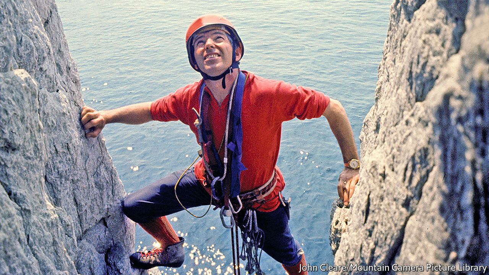

## Through crack and crag

# Joe Brown died on April 15th

> The colossus of British rock-climbing was 89

> May 2nd 2020

THAT FIRST time was not to be forgotten. He was 16, the youngest of seven, a small skinny boy from the grimmest part of Manchester. His father was dead; his mother did cleaning. He was apprenticed to a builder to learn a trade. But he also liked to be out on the moors, messing about with his mates in quarries and what-not. That was where one day they saw a plume of white water in the sky and ran to investigate. It was Kinder Downfall in spate blowing up in the wind, and at once he scaled the rocks beside it. Only 60 feet or so, but icy—and at the top, throwing the rope down to his companions, Joe Brown felt his whole life had suddenly got better.

That elation never went away. He felt it when he climbed the west face of the Petit Dru at Chamonix in 1954, which was reckoned the hardest ascent in the Alps; when he led his little team up Kanchenjunga in the Himalayas, the world’s third-highest mountain, in 1955, when no one had conquered it yet; when in 1967 he was first to scale the south face of the Old Man of Hoy, 450 feet of sheer sea-stack in the Orkneys; and when he did the first ascent of the Mustagh Tower in Pakistan, 24,000 feet of rock spire known as “the last citadel”. Triumphs like these made his reputation as the best British climber of the century. Yet he felt just as grand on home turf—or rather gritstone, or granite, or slate. To be the first up Cenotaph Corner in Snowdonia in 1952, when no one had previously got beyond the first 20 feet, or to find a new line up a Derbyshire peak, was sheer joy, and earned a smoke at the end of it.

It wasn’t a matter of getting to the top. That was by the by. The king of Nepal didn’t want them to tread on the holy peak of Kanchenjunga, so they stopped four feet short, and that was fine. He wasn’t one for sticking flags on mountains. The point was working out an untrodden route, the trickier the better. Existing routes, even VS, Very Severe, in the guidebook, often seemed to him a fuss about nothing. He thrived on foot- and hand-jamming up perpendicular cracks for hundreds of feet, scrabbling for handholds on flakes of rock a fraction of an inch thick, inching out round overhangs and even, on the Spiders Web at Craig Gogarth, on the inside of an immense arch over the sea. There were plenty of slips. A gritstone edge almost sawed through his rope once. He had several near-topples off ledges. In the Himalayas he got excruciating snow-blindness. He realised on one occasion that he was standing not on rock or ice but hanging snow, and had to tiptoe back trying to be weightless. But he was a light climber in any case, limiting himself to two pegs per pitch to give other people an equally challenging time. He named his routes to encourage them: Mousetrap, Masochism, Right Unconquerable, Cemetery Gates.

He did like to go fast. He was nimble, and his eye for a line made him the natural leader of the little teams he assembled. Competitive, too. His new route up the west face of the Aiguille de la Blaitière in the Mont Blanc massif, named “Fissure Brown” after him, involved overtaking three of the fastest climbers in France. Following a new line on the Carn Dearg buttress of Ben Nevis, he joyfully overtook a team of Scots, naming the route “Sassenach” in their honour. If he failed, though, he would just ruminate about the next time. He would hold the rock in his mind like a photo as he did his building day-job, working out all the options he could try. On his favourite climbing cliff, Clogwyn Du’r Arddu on Snowdon—“Cloggy” to him—he laid around two dozen new routes in the 1950s and 1960s, and perhaps 400-500 in the rest of Wales over his career. As with plastering, he kept trying to increase the daily yardage.

Building was a natural occupation for someone of his background. Rock-climbing was not. Before the war, it was a pursuit for the middle and upper classes. Afterwards he led the way to making it a pastime for anyone. His chief mentor, “Slim” Sorrell, was a pipefitter; his chief companion, Don Whillans, was a plumber from Salford. They would leave Manchester by the Friday-night train to get to the climbing places, or go by bus. Rain or clag didn’t deter them; the weekend was all they had. No one trained them, and they got what kit they could. His first ropes were pinched from roadworks, his chockstones metal nuts picked up on railway tracks. His first boots, proper nailed ones, were out of his reach until his boss gave him three pounds ten shillings. The trip to the Alps in 1954 cost him his job as well as all his money; after that he became a jobbing builder, taking breaks when he wanted. Cash still didn’t exactly flow. When he was invited on the Himalayan expedition, on a team with Everest-conquerors and Oxbridge men, he was told to bring £20 pocket money. He didn’t have £20 in the world.

In truth, making a living by jamming up cracks and hanging on ledges was never going to be easy. He could have made money from his fame, especially after 15m BBC viewers saw his climb on the Old Man of Hoy. But he hated all that. He wished his CBE could have been slipped into his pocket in a plain brown envelope, rather than all the fuss. And he refused outright to speak at any dinners; he liked to eat at home, with family. His solution to the money problem later was to open mountain-equipment shops in Snowdonia and make his own helmets for them, good rock-proof ones, just right for the job.

He made a few TV shorts, though. In one series, after each spectacularly difficult climb, he would emerge to find a near-inaccessible pool and go fishing. Angling was his second great love, as if he was back in Manchester trying his luck in the industrial canals. On most of his expeditions he took a collapsible rod with him, and in the Andes in 1979 he reached a black pool where explorers later found gold. He didn’t find any himself, and in his TV programmes he appeared to catch no fish either. As usual, it didn’t matter. Simply getting up there had been perfection enough. ■