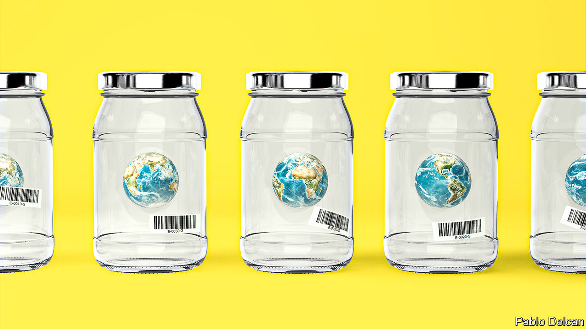

## Projections of the future

# How modelling articulates the science of climate change

> From paper and pencil to the world’s fastest computers

> May 2nd 2020

Editor’s note: This is the second in a series of climate briefs. To read the others, and more of our climate coverage, visit our hub at [economist.com/climatechange](https://www.economist.com//news/2020/04/24/the-economists-coverage-of-climate-change)

TO IMAGINE EARTH without greenhouse gases in its atmosphere is to turn the familiar blue marble into a barren lump of rock and ice on which the average surface temperature hovers around -18ºC. Such a planet would not receive less of the sunlight which is the ultimate source of all Earth’s warmth. But when the energy it absorbed from the sunlight was re-emitted as infrared radiation, as the laws of physics require, it would head unimpeded back out into space.

Greenhouse gases block that swift exit. Transparent to incoming sunlight, they absorb outgoing infrared radiation, thus warming the atmosphere and, in so doing, the surface below. The result is an average surface temperature of some 15ºC—warm enough for open seas and oceans and a vibrant biosphere.

In the late 19th century the discovery of the ice ages led scientists to the conclusion that climate could change on a global scale. Svante Arrhenius, a Swedish chemist, wondered if a weakened greenhouse effect might be to blame. Carbon dioxide was known to be a greenhouse gas: Eunice Foote, an American scientist, had found in the 1850s that the rate at which a sealed jar of air warmed up in sunlight depended on the level of carbon dioxide in that air. So Arrhenius—recently divorced, somewhat melancholy and in need of a project—began laboriously to calculate the effects on the climate of halving the atmosphere’s level of carbon dioxide.

Doing so required him to tackle a problem of the sort that most frustrates and most delights scientists who study the Earth system: a feedback loop through which a change in one factor affects another factor which, in turn, affects the first factor more.

Because water evaporates more slowly in cooler climes, the amount of water vapour in the atmosphere falls with the temperature. And water vapour, like carbon dioxide, is a greenhouse gas. Cooling the atmosphere dried the atmosphere which cooled the atmosphere further. Many pencils and thousands of sheets of paper into his exploration of this, Arrhenius concluded that halving the carbon-dioxide level would cool the planet by 5ºC (9ºF).

He also noted that the same relation would hold the other way round: double the carbon dioxide and you would get 5ºC of warming. Industry’s coal burning could thus warm the world—but only, he thought, very slowly indeed. He never imagined that the carbon-dioxide level would increase by a third in just a century.

Around the same time as Arrhenius was pondering the climate, a Norwegian scientist called Vilhelm Bjerknes was working on the physics of how heat drives fluid flow. His students applied these insights to large scale flows in the atmosphere and the oceans, laying the foundations of 20th-century weather forecasting. In 1950 one of those students’ students, Ragnar Fjørtoft, was part of the team which first programmed a computer to forecast the weather by solving such equations.

The computer models central to today’s climate research bring together Arrhenius’s curiosity and Bjerknes’s techniques. Programmes developed from weather-forecasting software calculate how the level of carbon-dioxide and other greenhouse gases is likely to affect the world’s flows of heat, energy and water, and through them the future climate. To do so they use computers that can be some 25trn times faster than the one used in 1950.

These climate models do not treat the atmosphere as a whole. They divide it into millions of “cells”. The conditions in each of these cells depend on the conditions in its neighbours above, below and to the sides as well as on its own history. The idea is to calculate how conditions in each cell change over time. Unlike a weather forecast, which tries to predict how a specific state of the atmosphere will evolve over a few days, these climate models simulate years, even centuries, of weather in order to discover the averages and probability distributions that define the climate—the envelope which constrains the norms and extremes of future weather.

Dozens of teams at meteorological and research organisations around the world run such models, each using different code to capture the climate’s underlying mechanisms and study everything from future peak rainfall to the tracks of storms to shifts in seasonality. Since 1995 the Coupled Model Intercomparison Project, or CMIP, has brought these teams together by providing standardised tasks for their models and then looking at the range of results. Thus, for example, the 56 different models considered in the fifth of the CMIP projects, which concluded in 2013, found that doubling the carbon-dioxide level would, in time, bring about a warming of between 1.5ºC and 4.5ºC. The uncertainty in what the models suggest at smaller scales is greater still. Different models can provide very different pictures of the future of regional climates.

The wide range of outcomes is, for the most part, down to the fact that no two models represent the mechanisms of the climate—and particularly its feedbacks—in precisely the same way. Some ways of doing things can be ruled out because the models they produce fail to capture the behaviour of the climate as it is, or as it was in the past (studies of the low-carbon-dioxide ice ages provide useful calibration, which would have pleased Arrhenius). But among models which reproduce past and current climates reasonably well, there is no clear way to say which one’s representations are most reliable. The differences between the models represent a basic level of uncertainty, given the current state of knowledge.

This endemic uncertainty, though, does not mean the models have nothing useful to say. Given how long modelling has been going on, it is now possible to compare predictions made decades ago with the way things have turned out. A study published last year systematically assessed what models published between the 1970s and 2007 had said about the way the climate would respond to steady rises in carbon dioxide. It found that for 14 out of 17 models what had happened had been within the model’s error bars; of the other three, two had overshot, one had undershot. Taking the models seriously would have been a good bet.

The most important source of uncertainty in the models lies in the clouds. As greenhouse gases warm the atmosphere its humidity changes, as does the extent to which it cools with altitude. These changes affect how clouds develop; the clouds, in turn, change surface temperature. Most clouds warm the world; some cool it.

The problem is that the processes which control a cloud’s thickness, lifetime and other qualities work on pretty small scales. The models do not. Even if every layer of the atmosphere is represented by hundreds of thousands of grid cells, they still end up being hundreds of kilometres on a side—much too large to capture the processes responsible for individual clouds.

Not all the feedbacks sit squarely within the atmosphere; some extend beneath it. Various feedbacks link the atmosphere to the oceans, which store, move and release heat in ways that do a great deal to shape the climate. In the 1960s modellers began trying to capture these effects by “coupling” models of the ocean to models of the atmosphere, so that what they saw in the atmosphere reflected changes in the oceans and vice versa.

Feedbacks involving the land matter, too. Cold weather brings snow; snowy ground, especially under clear skies, reflects away more sunlight, cooling things further. Biology adds yet more complexity. A tropical forest pumps water vapour into the atmosphere with far greater efficiency than a savannah does. In warmer oceans it is harder for nutrients to rise to the surface, which reduces the ability of plankton to suck carbon dioxide from the atmosphere. Melting permafrost produces copious microbial methane—a gas which absorbs infrared much more strongly than carbon dioxide does. Over the decades modellers have attempted to build more and more of these interrelationships into their models, adding greatly to their complexity.

Unfortunately increasing complexity does not always reduce uncertainty. A model which ignores, say, the instability of ice sheets—as most did until recently—is clearly missing something important. However, because there are always different ways to incorporate something new, two models updated to capture ice-sheet dynamics may diverge more after this “improvement” than they did when, unrealistically, they simply ignored the issue. In the CMIP6 process, which is currently winding up, preliminary results show a wider range of uncertainties than was seen in CMIP5.

The biggest source of uncertainty, though, lies not inside the models but outside them. Climate change is a problem because human activity is adding carbon dioxide, methane and other greenhouse gases to the atmosphere at a rate that is both prodigious and impossible for the physics, chemistry and biology encoded in the models to predict.

To estimate how changes in policy might affect emissions a different family of models is used—“integrated assessment models” (IAMs) which import simplified results from climate models into models of the economy.

One of the things that CMIP5 asked climate modellers to look at is the way that the climate might evolve if emissions followed four standardised “pathways” developed from four particular IAMs in the 2000s. Three were generated from IAMs trying to simulate various types of climate policy. The fourth, RCP8.5, though often referred to as “business as usual”, was generated from an IAM run featuring high population growth, low technological progress and very large scale use of coal. As a result it shows emissions increasing at a spectacular rate, which makes it scary, but not a helpful baseline.

The uncertainties in what the models predicted was as striking as ever (see chart). But they all agreed that only the pathway embodying the strongest climate action—much stronger than what is seen and promised today—might allow the world to keep the temperature rise since the 18th century well below 2ºC in the 21st, the target enshrined in the Paris agreement of 2015. ■

Sign up to our fortnightly climate-change newsletter [here](https://www.economist.com//theclimateissue/)

Dig deeper:Climate brief 1: [Why tackling global warming is a challenge without precedent](https://www.economist.com//schools-brief/2020/04/23/why-tackling-global-warming-is-a-challenge-without-precedent)Climate brief 3: [Humanity’s immense impact on Earth’s climate and carbon cycle](https://www.economist.com//schools-brief/2020/05/09/humanitys-immense-impact-on-earths-climate-and-carbon-cycle)Climate brief 4: [Damage from climate change will be widespread and sometimes surprising](https://www.economist.com//schools-brief/2020/05/16/damage-from-climate-change-will-be-widespread-and-sometimes-surprising)[The Economist’s climate-change hub](https://www.economist.com//news/2020/04/24/the-economists-coverage-of-climate-change)

## URL

https://www.economist.com/schools-brief/2020/05/02/how-modelling-articulates-the-science-of-climate-change
