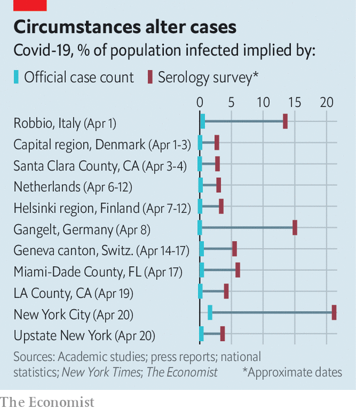

## Covid-19

# Leaving lockdown means understanding immune responses to the virus

> Unfortunately, a lot is still unknown

> May 2nd 2020

Editor’s note: The Economist is making some of its most important coverage of the covid-19 pandemic freely available to readers of The Economist Today, our daily newsletter. To receive it, register [here](https://www.economist.com//newslettersignup). For our coronavirus tracker and more coverage, see our [hub](https://www.economist.com//coronavirus)

OF THE VARIOUS ideas being touted to ease the world out of viral lockdown, one of the most striking is that of giving “immunity passports” to those who test positive for antibodies to SARS-CoV-2, the virus that causes covid-19. These passes would let people move around and return to work—based on the assumption that possession of such antibodies prevents reinfection. This might sound like a reasonable assumption. It is, after all, true of many other infections. Assumptions, however, are not data. So on April 24th the World Health Organisation issued a briefing note on why immunity passports are not a good idea: “There is currently no evidence”, it said, “that people who have recovered from covid-19 and have antibodies are protected from a second infection.”

Medical researchers have learned a lot about SARS-CoV-2 in the months since it was first isolated. But their knowledge of its interactions with the human immune system remains gappy. What are the specifics of the immune system’s response? How does this response affect the severity of someone’s illness? How long does immunity last? Lack of such knowledge makes it hard to decide when to relax restrictions on movement and association. Do it too soon and you risk a viral resurgence. Do it too late and you risk having no economy for people to return to.

When someone’s immune system is exposed to a pathogen, its first response is to recruit white blood cells called macrophages to slow the invaders’ progress by engulfing them. This is followed, five to ten days after infection, by a more tailored, two-pronged reaction. One prong involves the production of antibodies, by cells known as “B” lymphocytes (so named because they mature in the bone marrow). Antibodies are specially tailored proteins that latch onto a pathogen. Some, called neutralising antibodies, gum up the pathogen’s works and render it inoperative. All, whether neutralising or not, mark it for destruction by macrophages.

The other prong comes in the form of “T” lymphocytes (which mature in the thymus). These recognise and kill infected body cells. And if the combined efforts of macrophages, B cells and T cells are sufficient, the pathogen will be beaten back and eventually cleared from the body. Once this has happened, specialised “memory” B and T cells will help the immune system remember the pathogen, ready to respond if it returns.

The length of that memory depends on the pathogen. For measles, protection lasts a lifetime. For influenza, it can last just six months. How long the memory of SARS-CoV-2 lasts is, at present, unknown—for the simple reason that it has not yet been around long enough to find out.

There are, however, clues. One set come from SARS and MERS, two potentially lethal diseases caused by coronaviruses closely related to SARS-CoV-2. Those who have recovered from these illnesses have detectable antibodies in their blood for two years after infection in the case of SARS and three years for MERS. Similarly, around half of those who survived SARS still had strong T-cell responses a year later, while T-cell responses to MERS have been detected up to four years after infection.

Another set of clues comes from human coronavirus 229E. Unlike SARS-CoV-2, SARS or MERS, 229E is not deadly. Its symptoms present as what is known colloquially as a cold (though it is not the only cause of colds). But it, too, provides information about immune responses to coronaviruses. An experiment conducted in the late 1970s showed that those infected by 229E maintain their protective antibodies for less than a year. However, further work done in 1990 indicated that, despite this, people reinfected after a year developed much less severe symptoms.

As this work shows, a lack of antibodies does not mean that someone has no immune protection, for T cells also come into play. And that may apply to SARS-CoV-2 as well, as is suggested by a study from Shanghai that was posted recently to MedRxiv, a preprint server (and is thus not yet peer reviewed). The researchers involved examined blood samples taken from 175 people with mild cases of covid-19. They found that most patients developed neutralising antibodies 10-15 days after the onset of illness, though the amounts of these varied greatly. Intriguingly, however, ten people never had detectable antibodies in their blood, yet nonetheless managed to clear their infections. This suggests that other components of immunity, most likely the T-cell response, are indeed crucial.

That immunity to reinfection might be granted in the absence of antibodies is not, of course, an argument against antibody-based immunity passports. It would just be tough luck on those with T-cell-based immunity, who would still not be able to escape lockdown. A more pertinent objection, even if antibody protection is real, is that antibody tests are not yet truly reliable and cannot, in particular, distinguish between antibodies that are neutralising and those that are not.

These tests can, though, still give insights into the pandemic’s progress, by flagging up most of those who have been infected, including people who have had no symptoms. Antibody-based studies in America, Denmark, the Netherlands and other places have suggested that around 5% of the population sampled had been infected at some point prior to testing (see chart). In New York City, the centre of America’s covid-19 epidemic, that figure is around 20%. So far, no large-scale antibody surveys have been conducted in European hotspots such as Spain and Belgium.

Antibody data, when combined with mortality figures, suggest covid-19 is both faster-spreading and less deadly than was generally believed two months ago. But the reliability of those data depends on several things. One is the accuracy of the tests. Even a false-positive rate of just 1% could lead researchers to erroneous conclusions if the real rate is as small as 5%. Another is the representativeness of the participants. One much-criticised study, conducted in Santa Clara County, California, recruited its volunteers through Facebook, to which not everyone—particularly not the elderly—has access. The survey in New York was similarly skewed. It was conducted in a series of shops, and thus netted only those who felt healthy enough to go out shopping. Many of the data from Denmark and the Netherlands, meanwhile, relied on blood donors—a category that excludes the old and the sick.

More governments, including those in Britain and Germany, plan to run antibody-based surveys involving tens of thousands of people over the coming months. With luck, these will be more representative. A true understanding of the immune response to SARS-CoV-2 and of how that virus has spread through the world will, though, take years to emerge. Meanwhile, enduring uncertainties increase the risks associated with strategies for ending lockdowns that rely on people having long-term immunity from reinfection. Politicians in most countries are emphasising their willingness to follow science’s lead in matters concerning the pandemic. Their worry now must be that science has no lead to offer.■

Dig deeper:For our latest coverage of the covid-19 pandemic, register for The Economist Today, our daily [newsletter](https://www.economist.com//newslettersignup), or visit our [coronavirus tracker and story hub](https://www.economist.com//coronavirus)

## URL

https://www.economist.com/science-and-technology/2020/05/02/leaving-lockdown-means-understanding-immune-responses-to-the-virus
