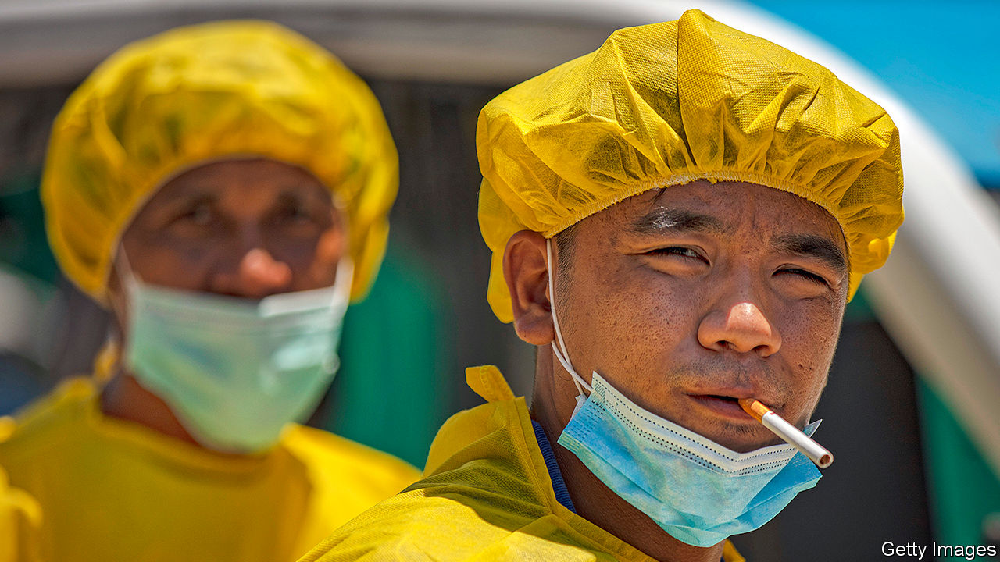

## Covid-19

# Smokers seem less likely than non-smokers to fall ill with covid-19

> That may point towards a way of treating it

> May 2nd 2020

Editor’s note: The Economist is making some of its most important coverage of the covid-19 pandemic freely available to readers of The Economist Today, our daily newsletter. To receive it, register [here](https://www.economist.com//newslettersignup). For our coronavirus tracker and more coverage, see our [hub](https://www.economist.com//coronavirus)

A QUARTER OF French adults smoke. Many people were surprised, therefore, when researchers reported late in April that only 5% of 482 covid-19 patients who came to the Pitié-Salpêtrière hospital in Paris between February 28th and April 9th were daily smokers. The ratios of smokers to non-smokers in earlier tallies at hospitals in America, China and elsewhere in France varied. But all revealed habitual smokers to be significantly underrepresented among those requiring hospital treatment for the illness. Smokers, the authors of the report wrote, “are much less likely” to suffer severely from SARS-CoV-2, the virus that causes covid-19. Rarely, they added, is such a result seen in medicine.

Smokers are almost certainly not protected from initial infection by SARS-CoV-2. In fact, because they first handle and then puff on cigarettes, they may be especially susceptible—for transmission often takes place through the mouth’s mucous membranes. What seems to be happening is that infected smokers are less likely to develop symptoms, or, if they do develop them, are more likely than non-smokers to have symptoms which are mild. That means they are more likely to stay home and not to show up in hospital statistics.

All this suggests that something in tobacco smoke is having a protective effect. The best guess is that the something in question is nicotine. News of this hypothesis has spread like wildfire. To stop a run on nicotine chemically extracted from tobacco, which is taken in one form or another by many smokers who are trying to quit the habit, France’s health ministry suspended online sales of the substance on April 24th. Purchases from pharmacies were limited to a month’s supply per person. With encouragement from the health minister, the organisations behind the Pitié-Salpêtrière study, which include the Pasteur Institute and the Sorbonne, are preparing trials. The plan is to offer nicotine patches to covid-19 patients, front-line workers and ordinary citizens. How they fare will be compared with control groups given a placebo.

Nicotine is not thought to attack SARS-CoV-2 directly. It may, however, play an indirect role that involves a cell-membrane protein called ACE2, to which the virus attaches itself in order to gain access to a cell. Some researchers suspect that nicotine binds to ACE2 as well, and that this makes it harder for the virus to do so alongside it. Nicotine may also soothe inflammation caused by the infection, a hypothesis supported by its use to treat inflamed bowels.

The new French study, which is expected to begin in three weeks’ time, may cast light, too, on another possible therapeutic effect of nicotine. Those severely ill with covid-19 are often the victims of a hyperactive immune response called a cytokine storm. Cytokines are a group of signalling molecules. Some have the job of recruiting pathogen-fighting white blood cells to a site of infection. If too many of these cells arrive at once they can end up attacking the body’s own tissues. Jason Sheltzer, a molecular biologist at Cold Spring Harbor Laboratory, in New York state, who studies the physiological effects of cigarette smoke, says it is theoretically possible that nicotine, which interferes with this process, may lessen the damage, though his research also points to significant negative effects of cigarette smoke on coronavirus infections.

Anti-smoking campaigners have been eager to point out that none of this is a recommendation to take up smoking. If a few lucky smokers have thus evaded the worst effects of covid-19, it can hardly be said that their actions were part of some well-thought-out plan. That is not, however, an excuse for pretending observations like those from the Pitié-Salpêtrière are irrelevant, and thus failing to follow them up. If either nicotine or some other chemical found in tobacco smoke leads to a treatment, the rest of humanity may be thankful for the world’s smokers having made themselves accidental guinea pigs in a giant epidemiological experiment.■

Correction (May 1st 2020): An earlier version of this story suggested that Jason Sheltzer is working directly on covid-19 and cytokine storms. This is not the case. Sorry.

Dig deeper:For our latest coverage of the covid-19 pandemic, register for The Economist Today, our daily [newsletter](https://www.economist.com//newslettersignup), or visit our [coronavirus tracker and story hub](https://www.economist.com//coronavirus)

## URL

https://www.economist.com/science-and-technology/2020/05/02/smokers-seem-less-likely-than-non-smokers-to-fall-ill-with-covid-19
