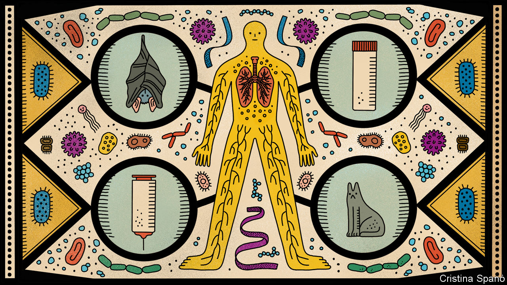
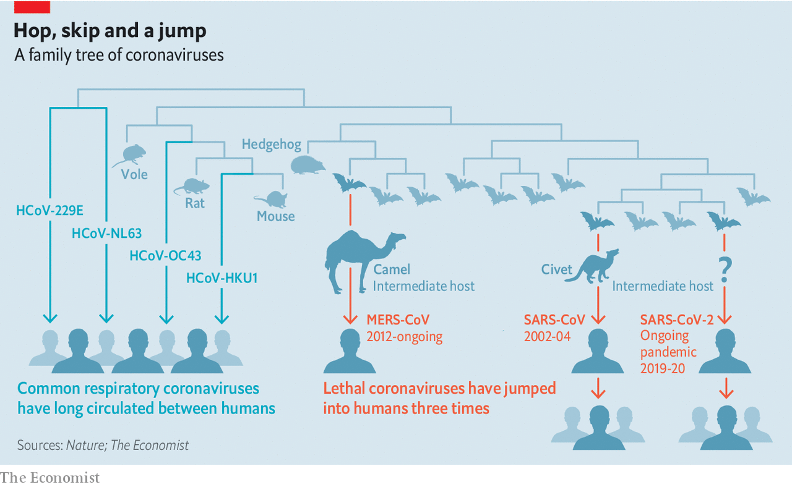
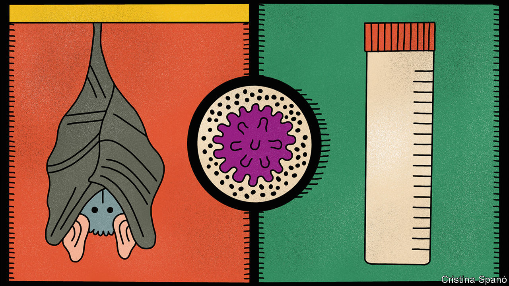

## The origin of covid-19

# The pieces of the puzzle of covid-19’s origin are coming to light

> How they fit together, though, remains mysterious

> May 2nd 2020

Editor’s note: The Economist is making some of its most important coverage of the covid-19 pandemic freely available to readers of The Economist Today, our daily newsletter. To receive it, register [here](https://www.economist.com//newslettersignup). For our coronavirus tracker and more coverage, see our [hub](https://www.economist.com//coronavirus)

AURIC GOLDFINGER, villain of the novel which bears his name, quotes a vivid Chicago aphorism to James Bond: “Once is happenstance, twice is coincidence, the third time it’s enemy action.”

Until 2002 medical science knew of a handful of coronaviruses that infected human beings, none of which caused serious illness. Then, in 2002, a virus now called SARS-CoV surfaced in the Chinese province of Guangdong. The subsequent outbreak of severe acute respiratory syndrome (SARS) killed 774 people around the world before it was brought under control. In 2012 another new illness, Middle Eastern respiratory syndrome (MERS), heralded the arrival of MERS-CoV, which while not spreading as far and as wide as SARS (bar an excursion to South Korea) has not yet been eliminated. It has killed 858 people to date, the most recent of them on February 4th.

The third time, it was SARS-CoV-2, now responsible for 225,000 covid-19 deaths. Both SARS-CoV and MERS-CoV are closely related to coronaviruses found in wild bats. In the case of SARS-CoV, the accepted story is that the virus spread from bats in a cave in Yunnan province into civets, which were sold at markets in Guangdong. In the case of MERS-CoV, the virus spread from bats into camels. It now passes regularly from camels to humans, which makes it hard to eliminate, but only spreads between people in conditions of close proximity, which makes it manageable.

An origin among bats seems overwhelmingly likely for SARS-CoV-2, too. The route it took from bat to human, though, has yet to be identified. If, like MERS-CoV, the virus is still circulating in an animal reservoir, it could break out again in the future. If not, some other virus will surely try something similar. Peter Ben Embarek, an expert on zoonoses (diseases passed from animals to people) at the World Health Organisation says that such spillovers are becoming more common as humans and their farmed animals push into new areas where they have closer contact with wildlife. Understanding the detail of how such spillovers occur should provide insights into stopping them.

In some minds, though, the possibility looms of enemy action on the part of something larger than a virus. Since the advent of genetic engineering in the 1970s, conspiracy theorists have pointed to pretty much every new infectious disease, from AIDs to Ebola to MERS to Lyme disease to SARS to Zika, as being a result of human tinkering or malevolence.

The politics of the covid-19 pandemic mean that this time such theories have an even greater appeal than normal. The pandemic started in China, where the government’s ingrained urge to cover problems up led it to delay measures that might have curtailed its spread. It has claimed its greatest toll in America, where the recorded number of covid-19 deaths already outstrips the number of names on the Vietnam War Memorial in Washington, DC.

These facts would have led to accusations ringing out across the Pacific come what may. What makes things worse is a suspicion in some quarters that SARS-CoV-2 might in some way be connected to Chinese virological research, and that saying so may reapportion any blame.

There is no evidence for the claim. Western experts say categorically that the sequence of the new virus’s genome—which Chinese scientists published early on, openly and accurately—reveals none of the telltales genetic engineering would leave in its wake. But it remains a fact that in Wuhan, where the outbreak was first spotted, there is a laboratory where scientists have in the past deliberately made coronaviruses more pathogenic.

Such research is carried out in laboratories around the world. Its proponents see it as a vital way of studying the question that covid-19 has brought so cruelly into the spotlight: how does a virus become the sort of thing that starts a pandemic? That some of this research has been done at the Wuhan Institute of Virology (WIV) seems all but certainly a coincidence. Without a compelling alternative account of the disease’s origin, however, there is room for doubt to remain.

The origin of the virus behind the 2003 SARS outbreak—“classic SARS”, as some virologists now wryly call it—was established in large part by Shi Zhengli, a researcher at WIV sometimes referred to in Chinese media as “the bat lady”. Over a period of years she and her team visited remote locations all across the country in search of a close relative of SARS-CoV in bats or their guano. They found one in a cave full of horseshoe bats in Yunnan.

It is in the collection of viral genomes assembled during those studies that scientists have now found the bat virus closest to SARS-CoV-2. A strain called RaTG13 gathered in the same cave in Yunnan shares 96% of its genetic sequence with the new virus. RaTG13 is not that virus’s ancestor. It is something more like its cousin. Edward Holmes, a virologist at the University of Sydney, estimates that the 4% difference between the two represents at least 20 years of evolutionary divergence from some common antecedent, and probably something more like 50.

Although bats could, in theory, have passed a virus descended from that antecedent directly to humans, experts find the idea unlikely. The bat viruses look different from SARS-CoV-2 in a specific way. In SARS-CoV-2 the spike protein on the viral particle’s surface has a receptor-binding domain (RBD) that is adept at sticking to a particular molecule on the surface of the human cells the virus infects. The RBD in bat coronaviruses is not the same.

One recent study suggests that SARS-CoV-2 is the product of natural genomic recombination. Different coronaviruses infecting the same host are more than happy to swap bits of genome. If a bat virus similar to RaTG13 got into an animal already infected with a coronavirus which boasted an RBD better suited to infecting humans, a basically batty virus with a more human-attuned RBD might well arise. That is what SARS-CoV-2 looks like.

Early on, it was widely imagined that the intermediate host was likely to be a species sold in Wuhan’s Huanan Seafood and Wildlife Market, a place where all sorts of creatures, from raccoon dogs to ferret badgers, and from near and far, are crammed together in unsanitary conditions. Many early human cases of covid-19 were associated with this market. Jonathan Epstein, vice-president of science with EcoHealth Alliance, an NGO, says of 585 swabs of different surfaces around the market, about 33 were positive for SARS-CoV-2. They all came from the area known to sell wild animals. That is pretty much as strong as circumstantial evidence gets.

The first animal to come under serious suspicion was the pangolin. A coronavirus found in pangolins has an RBD essentially identical to that of SARS-CoV-2, suggesting that it might have been the virus with which the bat virus recombined on its way to becoming SARS-CoV-2. Pangolins are used in traditional medicine, and though they are endangered, they can nonetheless be found on menus. There are apparently no records of them being traded at the Huanan market. But given that such trading is illegal, and that such records would now look rather incriminating, this is hardly proof that they were not.

The fact that pangolins are known to harbour viruses from which SARS-CoV-2 could have picked up its human-compatible RBD is certainly suggestive. But a range of other animals might harbour such viruses, too; it’s just that scientists have not yet looked all that thoroughly. The RBD in SARS-CoV-2 is useful not only for attacking the cells of human beings and, presumably, pangolins. It provides access to similar cells in other species, too. In recent weeks SARS-CoV-2 has been shown to have found its way from humans into domestic cats, farmed mink and a tiger. There is some evidence that it can actually pass between cats, which makes it conceivable that they were the intermediate—though there is as yet no evidence of a cat infecting a human.

The market’s appeal as a site for the human infections behind the Wuhan outbreak remains strong; a market in Guangdong is blamed for the spread of SARS. Without a known intermediate, though, the evidence against it remains circumstantial. Though many early human cases were associated with the market, plenty were not. They may have been linked to people with ties to the market in ways not yet known. But one cannot be sure.

The viral genomes found in early patients are so similar as to suggest strongly that the virus jumped from its intermediate host to people only once. Estimates based on the rate at which genomes diverge give the earliest time for this transfer as early October 2019. If that is right there were almost certainly infections which were not serious, or which did not reach hospitals, or which were not recognised as odd, before the first official cases were seen in Wuhan at the beginning of December. Those early cases may have taken place elsewhere.

Ian Lipkin, the boss of the Centre for Infection and Immunity at Columbia University, in New York, is working with Chinese researchers to test blood samples taken late last year from patients with pneumonia all around China, to see if there is any evidence for the virus having spread to Wuhan from somewhere else. If there is, then it may have entered Huanan market not in a cage, but on two legs. The market is popular with visitors as well as locals, and is close to Hankou railway station, a hub in China’s high-speed rail network.

Further research may make when, where and how the virus got into people clearer. There is scope for a lot more virus hunting in a wider range of possible intermediate species. If it were possible to conduct detailed interviews with those who came down with the earliest cases of covid-19, that genetic sampling could be better aimed, says Dr Embarek, and with a bit of luck one might get to the source. But the time needed to do this, he adds, “might be quick, or it might be extremely long”.

If it turns out to have originated elsewhere, the new virus’s identification during the early stages of the Wuhan epidemic may turn out to be thanks to the city’s concentration of virological know-how—know-how that is now surely being thrown into sequencing more viruses from more sources. But until a satisfactory account of a natural spillover is achieved, that same concentration of know-how, at WIV and another local research centre, the Wuhan Centre for Disease Control and Prevention, will continue to attract suspicion.

In 2017 WIV opened the first biosecurity-level 4 (BSL-4) laboratory in China—the sort of high-containment facility in which work is done on the most dangerous pathogens. A large part of Dr Shi’s post-SARS research there has been aimed at understanding the potential which viruses still circulating among bats have to spill over into the human population. In one experiment she and Ge Xingyi, also of the WIV, in collaboration with American and Italian scientists, explored the disease-like potential of a bat coronavirus, SHC014-CoV, by recombining its genome with that of a mouse-infecting coronavirus. The WIV newsletter of November 2015 reported that the resulting virus could “replicate efficiently in primary human airway cells and achieve in vitro titres equivalent to epidemic strains of SARS-CoV”. In early April this newsletter and all others were removed from the institute’s website.

This work, results from which were also published in Nature Medicine, demonstrated that SARS-CoV’s jump from bats to humans had not been a fluke; other bat coronaviruses were capable of something similar. Useful to know. But giving pathogens and potential pathogens extra powers in order to understand what they may be capable of is a controversial undertaking. These “gain of function” experiments, their proponents insist, have important uses such as understanding drug resistance and the tricks viruses employ to evade the immune system. They also carry obvious risks: the techniques on which they depend could be abused; their products could leak. The creation of an enhanced strain of bird flu in 2011 in an attempt to understand the peculiar virulence of the flu strain responsible for the pandemic of 1918-19 caused widespread alarm. America stopped funding gain-of-function work for several years.

Filippa Lentzos, who studies biomedicine and security at King’s College, London, says the possibility of SARS-CoV-2 having an origin connected with legitimate research is being discussed widely in the world of biosecurity. The possibilities speculated about include a leak of material from a laboratory and also the accidental infection of a human being in the course of work either in a lab or in the field.

Leaks from laboratories, including BSL-4 labs, are not unheard of. The world’s last known case of smallpox was caused by a leak from a British laboratory in 1978. An outbreak of foot and mouth disease in 2007 had a similar origin. In America there have been accidental releases and mishandlings involving Ebola, and, from a lower-containment-level laboratory, a deadly strain of bird flu. In China laboratory workers seem to have been infected with SARS and transmitted it to contacts outside on at least two occasions.

Things doubtless leak out of labs working at lower biosafety levels, too. But how much they do so is unknown, in part because people worry about them less. And as in other parts of this story the unknown is a Petri dish in which speculation can grow. This may be part of the reason for interest in a lab at the Wuhan Centre for Disease Control and Prevention. A preprint published on ResearchGate, a website, by two Chinese scientists and subsequently removed suggested that work done there may have been cause for concern. This lab is reported to have housed animals—including, for one study, hundreds of bats from Hubei and Zhejiang provinces—and to have specialised in pathogen collection.

Richard Pilch, who works on chemical and biological weapons non-proliferation at the Middlebury Institute of International Studies, in California, says that there is one feature of the new virus which might conceivably have arisen during “passaging experiments” in which pathogens are passed between hosts so as to study the evolution of their ability to spread. This is the “polybasic cleavage site”, which might enhance infectivity. SARS-CoV-2 has such a site on its spike protein. Its closest relatives among bat coronaviruses do not. But though such a cleavage site could have arisen through passaging there is no evidence that, in this case, it did. It could also have evolved in the normal way as the virus passed from host to host. Dr Holmes, meanwhile, has said that there is “no evidence that SARS-CoV-2...originated in a laboratory in Wuhan, China.” Though others have speculated about coincidences and possibilities, no one has been able, as yet, to undermine that statement.

Many scientists think that with so many biologists actively hunting for bat viruses, and gain-of-function work becoming more common, the world is at increasing risk of a laboratory-derived pandemic at some point. “One of my biggest hopes out of this pandemic is that we address this issue—it really worries me,” says Dr Pilch. Today there are around 70 BSL-4 sites in 30 countries. More such facilities are planned.

Again, though, it is necessary to consider the unknown. Every year there are tens of thousands of fatal cases of respiratory disease around the world of which the cause is mysterious. Some of them may be the result of unrecognised zoonoses. The question of whether they really are, and how those threats may stack up, needs attention. That attention needs laboratories. It also needs a degree of open co-operation that America is now degrading with accusations and reductions in funding, and that China has taken steps to suppress at source. That suppression has done nothing to help the country; indeed, by supporting speculation, it may yet harm it. ■

Dig deeper:For our latest coverage of the covid-19 pandemic, register for The Economist Today, our daily [newsletter](https://www.economist.com//newslettersignup), or visit our [coronavirus tracker and story hub](https://www.economist.com//coronavirus)

## URL

https://www.economist.com/science-and-technology/2020/05/02/the-pieces-of-the-puzzle-of-covid-19s-origin-are-coming-to-light
