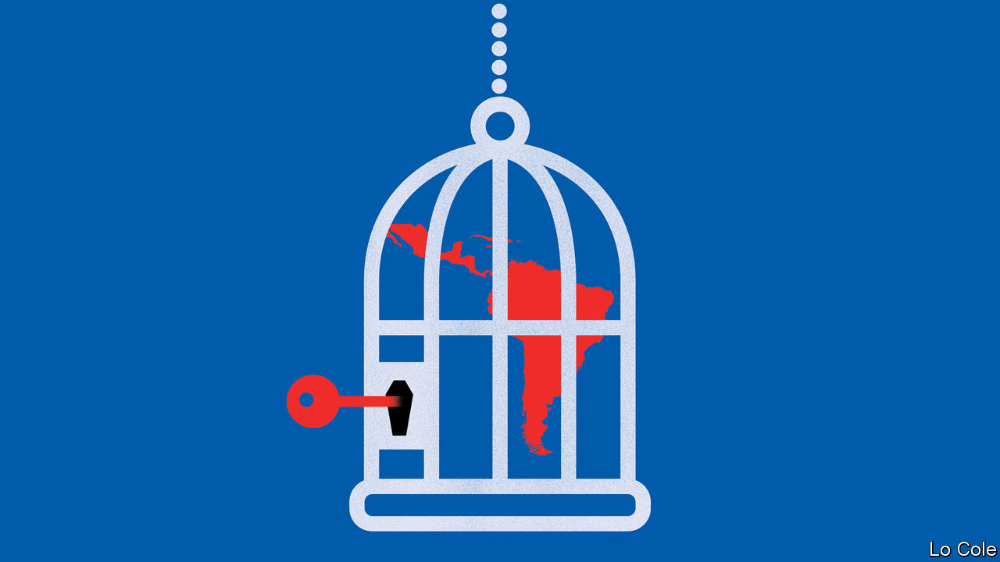

## Bello

# Choosing between livelihoods and lives in Latin America

> The pressure to move to more flexible lockdowns

> May 2nd 2020

Editor’s note: The Economist is making some of its most important coverage of the covid-19 pandemic freely available to readers of The Economist Today, our daily newsletter. To receive it, register [here](https://www.economist.com//newslettersignup). For our coronavirus tracker and more coverage, see our [hub](https://www.economist.com//coronavirus)

SCORES OF street vendors set up an open-air food market this week in Huáscar, a shantytown in north-eastern Lima, defying Peru’s strict lockdown against covid-19. Hundreds of seasonal workers have broken quarantine, too, to travel back from the coast after the summer harvests to their homes in Andean villages. In locked-down Colombia, in Bogotá suburbs like Ciudad Bolívar and Soacha, life goes on more or less normally. Vendors offer coffee and corn bread on the street. That picture is repeated in many poorer parts of Latin America.

The virus struck the region a few weeks after it laid waste to Europe and the United States. Forewarned, many governments reacted early. By the end of March, 11 had imposed strict lockdowns while others had closed schools and imposed rules of social distancing. These measures have generally been popular, and they have almost certainly blunted the impact of covid-19 so far, saving thousands of lives.

In most cases, the minority who are not respecting lockdowns are acting out of necessity. Data from Google, which tracks mobile phones, show more movement in poorer states and provinces in many countries. Several national governments, including those in Colombia and Peru, have been swift to get emergency payments to some of their poorer citizens. But that is a big challenge: one out of two Latin Americans works informally, often relying on daily cash takings. A new popular slogan holds that it is better to die of coronavirus than of hunger.

That poses an acute problem for governments. In Latin America generalised lockdowns can be maintained for no more than two months, reckons the Inter-American Development Bank. In a new paper, the bank worries that confinement will be loosened before health facilities have expanded enough to cope, and before governments can ensure that opening up does not lead to the uncontrolled spread of the virus. Many countries have done little testing. Even Chile and Peru, which have done the most, have done only half as much as the United States, relative to their populations.

Many officials expect the epidemic to peak in May. But they are navigating through a fog of unknowing. Though they vary greatly across countries, the statistical curves of infection and deaths in Latin America are slightly below those in Europe and the United States. It is not clear why. Some think the data are unreliable. Mexico doesn’t pretend to count more than a sample of cases, for example. There may be other explanations. Latin America has been good at vaccinating against diseases like measles and tuberculosis. Some researchers think this may provide some immunity against covid-19. And there are proportionally fewer vulnerable old people than in Italy or Spain.

While the policymakers agonise over the trade-off between protecting lives and livelihoods, this is likely to be resolved on the ground and in favour of livelihoods. “To stay closed is impossible. People are desperate,” says Alejandro Gaviria, a Colombian former health minister. He argues for a strategy of “active vigilance” in which officials monitor the occupation of intensive-care beds city by city, give priority to increasing testing rather than to more ventilators and rely more on primary health-care networks, which are easier to expand than hospitals. Some Latin American countries have experience in tracing infected people, from recent viral epidemics such as Zika and chikungunya. “We don’t have to start from scratch,” notes Mr Gaviria.

Chile and Colombia, which have relatively low infection rates, are working towards more flexible strategies. Chile relies on a nightly curfew and shutting commerce to enforce social distancing. Only in 15 hotspots of infection has it imposed a strict lockdown. Having started with one laboratory to process tests, it expanded that to more than 50, partly by bringing the private health system under temporary state control. Officials will also need to consider who can safely go back to work, and organise more buses to transport them.

Ecuador, which has had a bad outbreak, and Argentina are starting to loosen up. A more flexible approach is harder where hospitals are overwhelmed. That applies in Peru, in parts of Mexico (which has not locked down) and in some Brazilian cities. Such places may have no choice but to confine people for a bit longer. Elsewhere, trying to slow the epidemic as much as possible while loosening the stranglehold on the economy is the hard, but ineluctable, task.

Dig deeper:For our latest coverage of the covid-19 pandemic, register for The Economist Today, our daily [newsletter](https://www.economist.com//newslettersignup), or visit our [coronavirus tracker and story hub](https://www.economist.com//coronavirus)