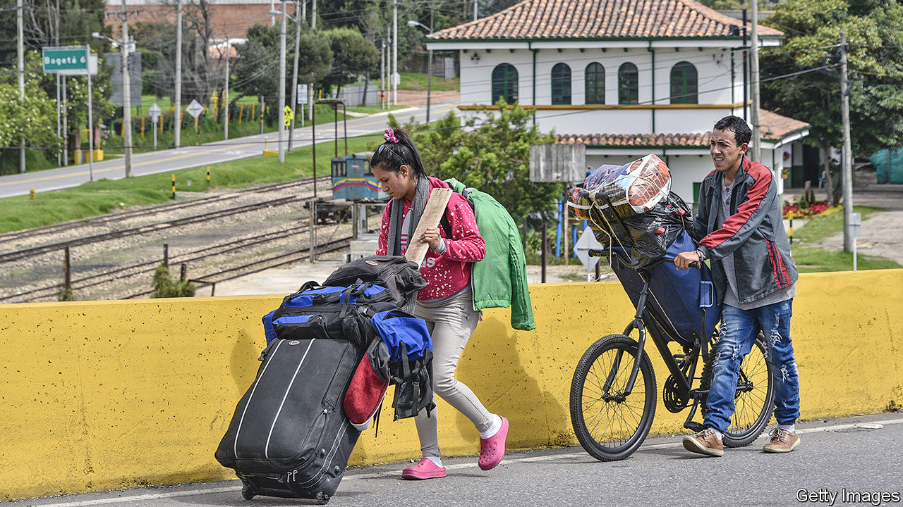

## The welcome mat frays

# Colombia cools on Venezuelan refugees

> Covid-19 is straining the country’s generosity

> Apr 30th 2020BOGOTÁ

A YEAR AGO Janelis Beris left Valencia, her hometown in northern Venezuela, because the monthly pittance she earned as a cleaner was enough to buy only a packet of rice and two of flour. She arrived in Bogotá, Colombia’s capital, where she made more money picking through rubbish left on the street for recyclable plastic, glass or anything else of value she could find. With that she could pay rent and feed her four children. She promised herself she would not return until Nicolás Maduro, Venezuela’s dictator, had left power.

On April 12th Ms Beris broke that promise. A strict lockdown in Colombia, imposed to stop the spread of covid-19, has left her worse off than when she lived in Venezuela. Demand for waste disappeared. Her landlord evicted her in late March. After that, she and her children slept under a bridge. When that became unendurable she put her children and belongings in a cart and pushed them to a bus station 20km (12 miles) away. Her plan: to head back to Valencia, where she still owns a house.

Until recently, Colombia has been the main destination for the 4m-odd Venezuelans who have fled Mr Maduro’s poverty-stricken dictatorship. Nearly half have settled there. Colombia’s government, now led by President Iván Duque, has allowed them to attend school and receive emergency medical treatment and given many permission to take formal jobs. But the pandemic has pummelled the refugees. On March 14th Mr Duque closed Colombia’s borders to foreigners, including the 55,000 a day, most of them shoppers, who came from Venezuela. The lockdown has been hardest for informal workers like Ms Beris and most other Venezuelan migrants. At least 12,000 returned to Venezuela between April 4th and 26th.

This will not end Venezuela’s exodus. Despite the border closure, the numbers fleeing into Colombia probably still exceed the numbers going back. The flight may return to its former level when covid-19 ravages Venezuela. But the next wave of migrants will find Colombia less welcoming.

Even before the pandemic anti-immigrant feelings were on the rise, polls show. The virus has increased xenophobia, says Ronal Rodríguez, a researcher at the Venezuelan Observatory, part of Rosario University in Bogotá. Hundreds of bogotanos have protested against plans to house migrants in sports facilities. Along the border, false reports of Venezuelans trying to break into gated neighbourhoods, spread through Facebook, prompted police to deport some.

Mr Duque’s government continues to support Venezuelans who are already in Colombia. It is handing out 200,000 food packages and channelling international aid to migrants in the form of cash payments. Those who test positive for covid-19 will be enrolled in health-insurance schemes if they have formal-work permits.

The government remains relatively generous, in part because Mr Duque’s conservative Democratic Centre party is a fierce foe of Mr Maduro’s left-wing regime. For some on Colombia’s political left, however, Mr Maduro is a lesser evil than Mr Duque’s right-wing mentor, Álvaro Uribe, a former president. They do not share the right’s sympathy for Mr Maduro’s victims.

Colombian mayors, many of whom belong to left-wing parties, have taken the lead in exploiting anti-immigrant feeling. They “see the virus as an opportunity to get rid of [the Venezuelans]”, says an official in Mr Duque’s government. In Pamplona, where Venezuelans stop as they walk to Bogotá, on March 17th the left-wing mayor barred migrants from entering the town and shut down shelters. The mayor of Yopal, in Colombia’s oil-producing east, has called migrants a “burden”, responsible for the city’s “security and health problems”. He says he will not give them a penny to help them through the health crisis.

Even Bogotá, which had been hospitable to its 350,000 Venezuelans, has turned frosty. Claudia López, its mayor since January, is openly gay and a member of the Green Alliance. But her attitudes towards migrants are less liberal than you might expect. She says the city’s taxpayers have done enough for them. A cash-transfer scheme for informal workers, which she unveiled on March 26th, relies on databases that include few Venezuelans.

In televised speeches, Mr Maduro promises a friendly homecoming. In fact, he has set up checkpoints that intercept returning Venezuelans and administer covid-19 tests, donated by China. Those who have been through the process say infection rates are high. Infected or not, they are forcibly quarantined in abandoned schools and sports facilities for up to 15 days, according to Colombian officials.

Conditions are terrible. Returning migrants sleep on asphalt in scorching heat. They eat rice, plantain or rotting tuna once a day, said two inmates in one such centre. The ELN, a Colombian guerrilla group backed by Mr Maduro, stops people from leaving, they say.

That will not stop the disease from spreading within Venezuela, where many people cannot afford soap. Faced with a health-care system that had collapsed before the pandemic, many Venezuelans will seek treatment in Colombia, according to Felipe Muñoz, an adviser to Mr Duque. Its health system is also under strain, but at least it functions. The porous border cannot serve as an “epidemiological fence” for Colombia, says Mr Rodríguez. Forced to choose, many Venezuelans will brave growing hostility next door in preference to tyranny and implosion at home.■

## URL

https://www.economist.com/the-americas/2020/04/30/colombia-cools-on-venezuelan-refugees
