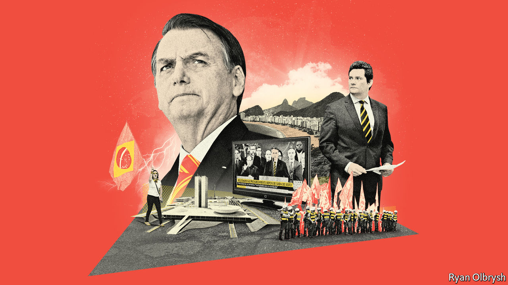

## Bust-up in Brasília

# Jair Bolsonaro’s dangerous divorce

> Brazil’s justice minister storms out, calling the president a scofflaw

> Apr 30th 2020SÃO PAULO

ON APRIL 19TH Brazil’s president, Jair Bolsonaro, climbed onto a lorry outside army headquarters in Brasília to fire up protesters who were calling for a shutdown of Congress and the Supreme Court. Soon after, according to Folha de S. Paulo, a newspaper, he learned that federal police were investigating allegations that one of his sons, Carlos, runs an online fake-news network that may have inspired the protest. On April 24th Mr Bolsonaro sacked the head of the federal police. Hours later the justice minister, Sérgio Moro, resigned. He accused the president on television of “political interference” in the police to shield his family.

Mr Moro’s resignation is the biggest political blow to Mr Bolsonaro since he became president at the beginning of 2019. An army captain turned congressman, Mr Bolsonaro rose from obscurity by exploiting anger at corruption. His appointment as justice minister of Mr Moro, a judge who jailed scores of politicians and businessmen as leader of the Lava Jato (Car Wash) anti-corruption investigations, signalled his determination to fight graft. Now Mr Moro, a hero to many Brazilians, has accused his former boss of obstructing justice. If an investigation backs that claim, Mr Bolsonaro could be impeached.

That crisis comes on top of twin calamities: the covid-19 pandemic and the economic slump it has caused. On April 16th Mr Bolsonaro sacked the health minister, Luiz Mandetta, who had refused to back his demands that shops and schools reopen. Some supporters are disillusioned. “I voted for Bolsonaro in hopes of a better Brazil,” says Ary, a taxi driver in the north-eastern city of Maceió. “But it was all in vain.”

The allegations against Carlos Bolsonaro are not the first to be levelled against the president’s family. Before he took office prosecutors opened an investigation into possible embezzlement by his eldest son, Flávio, now a senator from Rio de Janeiro. Documents published by the Intercept, a news site, suggest he used public money to finance illegal construction projects run by right-wing “militias”. Now Mr Moro has accused the president himself.

Mr Bolsonaro’s survival in office depends on three factors. The first is the probe triggered by Mr Moro. Its outcome may depend on whether the president’s alleged misconduct achieves its aim. Things are not going as he might wish. The person he appointed to be the new police chief is a family friend. But on April 29th a Supreme Court judge put the appointment on hold. Mr Bolsonaro says he will appeal that decision. The judge had earlier ruled that a new chief could not change the officers leading investigations into the actions of Mr Bolsonaro’s sons, who deny wrongdoing.

The second arena of judgment is Congress, which can evict a president from office by a two-thirds majority of both houses. To avoid this, Mr Bolsonaro is cosying up to the centrão, a block of ideologically vacant parties. He has abandoned his earlier pledge not to give legislators benefits, such as government jobs for their allies, in exchange for political support. Impeachment “is not in Congress’s interest”, says Ricardo Barros, a federal deputy from the Progressives party, part of the centrão.

That could change, he admits, if the president loses the support of voters, the third and most important influence on Mr Bolsonaro’s future. Before Dilma Rousseff was impeached in 2016 her approval rating dropped to 8% and she faced huge protests. Mr Bolsonaro remains strongly supported by a third of voters. According to Datafolha, a pollster, 46% of Brazilians want him to resign, a rise of nine percentage points within a month. But half think he should stay.

“People are starting to say: ‘I was wrong,’” says Renan Santos, the leader of the right-wing Free Brazil Movement, which organised protests against Ms Rousseff and initially supported Mr Bolsonaro but now calls for his impeachment. For the first time since 2017, Mr Bolsonaro has lost Facebook fans.

Whatever the popular verdict, Mr Bolsonaro’s presidency lost much of its purpose when Mr Moro resigned. Its other main justification, the reform programme led by the liberal economy minister, Paulo Guedes, is endangered by the recession. He wants to slash spending, simplify taxes and privatise state enterprises. Now the government must splash out. It has promised tens of millions of Brazilians a monthly payment of 600 reais ($110). That will cost 118bn reais this year, about 1.6% of GDP. On April 22nd the government announced a “recovery plan” to employ 1m people through sketchily defined infrastructure projects. Mr Guedes was not consulted. Rumours flew that he would follow Mr Moro out of the door.

The financial markets’ confidence in Brazil depends on Mr Guedes staying put. Knowing this, Mr Bolsonaro paraded him before journalists on April 27th and backed down from the public-works plan, for now. Even so, “reforms aren’t going to happen,” says Eduardo Cury, a federal deputy from the centre-right Party of Brazilian Social Democracy. “Guedes will have to hang his head or go home.”

His marginalisation leaves the government in the hands of ideologues and generals. The ideologues reinforce Mr Bolsonaro’s strongest preferences, for example to loosen gun controls. The soldiers, who occupy seven of 22 cabinet posts (including all four with offices in the presidential palace), sometimes restrain him. They tempered his hostility towards China, Brazil’s biggest trading partner. “They believe they’re capable of doing something important for the government at a time when it’s very chaotic,” says a retired general. But they are in tune with Mr Bolsonaro on developing the Amazon and favour bulking up the state’s economic role.

Some officers may have second thoughts about backing his imploding presidency, says a scholar who studies Brazil’s army. But their sense of duty will keep them loyal. Impeachment would not diminish their role. Hamilton Mourão, the vice-president, was a serving general until 2018. If the military-minded president is removed, he will leave a martial legacy.■

## URL

https://www.economist.com/the-americas/2020/04/30/jair-bolsonaros-dangerous-divorce
