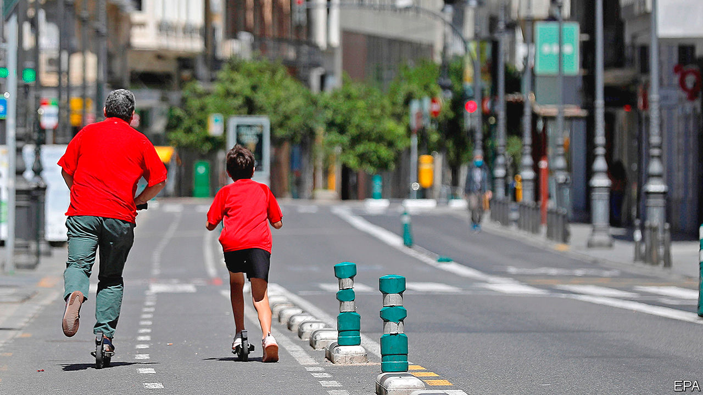
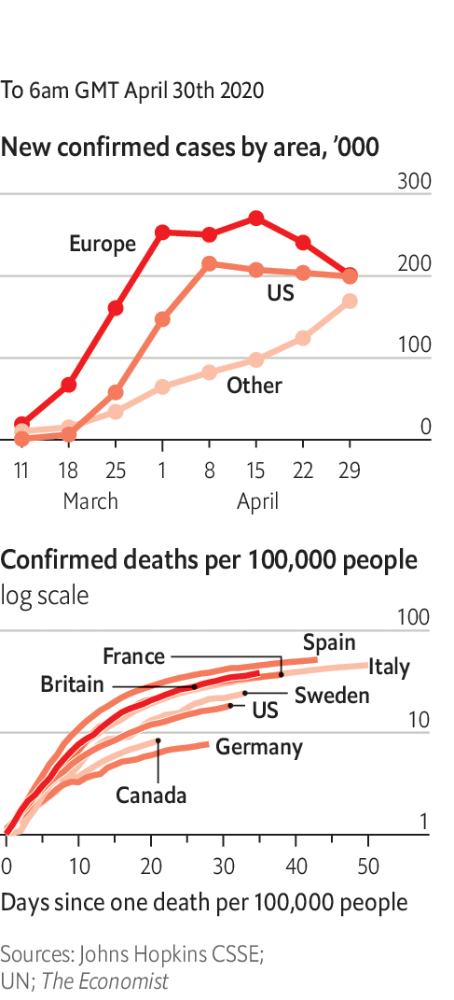

# Politics this week

> May 2nd 2020

Spain announced a complicated four-phase, eight-week return to a “new normality”, which will vary in speed between provinces. If all goes well, Spaniards will be able to return to beaches and bars by the end of June, and in some places before then. France also outlined its own “deconfinement” strategy. Most businesses will be allowed to reopen from May 11th, except for cafés, restaurants and large public spaces such as museums; public transport will largely resume too. The French prime minister said this was necessary to avoid economic collapse. France also suffered some alarming instances of rioting. See [article](https://www.economist.com//europe/2020/05/02/do-low-trust-societies-do-better-in-a-pandemic).

The chief executive of Heathrow called for the mandatory testing of passengers for covid-19 at airports in Britain,because travellers are currently allowed to enter the country “without visible measures in place”. Britain is one of only a few countries not to have introduced tighter border screening. Following scientific advice, the government has concluded that temperature checks are ineffective.

Argentina extended its ban on all domestic and international flights until September.

In El Salvador the president, Nayib Bukele, encouraged police to use “lethal force” against criminals following dozens of murders over a few days. The country’s homicide rate, one of the world’s highest, has fallen since Mr Bukele became president in June. He accused gangs of taking advantage of the pandemic, which has distracted security forces from fighting crime.

Brazil’s justice minister, Sérgio Moro, quit after the country’s populist president, Jair Bolsonaro, sacked the head of the federal police. Mr Moro accused the president of trying to interfere in investigations of members of his own family. The attorney-general opened an inquiry into Mr Moro’s charge that the president tried to obstruct justice. See [article](https://www.economist.com//the-americas/2020/04/30/jair-bolsonaros-dangerous-divorce).

Dozens of people were killed when a fuel lorry rigged with explosives was detonated in the Syrian city of Afrin, which is controlled by Turkish forces and their local allies. Turkey’s defence minister blamed a Kurdish militia, the YPG, which was pushed out of the city two years ago.

Southern separatists in Yemen broke a peace deal with the internationally recognised government and claimed control of the port city of Aden. The separatists are backed by the United Arab Emirates; the government, by Saudi Arabia. All four are ostensibly on the same side in the war against the Houthi rebels, who control the north. See [article](https://www.economist.com//middle-east-and-africa/2020/05/02/separatists-and-yemens-government-are-at-it-again).

Khalifa Haftar, the warlord battling the government in Libya, declared military rule in the east. General Haftar hopes to become Libya’s strongman, but he is on the back foot after recent losses in the west. See [article](https://www.economist.com//middle-east-and-africa/2020/05/02/khalifa-haftar-is-losing-ground-and-lashing-out-in-libya).

Saudi Arabia said it would no longer execute people who committed crimes when they were children. It also banned flogging as a punishment. But the beheadings continue: 184 people were put to death last year, a record for the kingdom. See [article](https://www.economist.com//middle-east-and-africa/2020/05/02/saudi-arabia-stops-flogging).

The IMF agreed to provide $3.4bn in emergency funding to Nigeria,its biggest disbursement related to covid-19 so far. Nigeria faces a shortage of foreign currency after a collapse in the oil price.

The scheduled launch of the African Continental Free Trade Area on July 1st was postponed indefinitely because of the outbreak of covid-19. The agreement is intended to create the world’s largest free- trade zone, with 55 members.

At least 43 people were killed in fighting in the east of the Democratic Republic of Congo. These include 12 rangers killed by rebels in the Virunga National Park.

America’s top brass were reportedly at odds about whether to re-instate Brett Crozier as captain of the  uss Theodore Roosevelt, an aircraft-carrier. Captain Crozier was fired for going outside official channels to ask for help amid an outbreak of covid-19 on his ship. The navy wants to give him his command back, but the Joint Chiefs of Staff is pushing for a full inquiry.

Gavin Newsom, the governor of California, warned that coronavirus “doesn’t take the weekends off” after two southern counties in the state re-opened beaches.

China’s parliament, the National People’s Congress, said it would convene its annual session on May 22nd. The meeting, which normally lasts for about ten days, had been scheduled for early March but was delayed because of the pandemic. The event will involve thousands of people from around the country.

Kim Jong Un, North Korea’s dictator, remained invisible. He has not been seen in public since April 11th, prompting speculation that he is sick. America and South Korea said they saw no sign of anything unusual. Mr Kim is the third-generation hereditary ruler of a supposedly communist state. He has no publicly designated successor. See [article](https://www.economist.com//asia/2020/04/30/north-koreas-dictator-has-disappeared).

The government of India said it would allow migrant workers stranded far from their home villages to return to them if they wanted. Many of the workers had lost their jobs as a result of a national coronavirus lockdown, but the associated curbs on travel had left them with nowhere to go.

The WHO asked states not to issue immunity passports. It said there was insufficient evidence that exposure to the virus confers immunity. See [article](https://www.economist.com//science-and-technology/2020/05/02/leaving-lockdown-means-understanding-immune-responses-to-the-virus).

Singapore reported another surge in cases; it is now one of the worst-hit countries in Asia, after Iran, China, Pakistan and India. South Korea reported no new domestic infections.

In Wuhan officials said no more patients with the disease were being treated in the city’s hospitals. A team that had been deployed to the city to oversee its fight against the outbreak returned to Beijing.

Australia called for an international inquiry into the origins of the disease. China warned it not to.

Boris Johnson returned to work, three weeks after being admitted to intensive care and a period of convalescence. The British prime minister’s fiancée gave birth to a son.

## URL

https://www.economist.com/the-world-this-week/2020/05/02/politics-this-week
