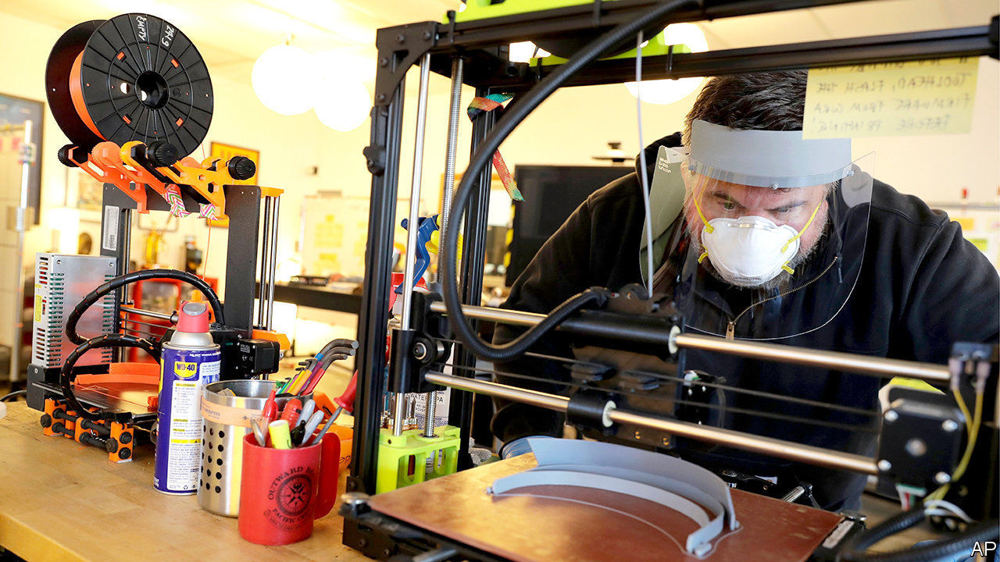

## A multitude of drops

# America’s makers and tinkerers turn their hands to PPE

> Makers and takers

> Apr 30th 2020DOBBS FERRY

Editor’s note: The Economist is making some of its most important coverage of the covid-19 pandemic freely available to readers of The Economist Today, our daily newsletter. To receive it, register [here](https://www.economist.com//newslettersignup). For our coronavirus tracker and more coverage, see our [hub](https://www.economist.com//coronavirus)

BEFORE THE pandemic, John-Paul Kaminski was a retired cross-country coach and middle-school technology teacher in Dobbs Ferry, a village about 15 miles (24km) up the Hudson river from Manhattan, who liked to tinker with his 3D printer at home. He used it to make key chains, jewellery boxes, maze games and the occasional carved pumpkin. These days, he and other tech teachers he knows from university use their printers—60 in all—to make head- and chinstraps that hold plastic face-shields in place. A college student nearby uses a laser cutter to stamp out the shields himself. Using materials bought out-of-pocket and through donations, they have given away more than 3,000 face shields to hospitals and nursing homes in four counties.

Across America, makers of all ages and skill levels have thrown themselves into helping to alleviate the shortage of personal protective equipment (PPE). Some, like Mr Kaminski, are making masks, shields and gowns. Others are collaborating on designs, and making those designs public. Still others are trying to figure out how to get PPE to those who need it most as quickly as possible. These charitable tinkerers provide ground for both a deeply American kind of hope—strangers doing as much as they can, wherever they can, for the good of their neighbours—and despair, at the colossal federal failure that inspired them.

One reason so many people have turned to face shields, explains Paul Mirel, a Baltimore-based maker, is that shields need not be sterile, and “they’re easiest to manufacture”. Rubber gloves require a complex extrusion process. Surgical masks and N95 masks (which filter 95% of small airborne particles) require polypropylene fibre and strenuous testing. Ventilators are complex machines that require a respiratory therapist to manage. Shields are just a stamped piece of plastic held in place with two other bits of plastic. They can be washed and disinfected. Wearing them extends the lives of the masks beneath, which in turn eases supply-chain pressure.

Some makers have been drawn to more complex challenges. Matt Parlmer, a Chicago-based computer scientist, says that in mid-March his father, an anaesthesiologist, was given a surgical mask and an N95 mask, and “told to wear them until they fell apart”. That made him angry but also curious. He cut an N95 mask apart, and realised that while “there’s some degree of technical complexity, it’s not building a car or a fighter jet”. He and a group of engineers have been making prototypes, testing them and trying to increase small-scale manufacturing capacity.

Getting more of them into the supply chain will not just help front-line workers. It could also help ordinary people feel more secure about being in crowds and taking public transport, which are essential if cities are to return to something approaching normal levels of productivity before a vaccine becomes widely available. And just as Mr Kaminski says his project was born of “wanting to help [but] not knowing how”, Mr Parlmer notes that his “solid amount” of donations and volunteers has been “organic, which shows how dire the need is and how willing people are to help”.

This surge in makers’ activity is also putting some people back to work—albeit on a small scale. Will Holman, who has converted the 34,000-square-foot makers’ space he runs in Baltimore into a face-shield production plant, has rehired five of the 21 people he had to lay off to do clerical and packaging work. He sits at the hub of a network of makers running 500 printers in homes, schools and libraries that in the first three weeks of production have made 7,650 masks, which they sell at cost to cover production materials and labour.

Mr Holman knows that “there’s no way that this is more cost- or labour-efficient than making it in a giant factory, but when all the giant factories are in China and China needs all the face shields domestically, it just exposes the yawning gap in America’s industrial space.” This sort of production, making use of crowdsourced design and small distribution networks, realises the promise of 3D printers: they will never compete in cost and efficiency with huge assembly lines, but they give American manufacturing a nimble, local backstop.

Once materials are made, where do they go? Mr Holman has an online form for local service organisations such as homeless shelters, which need PPE but, unlike hospitals and doctors’ offices, are unaccustomed to ordering it. Mr Kaminski and his network send it to anyone who asks.

A team of doctors have founded a network called getusppe.org to think bigger. They are using data on hospitals’ needs to build a centralised PPE distribution platform. Some have also been urging clothing manufacturers to start making cool-looking masks. Initially the firms were reluctant, says one, because “they didn’t want to look like they were making money” from a pandemic. But the more masks they make that people want to buy, the fewer people will buy surgical and N95 masks intended for front-line workers.

Ultimately, just as Mr Holman says his work is a “bridge project” to fill a need until big manufacturers can catch up, the doctors behind getusppe.org are trying to nudge the federal government into action. A few thousand makers, however dedicated and well-intentioned, cannot be a supply chain for a country of almost 330m. Tracking the needs of thousands of American hospitals—to say nothing of doctors’ offices and other medical facilities—cannot be left to doctors in their spare time. Mr Mirel calls his work “a tiny drop in a giant ocean of need”. But, as David Mitchell wrote in “Cloud Atlas”, “What is any ocean, but a multitude of drops?”■

Dig deeper:For our latest coverage of the covid-19 pandemic, register for The Economist Today, our daily [newsletter](https://www.economist.com//newslettersignup), or visit our [coronavirus tracker and story hub](https://www.economist.com//coronavirus)