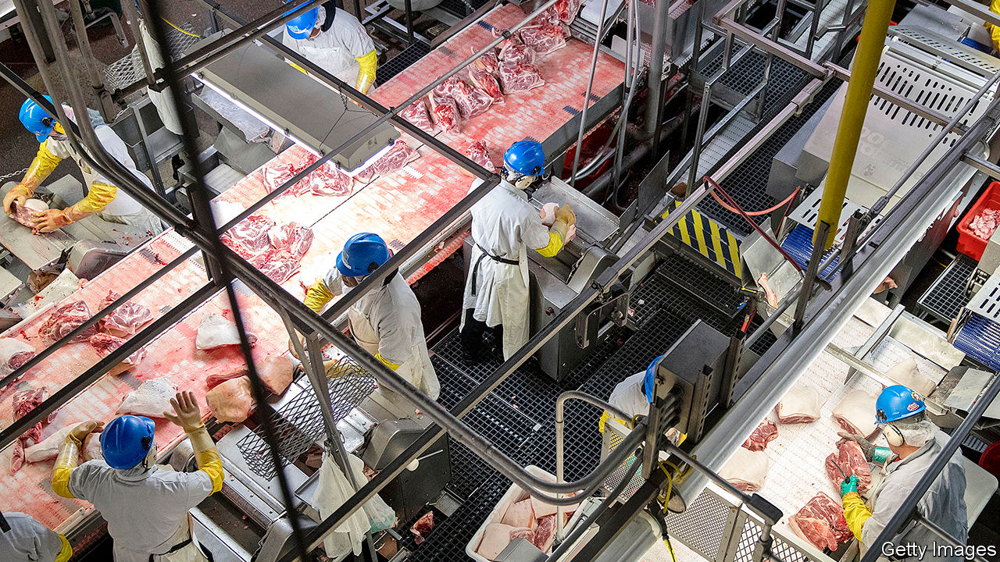

## Slaughterhouse dive

# In America, the virus threatens a meat industry that is too concentrated

> Healthy animals are being killed and buried for want of slaughterhouse workers

> May 2nd 2020CHICAGO

Editor’s note: The Economist is making some of its most important coverage of the covid-19 pandemic freely available to readers of The Economist Today, our daily newsletter. To receive it, register [here](https://www.economist.com//newslettersignup). For our coronavirus tracker and more coverage, see our [hub](https://www.economist.com//coronavirus)

WHAT IS THE biggest concern about America’s food-supply chain? The White House worries that shoppers, even before summer, may find supermarket shelves empty of steaks, burgers, sausages or chicken. Donald Trump invoked emergency powers under the Defence Production Act, declaring that closure of meatpacking plants threatens “critical infrastructure”, on April 28th. Supposedly that will oblige them to stay open, after more than 20 had closed because of coronavirus outbreaks affecting thousands of workers. At least 20 workers have died.

Mr Trump’s order, and a vow that all will have protein, came after big meat producers warned that supply bottlenecks would cause shortages. In mid-April the boss of Smithfield Foods, a huge pork firm, spoke of looming “severe, perhaps disastrous” effects on the food chain. It had just shut a big slaughterhouse in South Dakota. On April 26th the head of Tyson Foods, which dominates America’s chicken production, chirped up to greater effect. In full-page ads in national papers, John Tyson said a “vulnerable” food-supply chain is “breaking” and asked government to help. Tyson has closed plants in Iowa and beyond.

The White House took the alarm seriously. An official there suggested that some 80% of America’s meat-processing capacity might shut, at least for a while. Already a quarter of the pig-slaughtering capacity has closed. In recent weeks farmers and meatpackers in several states had begun culling millions of chickens and killing pigs to be rendered for fat and tallow, or just buried. Every year American farmers produce over 50m tons of beef, pork, turkey and chicken, and over 33m cattle, 120m pigs and 9bn chickens are slaughtered.

Just how the president’s order will keep slaughterhouses open is not clear, but one aim is to give legal cover for firms that do operate. As more workers fall sick, and some die, the presidential order could help limit their liability.

Unions say worker safety is bound to suffer—most workers in such plants are immigrants or refugees with few other job options. Those who spend shifts butchering meat while standing cheek-by-jowl at conveyor belts transmit the virus all too easily. Distancing is near-impossible unless plants operate more slowly, spacing out workers. Many have lacked protective equipment, such as masks, and some had to pay for their own. Testing, left to the companies, has also fallen badly short.

Even in the best conditions, safety is hard. Crammed in locker and lunch rooms, walking along narrow corridors (some shifts can involve as many as 2,000 people) and breathing air recirculated by refrigeration systems puts those inside at risk of catching the virus.

Temple Grandin, who has designed and audited slaughterhouses in Colorado, says much depends on isolating the unwell and most vulnerable. She suggests staggering shifts and setting up separate places to eat, as well as slowing lines. This could all mean that plants’ efficiency falls, perhaps by 50%, Ms Grandin says, so “the cost of meat is gonna go up as the supply chain tightens,” even if places stay open.

The pandemic is having another effect, “exposing weaknesses that people have talked about for ever,” argues Chris Leonard, author of a book that traces the rise of Tyson Foods to dominate the chicken industry. He says this is the moment to raise the alarm that the meat industry as a whole is unhealthily consolidated, in the hands of a few large firms as plump and mis-shapen as the big-breasted chickens or elongated hogs they cultivate.

Just four big companies now integrate almost every stage of raising animals, slaughtering them and packing the meat, and thus dominate the industry. That builds in weakness, he says. Such firms win economies of scale by building huge plants, but “big is fragile”, says Ms Grandin. When she began working in the meatpacking industry in the 1970s, there were many medium-size plants in each state. If one or two closed, others picked up their work. Now a single beef plant may slaughter 5,000 cattle daily, ten times more than when she started. Just one hog plant can account for 5% of America’s total pork processing. If a few such mega-sites close, as is happening now, it causes a wider shock.

That is all too clear when looking from the ground up. Art Cullen, a newspaper editor in Storm Lake, in northern Iowa, says his home town has become a “protein centre”. A pork plant has operated in town since 1928; it is now owned by Tyson Foods. A poultry farm nearby, also run by Tyson, can slaughter 30,000 birds a day. “There are virtually no independent producers left,” he says of pig farmers, noting how Smithfield breeds—through contracted farmers—some 40% of all the pigs in Iowa.

He blames weak regulators and politicians, who let a few firms dominate. “It unquestionably would have been more secure if there were lots of independent hog farmers and meatpackers,” he says. Instead he watches a “brutal” system, where bottlenecks in one or two big companies’ supply chains are putting workers at risk, threatening shortages and forcing the culling of millions of healthy animals. ■

Dig deeper:For our latest coverage of the covid-19 pandemic, register for The Economist Today, our daily [newsletter](https://www.economist.com//newslettersignup), or visit our [coronavirus tracker and story hub](https://www.economist.com//coronavirus)

## URL

https://www.economist.com/united-states/2020/05/02/in-america-the-virus-threatens-a-meat-industry-that-is-too-concentrated
