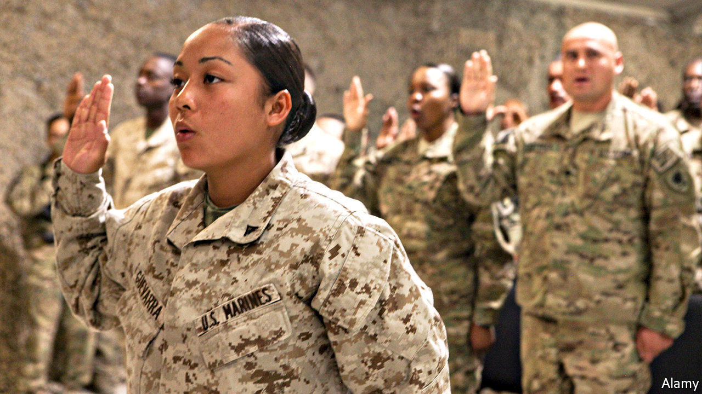

## Battling to be American

# The path to citizenship for those who put on American uniform has narrowed

> Military service was a time-honoured way to earn citizenship. No longer

> Apr 30th 2020NEW YORK

WHEN Baron Friedrich von Steuben, a Prussian officer helping the Continental Army, asked for a translator at Valley Forge to address some troops during America’s revolutionary war, the story goes that he was told there was no need. This particular group were immigrants and spoke German. Colonial militias offered state citizenship to soldiers. The Continental Congress granted citizenship even to enemy soldiers who switched sides. The baron was later given American citizenship for helping to see off the Brits.

Since 1952, immigrants have been able to apply for citizenship after one year of honourable service during peacetime. In wartime they have been able to become Americans almost as soon as they join up. Since the September 11th attacks in 2001, more than 100,000 service members have become citizens. But this avenue to citizenship is no longer assured.

In order for the naturalisation process to begin, the Department of Defence has to sign an honourable-service certification form. Without it, the Citizenship and Immigration Services (USCIS) will not consider the applicant. In October 2017 the department adopted stricter vetting; as a result, claims a new lawsuit, it is very difficult for service members to be naturalised speedily. This policy change is “a departure from pretty close to 200 years of US history”, says Muzaffar Chishti of the Migration Policy Institute, a think-tank.

Ange Samma, along with five other active-duty service members, and the American Civil Liberties Union (ACLU), an advocacy group, filed a class-action lawsuit against the Department of Defence on April 24th. Private Samma enlisted in 2018 and is serving in South Korea. Originally from Burkina Faso, he came to America as a teenager. According to the suit, it took multiple requests for him to receive the honourable-service certification form. When he finally did, USCIS rejected it as his officers had not filled it out properly. Without citizenship, he cannot get security clearance for some army work. He is not alone. Scarlet Kim, an ACLU lawyer, says that thousands of service members are having similar difficulties.

In 2018 there was a 70% drop in naturalisation applicants from the armed forces after the extra vetting was put in place. The lawsuit says the servicemen would have been naturalised faster if they had taken the lengthy civilian route. Their applications are being rejected at a higher rate than civilian ones. Margaret Stock, a retired lieutenant-colonel and now an immigration lawyer, says some serving soldiers are placed in deportation proceedings by the same government that they volunteered to fight for, before the application process has been completed.

Some countries are loosening citizen-enlistment rules because of military-recruitment problems, but only a few make service a path to citizenship as America does. This distinction helps with recruiting. Without immigrants the army would have failed to meet its goals nearly every year between 2002 and 2013. A Department of Defence report in 2016 found that non-citizens perform better, have lower attrition rates and are more likely to have medical and IT expertise than their citizen counterparts. Not only do they make useful recruits to the armed forces; they would make good citizens, too.■

## URL

https://www.economist.com/united-states/2020/04/30/the-path-to-citizenship-for-those-who-put-on-american-uniform-has-narrowed
