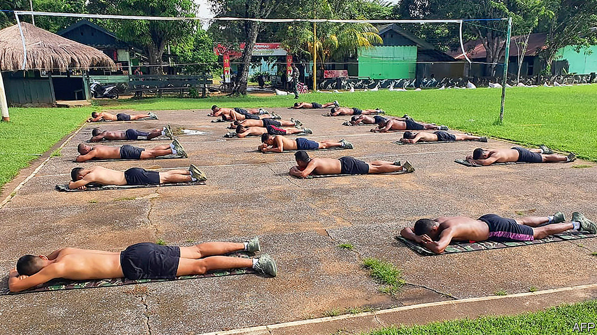

## Hot spot

# Sun-shy Indonesians are suddenly soaking up the rays

> The belief that sunlight kills the coronavirus is widespread

> May 9th 2020SINGAPORE

Editor’s note: The Economist is making some of its most important coverage of the covid-19 pandemic freely available to readers of The Economist Today, our daily newsletter. To receive it, register [here](https://www.economist.com//newslettersignup). For our coronavirus tracker and more coverage, see our [hub](https://www.economist.com//coronavirus)

FARAH REYNALDI loathes the sun. Yet for the past month, the 19-year-old law student has been soaking up the rays several mornings a week. At the behest of her father, she takes off her hijab, puts on a T-shirt and shorts, and sweats on the balcony for about half an hour. She is not alone. Over the past month or two, Indonesians have begun sunbathing en masse. Bare-chested soldiers and police officers prostrate themselves before the sun every morning. Residents of a slum abutting a metro line in Jakarta, the capital, drape themselves across the train tracks. So many people have suddenly started basking in the tropical glare that the government has begun extolling sun cream and warning about the risks of skin cancer.

Indonesian culture normally prizes pale skin, which is regarded as beautiful, says L. Ayu Saraswati, the author of “Putih” (White), a book about Indonesian attitudes to skin colour. Many Indonesian women use skin-whitening products. Indonesia is home to the world’s largest population of Muslims; the pious among them do not feel comfortable baring much skin. Most Indonesians would never dream of tanning. Yet they are willing to risk a darker shade now because they believe sunlight helps to fend off covid-19. 

There are two reasons for this belief, one more scientific than the other. Sunlight does stimulate the body to produce vitamin D, which in turn boosts the immune system, notes Madarina Julia of Gadjah Mada University. This is why Dr Andi Khomeini Takdir of Cipto Mangunkusomo National General Hospital in Jakarta encourages his patients to sunbathe for 10-15 minutes every day.

But many Indonesians believe that exposure to the sun also kills the virus in itself—an idea for which there is no scientific evidence. A woman spotted by the Jakarta Globe in early April shouted, “Die, you virus! Go away, corona!” as she exercised in the morning light. As Ms Reynaldi puts it, “If you’re not sunbathing, then you’re not preventing covid right.”

The idea that the sun can zap the virus has been endorsed by prominent politicians. Tito Karnavian, the home-affairs minister, said in March that covid-19 cannot spread in a tropical climate like Indonesia’s, and invited the public to snuff out the disease by sunbathing. The number of confirmed cases in the country has since risen to more than 12,000. Perhaps the minister should have read the WHO’s covid-19 myth-busters website, which states, “Exposing yourself to the sun or to temperatures higher than 25°C DOES NOT prevent covid-19.” ■

Dig deeper:For our latest coverage of the covid-19 pandemic, register for The Economist Today, our daily [newsletter](https://www.economist.com//newslettersignup), or visit our [coronavirus tracker and story hub](https://www.economist.com//coronavirus)