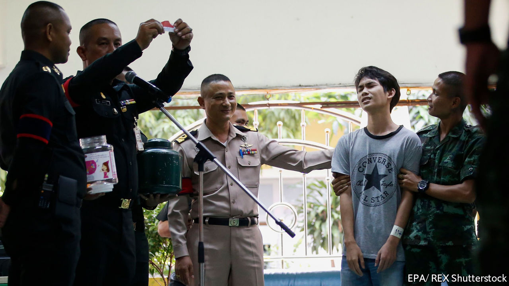

## In the doghouse

# Thais seem ever less impressed by the army

> The army commander recently accused them of ingratitude

> May 9th 2020SINGAPORE

“EVEN MILITARY dogs are grateful to the army,” said Apirat Kongsompong, its commander, earlier this year. He was implying that if mere animals could muster the appropriate emotion, people should be overflowing with gratitude. After all, the army is a “sacred” institution, he believes. Yet ordinary Thais do not seem to realise how lucky they are. Indeed, they have been showing signs of sacrilege.

Enlistment is one indicator of disenchantment. Every April the government conducts a lottery to select some 100,000 conscripts to serve in the armed forces for two years. Because this year’s draft has been delayed until July, owing to the coronavirus pandemic, a shortfall of soldiers looms: just 5,460 out of 42,000 conscripts scheduled for discharge at the end of April have volunteered to stay on, despite the wilting economy. Often it is poorer boys from rural areas who end up as conscripts; richer Thais seem better at finding ways to dodge the draft. Reports of beatings, abuse and drudgery abound. Occasionally conscripts die from such mistreatment. So unpopular is conscription that a new party which promised to end it and seek other military reforms won the third most seats in last year’s election.

A fuss about military spending is another sign of Thais’ diminishing regard for men in uniform. The government, led by Prayuth Chan-ocha, a former army commander who appointed himself prime minister after a coup, had planned to spend roughly 232bn baht ($7.2bn) on the armed forces this year. When covid-19 blew a hole in its finances, it turned to Thai businesses, cap in hand. Disgruntled netizens pointed out that plenty of savings could be made before the state went begging—a brave thing to do, given how many Thais have been locked up in recent years for expressing the wrong opinions online. The government swiftly trimmed military spending by 8%, diverting the savings to schemes to salvage the economy.

The biggest blow to the army’s standing came in February, when a soldier went on a shooting rampage in the city of Nakhon Ratchasima, killing 29 people. The incident revealed the army’s incompetence (the killer obtained guns and ammunition by raiding a poorly guarded armoury), corruption (he seems to have been enraged after being cheated in a property deal involving relatives of a superior officer) and arrogance (it was criticism of the army’s response to the killings that prompted General Apirat to complain about ingratitude).

Soon after the massacre General Apirat pledged to reform military housing and root out corruption. Mr Prayuth weighed in, too, promising to halve the number of generals—there are about 1,700 of them—and to trim the army overall. Thailand has some 560,000 soldiers and reservists. Britain, with a similar population and pretensions as a global power, has about 230,000.

Many doubt that the promised reforms will come to much. “Nothing is being done,” says Paul Chambers of Naresuan University. Besides, the most urgent reform of all—an end to the army’s involvement in politics—is hardly one that Mr Prayuth is likely to pursue. ■

## URL

https://www.economist.com/asia/2020/05/09/thais-seem-ever-less-impressed-by-the-army
