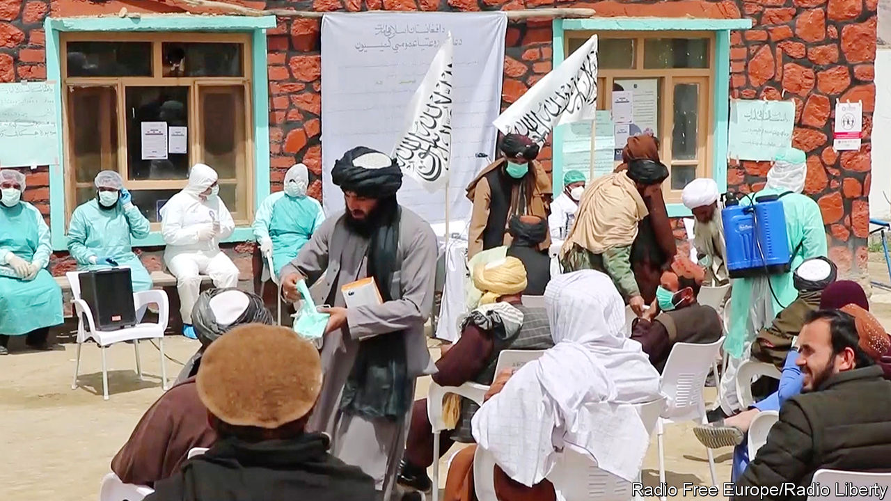

## Gunmen with thermometers

# The Taliban are joining Afghanistan’s fight against covid-19

> But they refuse to do the most helpful thing, and stop fighting

> May 9th 2020ISLAMABAD

Editor’s note: The Economist is making some of its most important coverage of the covid-19 pandemic freely available to readers of The Economist Today, our daily newsletter. To receive it, register [here](https://www.economist.com//newslettersignup). For our coronavirus tracker and more coverage, see our [hub](https://www.economist.com//coronavirus)

THE OFFICIAL in charge of the Afghan government’s response to covid-19 in a rural district near the city of Herat recently received a dressing-down by phone. The caller berated him for the lack of masks at a particular clinic. Local bureaucrats needed to get their act together quickly, the caller instructed. The man delivering the rebuke was not some big cheese from the ministry of health in Kabul, however, but a member of the Taliban, the rebels who have been trying to overthrow the government since 2001, when they themselves were ousted from power by American-backed forces.

The Taliban’s war with the American-backed regime is waged not just by force of arms, but also by vying to administer the country better. The insurgents pride themselves on their probity, in contrast to widespread corruption within the government. They extract only fixed “tolls” from truck drivers passing through areas under their control, for example, in contrast to the frequent and fluctuating payments demanded by government forces. Many Afghans prefer to seek justice from Taliban judges, who are seen as harsh but swift and clean, than in the slow and crooked government courts. The Taliban also appoint officials to oversee services such as health care and education in the big expanses of the countryside where they have more sway than the government.

When covid-19 reached Afghanistan, the Taliban were quick to trumpet their readiness. Social-media accounts that usually crow about killing government soldiers instead showed the militants handing out masks and advice on public health. One video purported to show Taliban health-workers kitted out in white suits, taking people’s temperatures and squirting disinfectant about. Afghans returning from Iran, an early hotspot for the virus, would be ordered into quarantine, the militants announced.

The government and aid agencies have welcomed the Taliban’s concern about the disease. Both rely on the rebels to allow them to operate in rural areas. For all their talk of good government, the Taliban provide relatively few services—for the most part, they simply co-opt the schools and clinics run by the government or charities. For them to reiterate medical advice about washing hands and social distancing is helpful, aid groups say.

A campaign to tell people how to behave plays to the Taliban’s strengths, says Ashley Jackson, who is researching their response to the coronavirus for the Overseas Development Institute, a British think-tank: “What the Taliban are really good at is discipline. They are not technical experts. What they do is they crack down on things.”

The most helpful thing the Taliban could do, however, is the one idea they have rejected outright. The militants have spurned calls for a ceasefire to allow the government and aid agencies to fight the virus unhindered. Instead, while offering Afghans advice on how to keep themselves safe, they have also been killing lots of them. Taliban attacks rose by more than 70% year-on-year in the six weeks after they signed a peace deal with America in Qatar at the end of February. Some 900 Afghan troops were killed over that period. America has accused the militants of flouting their pledge to reduce violence. The toll not just of pestilence, but also of war, looks set to rise further. ■

Dig deeper:For our latest coverage of the covid-19 pandemic, register for The Economist Today, our daily [newsletter](https://www.economist.com//newslettersignup), or visit our [coronavirus tracker and story hub](https://www.economist.com//coronavirus)

## URL

https://www.economist.com/asia/2020/05/09/the-taliban-are-joining-afghanistans-fight-against-covid-19
