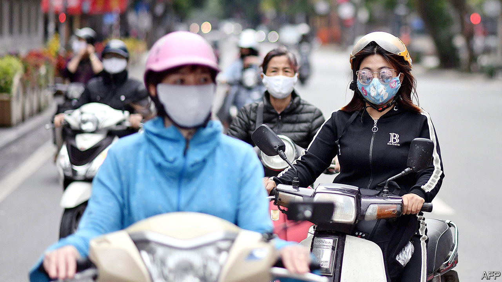
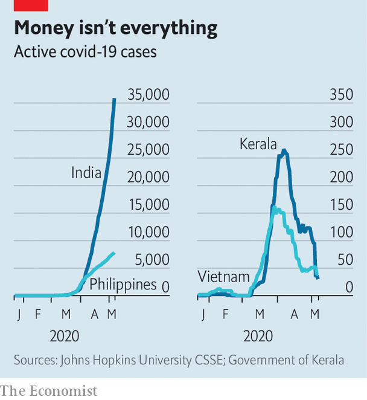

## Bargain abatement

# Vietnam and the Indian state of Kerala curbed covid-19 on the cheap

> Their secret is quick and efficient public-health systems

> May 9th 2020DELHI

Editor’s note: The Economist is making some of its most important coverage of the covid-19 pandemic freely available to readers of The Economist Today, our daily newsletter. To receive it, register [here](https://www.economist.com//newslettersignup). For our coronavirus tracker and more coverage, see our [hub](https://www.economist.com//coronavirus)

THE PHONE rings and a doctor picks up. “Sir, we’ve run out of ventilators. What do we do when more patients come?” Soon after, a grim medic explains that the disease they are battling kills three in four victims. There is no vaccine or treatment.

Such talk has become commonplace in the time of covid-19. Yet this scene has nothing to do with the current pandemic. It is the opening of “Virus”, a film that won critical acclaim last year in Mollywood, as the Malayalam-language cinema of the Indian state of Kerala is sometimes known. Styled as a thriller, it tells the true story of the struggle to contain an outbreak of the Nipah virus in 2018. The bat-borne pathogen killed 21 out of the 23 people infected. But Kerala tamed Nipah within a month, adopting an all-hands approach that included district-wide curfews, relentless contact-tracing and the quarantine of thousands of potential carriers.

Kerala has used the same simple, cheap tools to fight covid-19, with similarly stellar results. It was the first of India’s 36 states and territories to report a covid-19 case, a medical student who returned in January from Wuhan, the Chinese city where the epidemic started. By March 24th, when Narendra Modi, the prime minister, declared a nationwide lockdown to combat the disease, Kerala accounted for a fifth of India’s cases, more than any other state. Just six weeks later, it ranks 16th. As India’s active caseload has risen by a multiple of 71, Kerala’s has fallen by two-thirds (see chart). It has suffered just four deaths. Many of Kerala’s 35m people work abroad; 20 times more of them have died of the illness in another country than have at home.

With 95m people, Vietnam is a much bigger place. In dealing with covid-19, however, it has followed a strikingly similar script, with an even more striking outcome. Like Kerala it was exposed to the virus early, and saw a surge of infections in March. Active cases also peaked early, however, and have since tumbled to a mere 39. Uniquely among countries of even remotely similar size, and in contrast to such better known covid success stories as Taiwan and New Zealand, it has not yet suffered a single confirmed fatality. The Philippines, a nearby country of roughly the same population and wealth, has suffered more than 10,000 infections and 650 deaths.

Like Kerala, Vietnam has recently battled deadly epidemics, during the global outbreaks of SARS in 2003 and of swine flu in 2009. Vietnam and Kerala both benefit from a long legacy of investment in public health and particularly in primary care, with strong, centralised management, an institutional reach from city wards to remote villages and an abundance of skilled personnel. Not coincidentally, communism has been a strong influence, as the unchallenged state ideology of Vietnam and as a brand touted by the leftist parties that have dominated Kerala since the 1950s.

Some suggest that having relatively young populations may have lessened the toll of the disease in both places. Others speculate that universal inoculation with BCG, a vaccine against tuberculosis and leprosy, has made locals less susceptible. Todd Pollack, a specialist in infectious diseases based in Vietnam, says the reasons for its success are simpler: “Countries that took early, aggressive action, using proven methods, have severely limited the virus. If you reduce it fast enough, you never reach the point of exponential growth.”

Mr Pollack agrees that cultural factors may have aided Vietnam’s effort, such as a willingness to study and learn from China, social comfort with wearing protective masks, acceptance of being isolated away from home and respect for expert advice. He admits that the age profile of Vietnamese covid-19 carriers has been generally younger than elsewhere, giving more resistance to illness. But that is largely because health workers swiftly and effectively isolated carriers, so protecting older people.

Before the end of January Vietnam had declared a national emergency, formed a top-level steering committee chaired by the deputy prime minister and begun screening passengers and restricting movement. The effort to trace the contacts of infected travellers drew on personnel from the army and civil service as well as health workers. At one large hospital in Hanoi, the capital, investigators tracked and tested some 5,000 people. As early as mid-February, Vietnam had imposed stringent lockdowns on some districts, with communes of as many as 10,000 inhabitants placed under heavy police guard. As in China, potential carriers of the disease were quarantined away from their own families.

The government’s public-awareness campaign was equally aggressive, relying on text-messaging, information-packed websites and downloadable apps as well as a barrage of some 127 articles a day, on average, across 13 of the most popular online news outlets. “The impression they created was that the government was really doing everything it could,” says Mr Pollack.

Kerala’s state government has been similarly energetic, from the chief minister, its top elected official, giving nightly pep talks to village-level committees working to set up public hand-washing stations. Aside from showing logistical efficiency in monitoring cases and equipping its health system, it has also emphasised sympathy and compassion for people affected by the pandemic. The state has mobilised some 16,000 teams to man call centres and to look after as many as 100,000 quarantined people, ensuring they do not lack food, medical care or simply someone to talk to. Free meals have been delivered to thousands of homes, as well as to migrant workers stranded by a national lockdown.

Both Kerala and Vietnam are keenly aware that the danger is far from over. Until there is a vaccine or better treatment, Vietnam will remain on alert, says Mr Pollack. Kerala, for its part, is preparing for a huge influx of expatriate workers returning from the economically battered Arab Gulf countries. More than 300,000 have requested help getting home via a state website. Rajeev Sadanandan, a public-health expert who spearheaded Kerala’s Nipah campaign, admits this is a big risk, as well as an added burden at a time when state revenues are under severe strain. “But”, he says, “there is no doubt in government or in our society that they must be brought back and that we should stand by them whatever the circumstances.” ■

Dig deeper:For our latest coverage of the covid-19 pandemic, register for The Economist Today, our daily [newsletter](https://www.economist.com//newslettersignup), or visit our [coronavirus tracker and story hub](https://www.economist.com//coronavirus)

## URL

https://www.economist.com/asia/2020/05/09/vietnam-and-the-indian-state-of-kerala-curbed-covid-19-on-the-cheap
