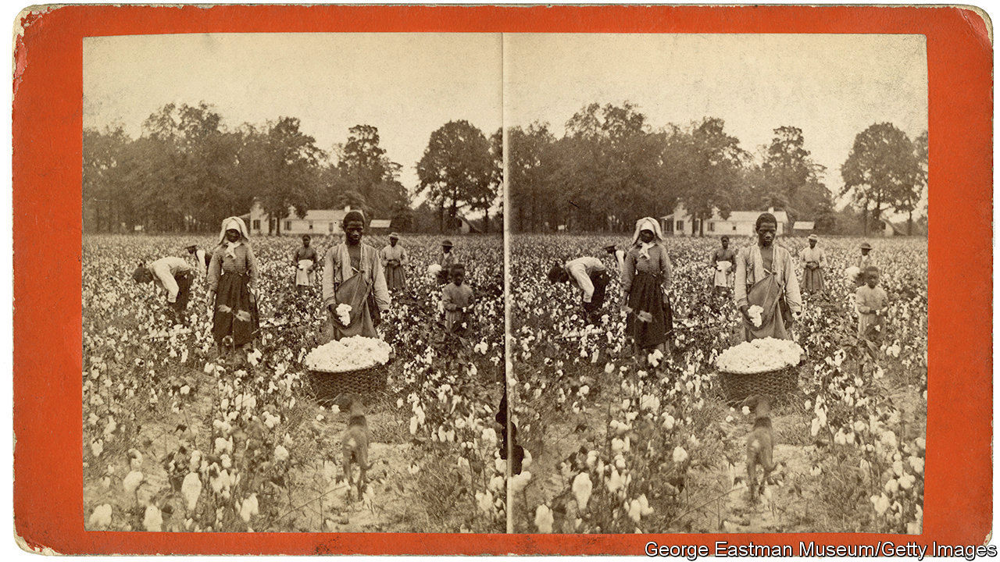

## A kind of freedom

# “Conjure Women” is a tale of slavery and its aftermath

> Afia Atakora’s debut novel evokes a haunting period in American history

> May 7th 2020

Conjure Women. By Afia Atakora. Random House; 416 pages; $27. Fourth Estate; £14.99.

RUE KNEW she was a liar. When she was enslaved, and then during her first years of freedom, she often said, falsely, “I know.” As a child, she only pretended to understand why her mother’s love felt so fierce and unforgiving. Years later, as her plantation’s resident healer, she was not sure why so many babies fell ill, or why women felt certain pains in childbirth, but she assured people otherwise. Rue saw that healing demanded faith and that she had to seem confident to get others to believe in her power. Her magic “ought to be absolute…or it wasn’t magic at all”.

“Conjure Women”, Afia Atakora’s atmospheric debut novel, is largely Rue’s story. Born into slavery in America’s South, she tends to the plantation’s pregnant and sick in the years after the civil war. Her mother, May Belle, made her name and living crafting curses for fellow slaves. “Hoodoo”, May Belle would say, “is black folks’ currency.” From her, Rue learned to heal, but she is wary of witchcraft—and troubled by a shameful secret. When an illness claims the lives of local children, grieving parents accuse her of devilry. Meanwhile, Bruh Abel, a handsome itinerant minister with “a too-wide grin on his face”, arrives peddling salvation to a community too nervous about reprisals to feel truly free.

The book opens in the 1860s (“Freedomtime”), when Rue is around 20, but it skips back and forth before and after the war. By juxtaposing the brutality of slavery with the uncertainty of freedom, Ms Atakora captures the disorientation of the era. After Rue’s first whipping, her father reassures her that her cuts will “harden so’s the next time and the next time they beat you it won’t hurt quite so bad.” A few years later, he will be lynched by a white mob, “his dangling toes making circles in the dirt as his body spun on the rope”. Naturally, Rue and her fellow former slaves remain wary of breaking “the white man’s nonsense rules”. She “had never seen that thing the Yankees were promising—freedom—and she did not trust in what she could not see.”

Ms Atakora poetically evokes the anxious, cloistered life of newly emancipated slaves. She notes “the aroma the earth made when it sighed”, and the stale air in the bedroom of the master’s daughter, which “smelled of rosehip and burning hair and sweat”. Repetitious as it sometimes feels, her novel is a vivid portrait of a time in American history that remains both haunting and unresolved. ■