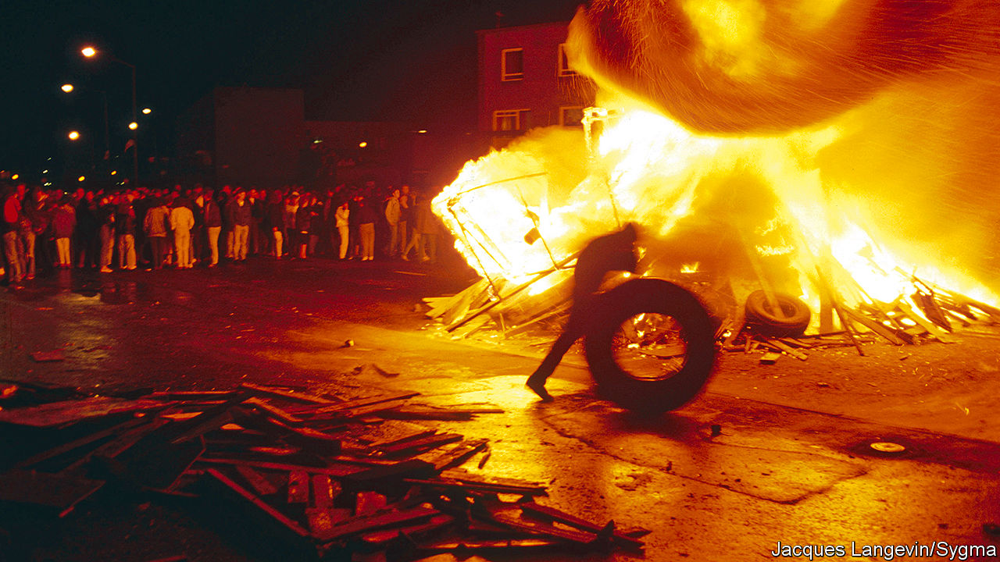

## Ghost town

# Darran Anderson’s granular memoir of the Troubles

> “We are only sheltered from tragedy”, he writes in “Inventory”, “by the thin ice that we call time.”

> May 7th 2020

Inventory. By Darran Anderson.Chatto & Windus; 416 pages; £16.99. To be published in America by Farrar, Straus and Giroux in August; $27.

THE TITLE of Darran Anderson’s new book comes from Georges Perec, an experimental French writer of the mid-20th century. Perec urged other authors to describe—to inventorise—the streets and objects around them. Mr Anderson follows this advice rigorously, rendering a finely textured account of his upbringing in a city that Catholics called Derry and many Protestants knew as Londonderry. In the 1980s and 1990s, amid the fear and violence of the Troubles, every detail was telling.

The telephone, for example, was more than an everyday communication device. It was used by paramilitaries to issue warnings of bombings or to claim responsibility for attacks and murders. As Mr Anderson puts it, it was a means to “give ideological justification for why a child might no longer have a parent or a parent might no longer have a child”.

His own (Catholic) family were stalwarts of the city. His grandfather was a smuggler who knew every sandbank and cove of the Foyle, a river that runs through Derry-Londonderry and along the Irish border. His father was a gravedigger and gardener, who in his youth had been caught up in the Troubles and imprisoned, though he never spoke of the experience with his son. But the sectarian strife, and the bigotry that fed it, stretched into the author’s childhood, and scarred it.

The daily news was a roster of violent death. The residents of the city, mostly innocent civilians, were killed frequently and in diverse ways. Some murders were banal: you could be shot carrying your supper from the fish-and-chip shop. Others were fiendish: victims were kidnapped, then beaten and killed in pubs to entertain mobs. The presence of the army and paramilitary outfits made adolescence hazardous. Prowling around derelict buildings in a teenage posse was risky, given the proximity of trigger-happy adults. The paramilitaries’ assumption of policing duties meant Mr Anderson and his friends risked death or disability for standard youthful excesses such as throwing noisy parties.

None of this was very long ago, but—two decades after the Good Friday Agreement ended the violence—it now feels remote in history. Here are lives lived under extreme stress in a divided community, where everyone was marked by poverty, superstition and bloodshed. The book is an admirable feat of recreation that yanks the past back into clear focus—and, as Brexit calls into question the border arrangements that are part of the peace deal, a timely warning. As Mr Anderson says, “we are only sheltered from tragedy and brutality by the thin ice that we call time.”