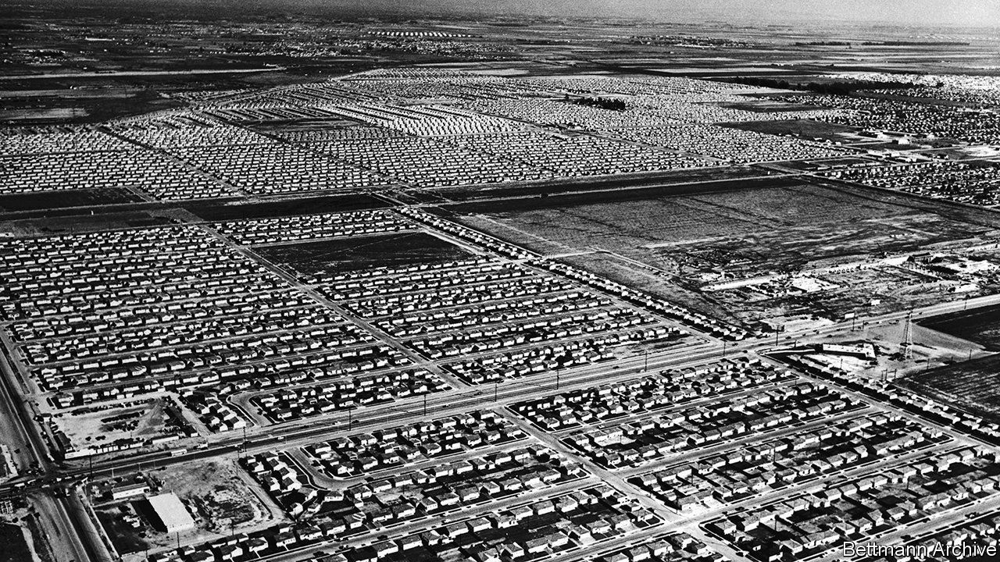

## Home Entertainment

# “Holy Land” and the comforts of suburbia

> A classic account makes clear that many people are happy to lead constrained lives

> May 9th 2020

HE LIVES WHERE most Americans live—in suburbia. His house sits on a plot that is 50 feet wide and 100 feet deep. In front is a pavement, four feet wide, then a strip of green containing a tree, seven feet, then a road, 40 feet. His neighbours’ houses look much the same. At six per acre, homes are close enough for arguments to be overheard, but only if you pay attention. They are close enough for comfort.

The suburb is Lakewood, south of Los Angeles. It was built during and after the second world war and was at first occupied mostly by white manual workers. Although the developers were Jewish, Jews were initially barred from living there, as were blacks. Among the early settlers were the parents of D.J. Waldie. He became a city official, and in 1996 published “Holy Land”, a short, delightful book about the place. It is a reminder that many people are happy to lead constrained lives, even if they are free to move.

Earlier defences of America’s suburbs, such as Herbert Gans’s “The Levittowners”, argued that they were more diverse and sociable than their critics alleged. Mr Waldie does not quite agree. His childhood, with its packed swimming pools and freewheeling Monopoly games, was sociable. Adulthood is less so. Few people walk the streets; each house is an island, visited occasionally by friends and family, who come and go in cars. “The critics of suburbs say that you and I live narrow lives,” he writes. “I agree.”

The form of the suburb encourages conformity and repetition. Most streets adhere to a grid, running north-south and east-west, which is linked to a grid that extends across southern California and indeed much of America. Navigation is straightforward. The ambulance that carries Mr Waldie and his dead father to the hospital turns left out of his road, then left onto a boulevard, then right. Those who live there do not find this stifling. “The grid limited our choices, exactly as urban planners said it would. But the limits weren’t paralysing.”

Yet, as in many locked-down homes, the impression of quiet and order is surface deep. The community relies on deep aquifers, but the rocks could also transmit terrible seismic shocks to the surface. During the second world war the nearby aircraft factory was disguised to look like a suburb: had the enemy bombers come, Lakewood could have been accidentally wiped out. The buyer of one house discovers that the previous owner had excavated a large air-raid shelter underneath his garage.

Above all, residents feel the presence of God. The developers boasted of Lakewood’s many churches, and funded a synagogue after the ban on Jews was lifted. Mr Waldie’s father, who had briefly joined a religious order, knows the Catholic liturgy so well that he teaches newly ordained priests. As a boy, Mr Waldie carried the crucifix in his church on Good Friday, wiping lipstick off Jesus’s feet. In the book of Revelation, the city of God is perfectly square. ■

## URL

https://www.economist.com/books-and-arts/2020/05/09/holy-land-and-the-comforts-of-suburbia
