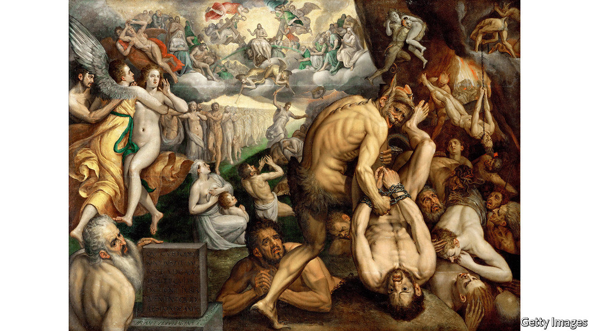

## A place on Earth

# The ideas of celestial bliss and fiery damnation are powerful ones

> But Jesus himself never spoke of heaven and hell, explains Bart Ehrman

> May 9th 2020

Heaven and Hell: A History of the Afterlife. By Bart Ehrman.Simon & Schuster; 352 pages; $28. Oneworld; £20.

WHERE WOULD Christianity be without heaven and hell? Where, for that matter, would art and culture be, without Dante’s “Divine Comedy”, Milton’s “Paradise Lost”, Michelangelo’s “Last Judgment” or Verdi’s “Dies Irae”? For centuries the moral suasion of death, judgment, heaven and hell has underpinned much of Western civilisation. And hard as modern theologians may argue that heaven and hell are just states of mind, experienced here on Earth as much as anywhere else, even now furious devils and shining angels lurk stubbornly in people’s brains. Some 72% of Americans believe in an actual heaven, and 58% in an actual hell.

Hell has always had the more exciting press: fornicators hung by their hair or their genitals, simoniacs buried in sink-holes upside down, despairing gluttons shrieking for a single drop of water, continuous rains of hot coals. Heaven, by contrast, can seem dull and over-decorated with beryl and crystal, with round after round of feasting broken only by sessions of praise. But Bart Ehrman of the University of North Carolina, Chapel Hill, is not concerned with how these imagined places developed their visitor offerings over time. In this unexpectedly entertaining book he sets out to explore how they took hold in Christianity at all.

The fact is that the Old Testament does not mention them, and Jesus himself never spoke of them. Countless priests and bishops have taught that he did; but, says Mr Ehrman, they have all got it wrong. The outer darkness where there is weeping and gnashing of teeth, or the fire into which the tares are cast, are not hell but Gehenna (the word Jesus used), a desecrated ravine and tip outside Jerusalem where rubbish smouldered until it was entirely consumed. Gehenna was simply the grave or the pit, like the Hebrew Sheol; it was death itself, annihilation.

And its opposite was not heaven, as far as Jesus taught: it was the coming of the Kingdom of God on Earth, in which those who did good, and believed in him, would be saved to live and flourish. Resurrection, in so far as he mentioned it, was not individual but general, just as God had promised to raise up the whole nation of Israel after its wanderings; and it was not to be in the same old bodies but in glorified ones, as spirits or angels might appear.

In Mark, the earliest canonical gospel, these teachings are quite clear. Gradually, especially in Luke and John (both written several decades after Jesus’s crucifixion), other ideas crept in. Luke’s story of the good thief, who is told by Jesus on the cross that “This day you will be with me in paradise”, introduces the idea of instant individual resurrection. The incident in Luke 24, where Jesus appears to his disciples after the resurrection and eats broiled fish with them, suggests that he has been raised bodily and hungrily from the dead. Luke’s tale of Dives and Lazarus, rich man and poor, and their different posthumous fates—Dives desperate with thirst, Lazarus cosy in the bosom of Abraham—puts heaven firmly above and hell below, a topography for the ages, when all Jesus had taught was the triumph of a glorious future over the sins of the past.

Luke, however, was not writing in a vacuum. Ideas about the nature of the afterlife had been evolving and intermingling for centuries, perhaps millennia; for nothing is more comforting to humans than to think that death is not the end, and that their individually conscious existence will somehow carry on. The dead in many cultures were buried with grave-goods—food and weapons, harps and drinking cups—in case they needed them in the next world. But the details and description of this next world were often vague. The most famous of them, the Greco-Roman Hades, was a dim place of flitting, fretful shades, still recognisable (as Virgil’s Aeneas recognised his father), but fugitive as sand. And this was their condition for eternity; there was no coming back.

Yet a perception of unfairness was creeping in. Surely, after death, not all should be treated alike. Indeed, already some were not. In Hades those who had offended the gods were given special treatment: Tantalus eternally tormented by delicious food he could not reach, Sisyphus doomed to push a boulder eternally uphill. Meanwhile, the great and good were somewhere else entirely, the restful Elysian Fields, where Socrates in Plato’s “Apology” imagined he might meet old friends for delightful conversation.

Jesus’s teachings of the wheat and the tares, the sheep and the goats, even God and Satan, could be taken to imply something similar: a sorting out and judgment that would lead to distinctly separate eternities in distinctly separate realms. (Since the Kingdom had not after all appeared on Earth, it was probably confined to heaven.) And this distortion of Jesus’s teaching was evidently useful. The thought of heaven encouraged listeners across the Roman Empire to convert, spread the faith and become martyrs in the firm trust of joyful reward; and for centuries afterwards the thought of hell instilled sufficient fear in ordinary folk to make them behave better, more or less.

Many redoubtable volumes have been written about all this, but Mr Ehrman, who already has more than two dozen books on early Christianity under his belt, merrily blows the dust off the subject. A paragraph on hell breezily concludes “You don’t want to go there,” and one on heaven “Let the good times roll.” One quibble is that he omits the influence of ancient Egyptian beliefs about the afterlife, which also involved judgment, expiation and redemption, and which influenced Greece through Orphic and Eleusinian teachings. Another is that he repeats and recapitulates much more than seems necessary—perhaps anticipating readers who believe in the literal truth of the Bible, and may need gentle but insistent persuading.

They should take comfort in the knowledge that the coming of the Kingdom on Earth is something, at least, that Jesus did teach. As for Mr Ehrman, he is looking forward to the alternative afterlife that Socrates also imagined: after a full life happily lived, a good long unbroken sleep. ■

Correction (May 13th): A previous version of this article referred to Plato’s “Phaedo”, instead of “Apology”. Apologies.