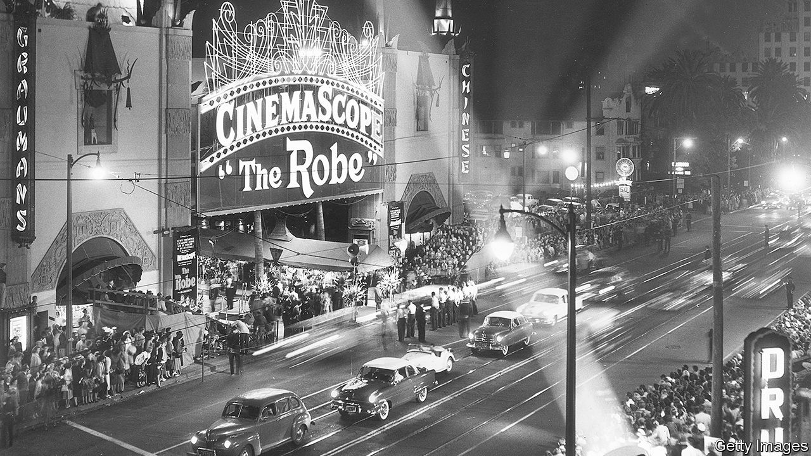

## After the intermission

# When cinemas reopen they will not be the same

> Covid-19’s legacy will be fewer theatres, showing bigger blockbusters

> May 7th 2020

THE LIGHTS are off in many Florida businesses. But after dark, the glow of the Ocala Drive-In’s 90-foot screen can be seen from a quarter of a mile down the highway. With half the parking spaces in its seven-acre plot fenced off to allow for social distancing, the Ocala has room for 240 vehicles—and it is full every night. “We’re the only thing going right now,” says John Watzke, the owner. Families sit out in deckchairs or perch beneath open tailgates to see a double-bill of “Trolls World Tour” and “Back to the Future” for $6 per adult (under-fives and pets go free). Mr Watzke decided to stay open because of his experience of Hurricane Katrina in 2005, when “anything that brought a few minutes of normal lifestyle to us was appreciated.”

For most of America’s nearly 6,000 cinemas, life is far from normal. All but a handful have been shut since March. And although some states have begun to ease the lockdown, it will be months before theatres raise their curtains. A quarter of Americans say they won’t go back to the movies until at least the autumn, so studios are holding their films. No releases are planned for the July 4th weekend, normally a coveted slot. The next big-budget premiere, “Tenet”, an action flick from Warner Bros, is tentatively down for July 17th.

That may be longer than some cinemas can wait. Already indebted after years of investing in reclining seats and the like, they face four months without revenue, followed by only a slow return to business as usual. The world’s largest chain, AMC, which has around 1,000 theatres, the bulk of them in America, last month borrowed an emergency $500m, which ought to tide it over until November. But this will bring its total debt to nearly ten times gross operating profit, according to Moody’s, a rating agency. Restructuring looks likely. Cineworld, the second-largest chain, said in March that it would be at risk of bankruptcy if forced to close for more than three months. The stock prices of both firms have plunged since the start of the year.

America already has 1,600 fewer cinemas than at the turn of the century. Back then the average American went to the movies five times a year; last year it was three and a half. As more theatres close or cut costs and the virus lingers, the couch will become more tempting still.

So Hollywood studios are exploring alternatives. Although it hit screens on April 10th, amid the pandemic, “Trolls World Tour” has been seen well beyond the Ocala, since Universal Pictures decided to put the animation online on the same day. At $20 for a 48-hour download, it took $95m in America in its first three weeks, the Wall Street Journal reported. That is less than the $125m the previous “Trolls” movie made at the box office in the same period. But Universal could keep about 80% of download revenues rather than giving almost half to theatres. The studio hailed the experiment as a success and said it would do more simultaneous releases in future.

Cinema bosses are naturally horrified by this breaking of the 90-day window in which films are normally shown exclusively on the big screen; AMC says it will no longer show any Universal films, adding with a suitably theatrical flourish that this is “not some hollow or ill-considered threat”. Cineworld says it too will boycott films that break the window. But Universal is not the only studio going online. Warner has arranged a digital-only release for “Scoob!”, which was due in theatres on May 15th. Paramount has sold “The Lovebirds” to Netflix. Even Disney, which does better at the box office than any other studio, has decided to put “Artemis Fowl” on its Disney+ streaming service, skipping the cinema.

These decisions were all provoked by the pandemic. But studios were already under pressure to provide content for the streaming services launched by their parent companies. When Netflix is commissioning hits and putting them online immediately, Disney cannot serve up a diet of months-old films. Hence features like its remake of “Robin Hood”, which in the past might have got an outing at the cinema, are going straight to Disney+. This year’s Oscars will admit streaming-only films, in what the Academy insists is a covid-induced one-off. But last year’s best-picture nominations included two Netflix films—“The Irishman” and “Marriage Story”—that had minimal theatre runs.

It isn’t yet time for the credits to roll for the cinema. This year’s biggest titles, from James Bond to Wonder Woman, have been postponed rather than put online. Universal itself has delayed the latest in its “Fast and Furious” series until next April. Given that previous “Furious” films have taken as much as $1.2bn at the worldwide box office, it cannot afford to miss a theatre run.

But increasingly, cinematic releases make sense only for the biggest blockbusters. Studios have realised that betting heavily on a few expensive “tentpoles” brings in more money than placing lots of smaller stakes. Blockbusters’ marketing costs are proportionally lower than those of middling movies, and shelling out for globally famous stars makes it easier to sell a film internationally. With cinema attendance in decline in America, titles must sparkle to be one of the few that people bother going to see. And so ever-greater rewards are accruing to the biggest hits. Last year the five highest-grossing films took a quarter of the domestic box-office, nearly double the top five’s share in 2000.

Critics complain that the emphasis on “event movies” is making studios tediously conservative about what they green-light. All of America’s ten most successful films last year were part of a series, like “Avengers: Endgame”, or remakes, like “The Lion King”. That was the case for only two of the top ten in 2000. And what Hollywood produces, the rest of the world watches: last year’s global top ten was almost identical to America’s. In truth, studios won’t stop making lower-budget features; apart from anything else, they need to try out new actors and new ideas (it wasn’t always obvious that comic-book adaptations would be money-spinners). But increasingly, the tiddlers will go straight to streaming.

All this is only a continuation of television’s century-long siphoning of content away from the cinema. Movie theatres were once the home of all types of video. From the 1950s TV nabbed news, cartoons and serials, leaving cinemas with only feature films. Now streaming is sucking up many of those too, so that the theatre is a place to visit just for event movies. Something is being lost: an evening at home with Netflix isn’t quite the same as a night at the Ocala, reflects Mr Watzke. People may enjoy a film just as much on TV. But “if they see it at the drive-in, it’s a memory.” ■

## URL

https://www.economist.com/books-and-arts/2020/05/07/when-cinemas-reopen-they-will-not-be-the-same
