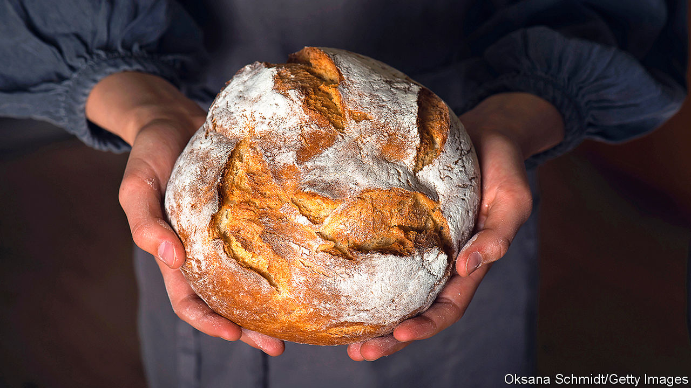

## Home Entertainment

# Why and how to bake your way through the lockdown

> Sourdough starters are today’s pockets full of posies: charms against the surrounding pestilence

> May 5th 2020

Editor’s note: The Economist is making some of its most important coverage of the covid-19 pandemic freely available to readers of The Economist Today, our daily newsletter. To receive it, register [here](https://www.economist.com//newslettersignup). For our coronavirus tracker and more coverage, see our [hub](https://www.economist.com//coronavirus)

DISSERTATIONS WILL doubtless soon be written on supermarket shortages during the pandemic. First disinfectant disappeared, then loo roll, frozen foods, pasta and rice. And then people came for the flour and yeast. There are no atheists in foxholes; there are, apparently, no carb-phobes in a lockdown.

Unable to publicise their ski slopes and cruises, show-offs have instead posted snaps of burnished brioche, perfectly whorled pain de campagne and glistening pastries. Pride in seeing a loaf nurtured from a handful of grist emerge from the oven is understandable—and eating one is a soul-filling pleasure, the culinary equivalent of a grandmother’s hug. But just as holiday pictures fail to capture the real highlights of time off (noodling around without a deadline), the true joy of baking lies as much in the process and experimentation as in the finished article.

Be warned: novices are unlikely to produce anything to rival a high-street bakery. But that is not the point. Weekend runners do not hang up their trainers because they will never compete with Mo Farah. Home-brewers may never outdo the pints pulled at their local pub, but rumour has it that some find the effort enjoyable. And you will not fail entirely, or not for long.

More than other culinary arts, baking has an element of magic. A glistening croquembouche suspended in its golden cage, a tiered wedding cake gilded with fondant flowers, ethereal multicoloured macarons—all can seem as if they have sprung from a fairy tale. Yet with trial, error and time, anyone can make them. And the wonder and grace of baking, as in so much else, often lie in the simple things. A Poilâne-style miche, made from high-extraction winter-wheat flour and two days’ labour, is a work of art and craft; but, when made with love, so is chapati (flour, water and salt, rolled thin and blasted on a stovetop).

Take, for example, sourdough—bread with a malty, complex, acidic flavour—the baking craze of the pandemic. Flour and water stirred and fed for a few days with more flour and water will produce a teeming, bubbling, leavening slurry. This is the starter, a prosaic name for a galaxy of wild yeast and attendant bacteria which, when combined with more of the same ingredients, left to rise and baked, results in sourdough. Starters are today’s pockets full of posies: charms against the surrounding pestilence.

Sourdough starter is an expression of place and individuality. The precise combination of yeast and bacteria varies with location, so sourdough bread made in one city will taste different from another’s. So too will loaves made by two people chatting in the same kitchen, because those bakers will have different microbiotic flora on their hands and in their mouths.

With proper care and feeding, starters can last indefinitely, subtly changing over time as the bakers themselves must. To create a starter, then, is to encourage and nurture life—a noble mission, especially in a virus-stricken age. ■

Dig deeper:For our latest coverage of the covid-19 pandemic, register for The Economist Today, our daily [newsletter](https://www.economist.com//newslettersignup), or visit our [coronavirus tracker and story hub](https://www.economist.com//coronavirus)

## URL

https://www.economist.com/books-and-arts/2020/05/05/why-and-how-to-bake-your-way-through-the-lockdown
