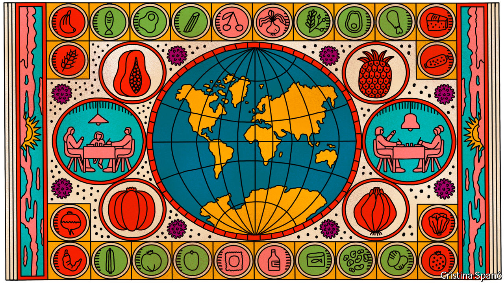
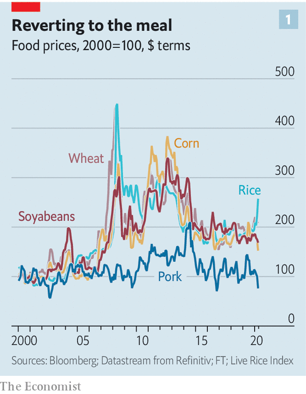
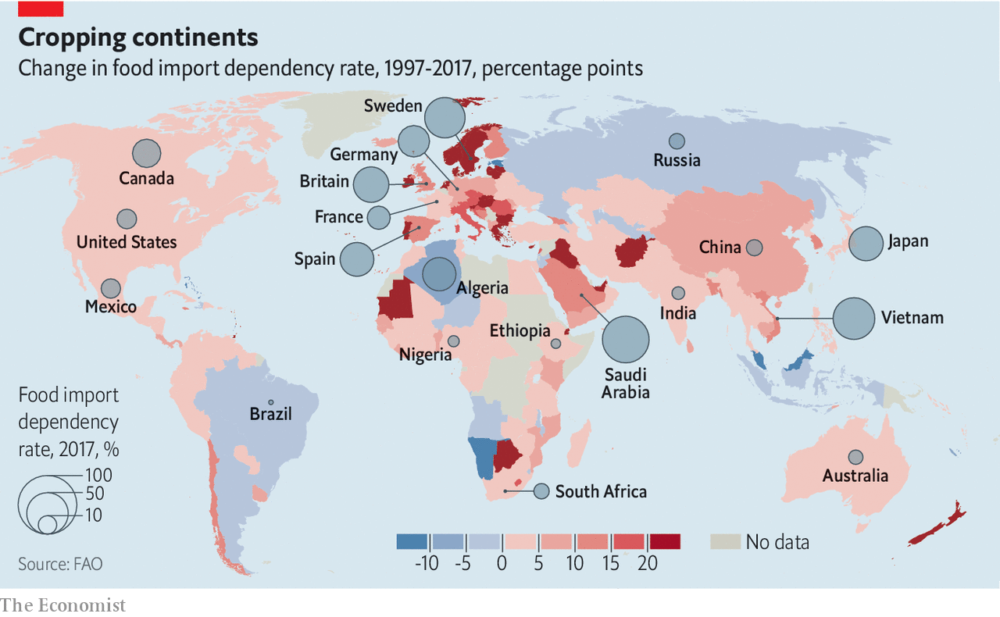
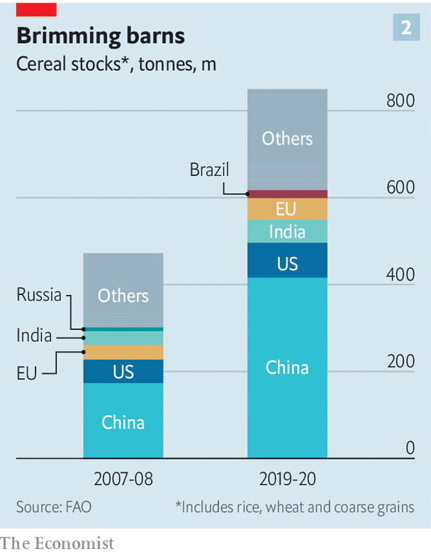
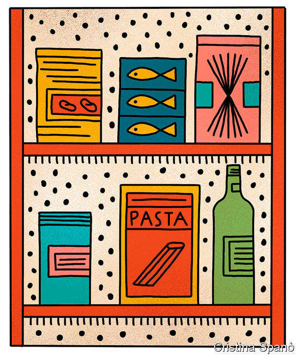

## Keeping things cornucopious

# The world’s food system has so far weathered the challenge of covid-19

> But things could still go awry

> May 9th 2020

Editor’s note: The Economist is making some of its most important coverage of the covid-19 pandemic freely available to readers of The Economist Today, our daily newsletter. To receive it, register [here](https://www.economist.com//newslettersignup). For our coronavirus tracker and more coverage, see our [hub](https://www.economist.com//coronavirus)

IN LATE JANUARY China banned package tours from heading overseas for the lunar new-year holiday. This gave cold sweats to David Parker, New Zealand’s trade minister. Fewer tourists were a disappointment, but planes that did not bring tourists in one direction would not take agricultural produce back in the other—significantly more worrying, given that China is New Zealand’s biggest customer for the food which is its biggest export.

So as airlines started grounding planes, the government engineered a deal with Air New Zealand; the airline would get a loan if it kept routes to China, Singapore and America open, thus allowing kiwi fruits and other delicacies out into the world even when the cabins above the hold were empty. Mr Parker also offered support to airlines based in the Middle East. “It’s hard to grow some of the things they eat there,” he says. “There was a mutual interest in maintaining connectivity.”

Connectivity is what the world’s agro-industrial complex is all about. Four-fifths of the planet’s 8bn mouths are fed in part by imports; the $1.5trn that was paid for them last year was three times 2000’s bill. Battalions of lorries and fleets of ships connect tens of millions of farms to hundreds of millions of shops and kitchens. The sophistication of the system, and the foresight of players within it like Mr Parker, has meant that, so far, it has held up to covid-19’s impacts on both supply and demand by dexterously swapping sources and rerouting supply chains. Prices for most staples have fallen so far this year (see chart 1).

The system’s complex architecture means it has many potential bottlenecks, and the pandemic’s global dislocation has found a fair few of them. Some have been dealt with quite well. The enormous queues of lorries seen in central Europe in March, when concerns about where people were coming from took hold, have been largely eliminated with expedited controls. Others, such as the lack of capacity in America’s meat-processing sector due to slaughterhouse closures, have yet to be fully sorted out.

But the biggest problem lies not in the system’s bottlenecks. It lies in the effects on consumers of almost a billion incomes reduced or lost. The UN estimates that the economic fallout from covid-19 could see the number of people suffering from acute hunger double to 265m over the course of this year. Developed countries are not immune. In America queues at food banks in some cities stretch for kilometres. In these circumstances even quite small dislocations in the food system could, by increasing prices further, lead to great suffering.

Although farms are, by their nature, local, much of the rest of the food industry is global. The supplies of seed, fertiliser, machinery and fuel that farmers need come from far afield. The companies that tie the system together—giant middlemen like America’s ADM, Bunge and Cargill, Louis Dreyfus, based in the Netherlands, and Olam International, based in Singapore—all operate on a worldwide basis, sourcing, storing and shipping agricultural commodities for foodmakers like Kraft or Unilever. Their size and global reach lets them make a lot of money on quite narrow margins. They can quickly swap one source for another to accommodate changes in supply or demand, smoothing prices and keeping the system flexible.

In the past 20 years the industry has seen increased concentration of ownership as firms chase the advantages of scale. Half of America’s poultry market—the largest in the world—is now controlled by just four firms. Two of the six largest mergers in the 2010s were between companies in food and drink. Emerging markets, where changing diets and urbanisation create fresh demand, have spawned giants of their own. Brazil’s JBS is the largest meat-processing company in the world. China’s largest food manufacturer, COFCO, has gobbled up a bevy of established traders as it keeps the grain flowing to Beijing.

The potential for efficiency and the capacity to absorb fixed costs that size brings has seen the system become increasingly sophisticated. The world’s breadbaskets have become more capital intensive. Autonomous tractors roam giant fields and machines handle cargo. Images from satellites, increasingly looked at through the lens of artificial intelligence, keep tabs on ships and storms as well as providing estimates of the season’s yields.

This refinement allows production networks to be very complex. Food, like cars, is often assembled close to the consumer from parts sourced anywhere but. Ukrainian wheat, milled into flour in Turkey, may be turned into noodles in China. Frank van Lierde, who helms the food ingredients and bio-industrial units of Cargill, says it has “a far more diverse footprint” than 20 years ago. Next year the firm will open a factory in Brazil to make pectin, an orange-peel extract used to thicken jam and yogurt, which it will sell worldwide.

This globalisation means more countries depend on imports. Analysis done for The Economist by Josef Schmidhuber and Bing Qiao of the UN’s Food and Agriculture Organisation (FAO) shows that most countries are more dependent on imports today than they were 20 years ago (see map). This has made observers worry that disruptions caused by covid-19 could trigger a repeat of the food crisis of 2007-08, when a sharp rise in prices was exacerbated by panicking governments. Some 75m people were pushed below the hunger threshold, sparking riots from Bangladesh and Burkina Faso to Mauritania and Mexico, and contributing to the conditions that fostered Syria’s civil war.

But if most of the world is more import-dependent now than it was then, it is also on a more robust footing. In 2007 there had been poor wheat harvests in Australia and Europe and a poor corn harvest in America; grain stocks were at their lowest since 1973, says Caitlin Welsh of the CSIS, a think-tank. Oil prices were sky high, which made making fertilisers and getting food to market more expensive. It also increased demand for crops, like corn and sugar, that can be used as feedstocks for biofuels.

Today cereal stocks are twice as high as they were then (see chart 2). Bulk shipping is 20 times cheaper and crude oil is just $30 a barrel. That makes all manner of inputs cheaper and pushes the price of fuel feedstocks like corn and sugar lower still to boot. If the number of importing countries has risen for most crops, so has the number of exporting countries. That makes trade more resilient to swings in supply and demand.

Those broad brush benefits do not mean that there are no challenges. Some have been on the demand side. In March lockdowns and the prospect of lockdowns saw households rush to stockpile durable goods. In some countries sales of tinned goods and pasta went up sevenfold. Supply lines emptied. But alternatives can be found. When Indian traders stopped signing new export contracts in April, Carrefour, a French supermarket group, found new rice supplies in Pakistan and Vietnam and opened a beef import route from Romania, says Hani Weiss, who heads the franchise across 37 emerging markets from his base in the UAE. To guard against further trouble the company has increased its stock of essential items from 30 days or less to 90 days, he says. Not only is there produce to put on shelves, there are people to put it there. Tesco, Britain’s largest grocer, got 1.3m job applications in March, over ten times the usual number.

Demand for such goods has now mostly fallen back to normal. Meanwhile demand for other forms of food is very low. Restaurants, cafés and cafeterias in schools and other institutions account for 30% of all calories consumed—and in many countries these venues are closed. This has left many farmers stranded without custom.

In theory they could redirect their produce to shops. But people staying at home do not just eat the same things they would at work or on an evening out. They tend to favour processed and pre-packaged products many chefs would not touch, and to use more basic ingredients when they cook: mince, not steaks. They also drink a good bit less milk than they would in a world of baristas and lattes.

Even when the food wanted for homes is the same as that which would be wanted by professional kitchens, there is an issue of quantum. Canteen chefs buy flour in 16kg bags; sourdough enthusiasts want it by the kilogram. Changing the size of the packaging is a lot of work for a processor. Getting supermarkets to approve new suppliers is a lengthy process, too.

As a result of these changes, some food producers are in trouble. French fishermen say they are throwing back two-thirds of their catch. Australia is facing an avocado glut. Alain Goubau, a farmer in Ontario, now feeds some of his milk back to his cows. But there is a limit to what can be recycled; most of what cannot be sold will be wasted. Millions of litres of keg beer is going stale. The EU is expecting to lose €400m ($430m) of potatoes. America’s food-waste ratio is set to rise from 30% to 40% this year, according to André Laperrière of GODAN, a group which promotes open data.

On top of changes in demand, there are also transport bottlenecks, some sudden and unexpected. In March Timbues, one of the main ports of Rosario, a region accounting for 80% of Argentina’s food exports, shut for nearly a week because of the disease. But grain still travels. Things are made easier by increasingly automated food handling, says Tom Carr-Ellison, who runs a farm in Uruguay—a trend the pandemic will only encourage. Shipping is working so smoothly that India’s locked-down coastal states have opted to buy soyabean oil from Argentina rather than trucking it from inland.

Moving perishables is more problematic. Fruit and vegetables, along with coffee and meat, usually travel by plane or in refrigerated containers on special ships. Slowdowns elsewhere in the trade system have led some to report problems with refrigerated containers, though these are not universal. Janine Mansour of Port of New Orleans, America’s top coffee importer and second-largest poultry exporter, says throughput from its container business was up in the first quarter. Capacity in the bellies of airliners, though, is a problem for everyone. By the last week of March it was down by 80% worldwide. When the means by which goods get to market vanishes that completely, the price the producer gets collapses. In Thailand wholesale prices of dragon fruit, which is a favourite in China, have dropped by 85%.

Meat offers particularly distressing bottlenecks. Demand is quite low. Carlos Rodriguez of AGRO Merchants, which provides cold storage in 11 countries, says meat fridges that once had spare capacity are now “totally full”. But supply marches on; and animals born must, at some point, be slaughtered. This is hitting America’s pork industry in a big way. Shutdowns in giant abattoirs slashed the country’s pork slaughter capacity by 40%; every five days saw 1m “excess” pigs left alive on farms which have no space for them. President Donald Trump last week took on powers allowing the government to force processors to stay open. Many now are so; but absenteeism has soared.

In the rich world the result of such disruptions is not famine but inconvenience: dearer bacon and blueberries. But three dangers loom—and the longer the crisis lasts, the nastier they are likely to get.

The first is that farmers start producing less. Some lack labour. The closure of American consulates in Mexico could mean many of the 250,000 H-2A visas for agricultural workers do not get issued this year. Britain will see very few of the 90,000 pickers it normally gets from Europe. Replacements are not easy to find. Australia has tapped backpackers taking refuge in the countryside, says David Sackett, who runs a $260m portfolio of farms. In Britain, though, a scheme to move the unemployed to the fields has had a singular lack of uptake. And some farmers say unproductive novices are a waste of money. Farms with capital will be looking ever more keenly at robots, as long as the boffins can get them to handle soft fruit well.

Some farmers deprived of markets, and thus cash, by restaurant closures and the like will leave crops to rot rather than pay for harvest. Some will go bust. In countries with low interest rates the risk is lessened. American farms pay much less to service their debt than they did in the 1980s, and are thus more secure. Capital-intensive farms in Latin America, where debt-to-equity ratios and interest rates are high, are much more exposed.

Scarce credit is the second risk. Supply chains run smoothly because short-term loans allow each link to pay for produce before selling it on. As operations slow down, the term of these loans is extended, trapping cash that could be lent elsewhere. And banks are currently wary of financing commodities deals of any sort, says John MacNamara, a former trade-finance boss of Deutsche Bank. Volatile currencies, collapsing oil markets and the falling value of the grain that companies typically offer as collateral have them spooked. Multilateral institutions are doing their bit. Over a fifth of the $425m in emergency trade cash provided by the Asian Development Bank in April covered food-security deals. But an official close to major banks says he “is hearing the cracks” in the system.

The third danger is that governments lose their calm. In 2007-08, 33 countries declared export controls. Those bans caused most of the 116% rise in rice prices seen then, according to a World Bank paper. This time 19 states have so far limited exports and the impact is much less. 2007-08’s control affected 19% of the world’s traded calories; this year’s so far affect just 5%.

But the market is nervous. Relatively small actions can cause a spike, especially in thinly traded markets. Sunny Verghese of Olam, the world’s second-largest rice trader, says only four or five countries grow more rice than they eat. That is why Vietnam’s recent restrictions on exports sent the price up sharply.

And export controls prompt buyers to stockpile, igniting a vicious circle. Many import-dependent nations hold “strategic” grain reserves, which typically cover three months of supply. They may now seek an extra month, says Jonatan Lassa of Charles Darwin University in Australia.

The combined effect of export controls and stockpiling could be devastating to poor countries. Many have seen their currencies tumble and so already pay more to import food. Poverty is increasing at a time when the informal, and often crowded, markets where the poor tend to get their staples are closed in many places. Food inflation anything like that of 2007-08 on top of this would be a humanitarian disaster.

Global co-ordination could help keep that tragedy at bay. Last month 22 members of the World Trade Organisation, who between them account for 63% of the world’s agricultural exports, pledged to keep trade open, a good omen. More transparency on strategic stocks could ease tensions. Mr Laperrière suggests that co-operation could help on local levels, too: supermarkets could launch inter-trading platforms, where they can exchange produce when faced with shortages. If such co-operation and interconnection can be maintained, the worst of the covid-19 hunger may yet be averted. ■

Dig deeper:For our latest coverage of the covid-19 pandemic, register for The Economist Today, our daily [newsletter](https://www.economist.com//newslettersignup), or visit our [coronavirus tracker and story hub](https://www.economist.com//coronavirus)

## URL

https://www.economist.com/briefing/2020/05/09/the-worlds-food-system-has-so-far-weathered-the-challenge-of-covid-19
