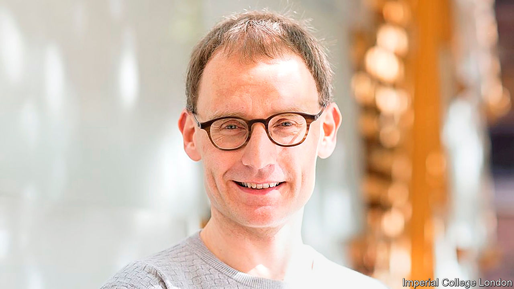

## Scientist and politics

# Britain’s government says it is “following the science”. Which science?

> Scientists deal in uncertainty, politicians prefer not to. Amid the pandemic, the two are not mixing well

> May 9th 2020

Editor’s note: The Economist is making some of its most important coverage of the covid-19 pandemic freely available to readers of The Economist Today, our daily newsletter. To receive it, register [here](https://www.economist.com//newslettersignup). For our coronavirus tracker and more coverage, see our [hub](https://www.economist.com//coronavirus)

WATCHING THE great and good trip up is a popular British spectator sport, and the lockdown offers a variety of banana skins which may bring eminent people down. First to tumble was Catherine Calderwood, who resigned as Scotland’s chief medical officer after twice breaking restrictions to visit her second home. This week it was the turn of Neil Ferguson (pictured), an epidemiologist whose bleak modelling spurred on Britain’s lockdown. He will no longer advise the government after flouting the rules by having his lover visit. The newspaper headlines were merciless. “Prof Lockdown broke lockdown to get his trousers down,” read the Sun’s splash.

The episode provides a fine example not only of Britain’s immature attitude to sex and scandal but also of the degree to which the covid-19 pandemic has thrust scientists into the spotlight. Eight weeks ago, hardly anybody had heard of the man whose extra-curricular activities graced the newspapers’ front pages; today, whether he likes it or not, “Prof Lockdown” is a public figure.

The roles of the government’s chief scientific officer and chief medical officer are normally “backstage jobs”, says James Wilsdon of Sheffield University, who has had trouble tracking down pictures of former office-holders with prime ministers for his lectures. Yet the incumbents—Sir Patrick Vallance and Chris Whitty, respectively—are now household names. They flank the prime minister at press conferences; Dr Whitty fronts public-information advertisements. The editor of the Lancet, a medical journal, pops up on television panels. And everybody seems to have a view about SAGE, the acronym for the government’s scientific advisory group for emergencies.

The closeness of the new relationship between science and politics has created three problems. First, as Dr Ferguson found to his cost, scientists who get drawn into politics are exposed to new dangers. There’s a good reason why governments should want to put them into the front line: polling by Ipsos MORI finds that more than four in five Britons trust professors and scientists, compared with fewer than one in five who put their faith in government ministers. But some scientists worry that the government’s mantra that it is “following the science” is an attempt to deflect blame. Sir David King, a former chief scientific adviser, has said he is “a little worried the ministers are setting the scientists up to be the fall guys”. If they fall, as Dr Ferguson has, the public interest will be damaged along with theirs.

Second, science and politics operate best under different conditions. While science needs transparency to progress, policymaking requires a certain amount of opacity. SAGE’s membership and processes have been kept secret, though on May 4th the government reluctantly, under pressure, published a list of all but two of its members. Sir David, arguing that science is best done in sunlight, set up his own rival group, the “independent sage”, which streams its meetings on YouTube.

Third, the government’s mantra implies a consensus about “the science” that points towards a single policy choice. Yet covid-19 has spread so fast that none of the important questions about it have been settled. Estimates of the proportion of the population infected range widely. It is hard to be definitive about the rate at which the disease reproduces, even though this number is pivotal to policymaking. There are even competing death tolls. Do you consider all excess deaths or only those strictly attributed to covid-19? Evidence can be found for many different policy responses. “In the absence of sufficient data and scientific consensus, people are going to use their judgment,” says Kieron Flanagan of Manchester University.

Scientists are accustomed to talking about ranges and living with uncertainty. The public might find that harder. As the first meeting of Sir David’s online committee got going, commenters were enthusiastic about “this effort to disseminate the science, rather than the spin”. But, once it became clear that the panellists had differing views and were not about to offer up a ready-packaged solution, the tone changed. “Please Mr Modeller!” went one comment. “Just answer the questions.”■

Dig deeper:For our latest coverage of the covid-19 pandemic, register for The Economist Today, our daily [newsletter](https://www.economist.com//newslettersignup), or visit our [coronavirus tracker and story hub](https://www.economist.com//coronavirus)

## URL

https://www.economist.com/britain/2020/05/09/britains-government-says-it-is-following-the-science-which-science
