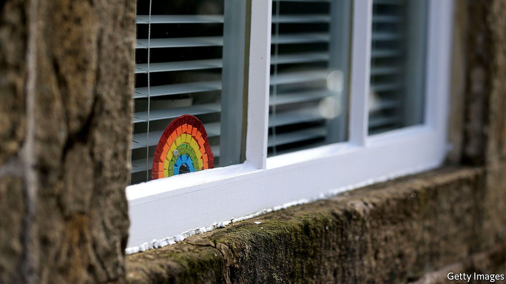

## Children at risk

# How covid-19 puts vulnerable children in greater danger

> The lives of vulnerable children have got harder. So has the job of protecting them

> May 9th 2020

Editor’s note: The Economist is making some of its most important coverage of the covid-19 pandemic freely available to readers of The Economist Today, our daily newsletter. To receive it, register [here](https://www.economist.com//newslettersignup). For our coronavirus tracker and more coverage, see our [hub](https://www.economist.com//coronavirus)

IN NORMAL TIMES Chris, a social worker in a north London borough, visits the homes of vulnerable children, checking the fridge for food, looking for evidence of drugs or excessive drinking and otherwise being the eyes of the state. Now he has to try to gauge the condition of a household over a ropy internet connection. “It’s been an extraordinarily steep learning curve,” he says. “When you’re relying on a video call, things can easily be hidden.” A child who appears to be alone may not be. A violent partner may just step outside. Illicit substances can be locked away.

The number of children in the care of the state has been rising for over a decade, as the government becomes more cautious about leaving vulnerable children exposed to potential harm. Around 400,000 children have an assigned social worker, meaning that the state is worried enough about their welfare to want to check on them frequently. According to the Children’s Commissioner, 723,000 are receiving some sort of protection and 2.3m are “living with risk”.

Lockdown affects nearly everyone, but those least vulnerable to the actual virus—children—may be among the most exposed to the consequences of being shut in, especially if they are poor. With families cooped up, often in overcrowded homes, the likelihood of violence or abuse soars. Calls to the government’s domestic-violence hotline have jumped by half.

The government is trying to mitigate the effect of lockdown on vulnerable children by keeping school places open for them. That has not happened elsewhere in Europe. But the message to stay home has swamped the message that some children should still go to school, says Anne Longfield, the children’s commissioner. At the beginning of this term, just one in 20 eligible to attend actually turned up.

Since the support and vigilance that schools offer vulnerable children has been withdrawn, some big urban councils are not willing to take the risk of leaving them in potentially dangerous situations. Applications for children to be removed from their homes have therefore jumped, according to Ms Longfield.

But lockdown is hampering the process of taking children into local authority care. Court hearings have to take place by telephone. Removing a child with evidence given over the phone was “unimaginable in pre-covid days”, says Aysen Soyer, a solicitor who deals with many child-protection cases. It is happening now.

Yet making such huge decisions remotely is not easy. On April 16th Andrew McFarlane, the president of the family division of the courts, issued a judgment in a complicated case involving a seven-year-old girl where the local authority alleges that the mother has harmed her daughter by fabricating illnesses. Mr McFarlane ruled that while delaying the decision would not be good for the girl, he feared it would be “impossible” to come to a fair decision remotely, with a judge having to decide about the parties’ honesty based on a “postage-stamp image” on a screen. Some lawyers feared that would stop hearings entirely. For now they are continuing, but judges are forced to weigh the fairness of remote proceedings on top of everything else. Covid-19 has made both the lives of vulnerable children and the job of protecting them much harder.■

Dig deeper:For our latest coverage of the covid-19 pandemic, register for The Economist Today, our daily [newsletter](https://www.economist.com//newslettersignup), or visit our [coronavirus tracker and story hub](https://www.economist.com//coronavirus)