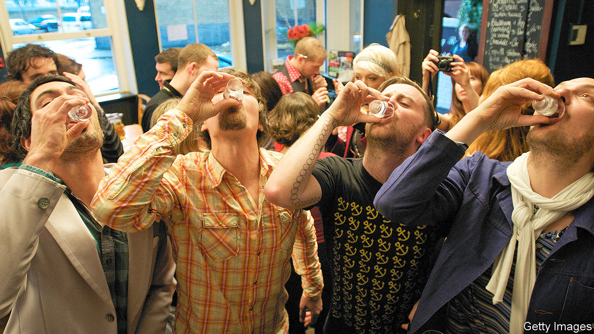

## First orders

# How pubs, cinemas and shops will reopen

> Non-essential businesses are making plans to reassure customers

> May 9th 2020

Editor’s note: The Economist is making some of its most important coverage of the covid-19 pandemic freely available to readers of The Economist Today, our daily newsletter. To receive it, register [here](https://www.economist.com//newslettersignup). For our coronavirus tracker and more coverage, see our [hub](https://www.economist.com//coronavirus)

STREAMING SERVICES have replaced the cinema. Online shopping is standing in for the high street. Restaurant food is being home-delivered. And the ol’ Horse and Groom has become the Horse and Zoom, as people take to video-chatting with friends while sipping from a can of lager. It is, pub-goers have discovered, a poor substitute for the real thing. As Nick Mackenzie of Greene King, which runs 2,700 pubs, puts it: “The point of the pub is to socialise.”

The boozer was among the first casualties of Britain’s lockdown, with pubs ordered to close three days before the rest of the country. Along with other non-essential leisure venues, they will probably be the last to reopen, too. Evidence from countries now opening up suggests that such businesses will have to wait a few weeks longer than everyone else. Those in Britain are using the extra time to plan how to operate when they are allowed to welcome customers once more.

The task is particularly tricky for publicans. The very social-distancing measures that save lives also kill the vibe: nobody wants to go to an empty pub. Larger pubs are planning to space out tables, reduce the number of occupants and offer takeaway pints and roasts. Independent pubs can start selling other things, such as groceries. One, the Red Lion in Ealing, is already offering Italian cheese, olives and ham, as well as sourdough breads. Those of all sizes will have to make a show of good hygiene. Expect regular table-wiping and digital ordering to replace germy paper menus.

Consumers are likely to hit the high street before the pub. Primark, a big clothes retailer with no online shop, is installing hand-sanitiser stations and Perspex screens to separate staff from customers at the tills. The layout of its shops is being tweaked to discourage people from lingering at high-traffic spots. “The government can give regulations. I think you go beyond...The thing that we’re looking at is reassurance,” says John Bason of Associated British Foods, which owns Primark. The hand sanitiser, for instance, is not merely plonked onto tables but installed in solid-looking fixtures.

Perhaps the unlikeliest leisure business preparing to reopen is the cinema. Pubs can space tables farther apart and shops can allow in fewer customers. But going to the cinema means spending hours in a small, enclosed space, breathing the same air as others. That does not faze Tim Richards, who runs Vue, a chain of cinemas. “I think what’s important to recognise is that our occupancy rate tends to be around 20%, so for us to manage our customers coming in is relatively easy to do.”

Mr Richards’s plan is to stagger screening times in a cinema’s different auditoria, with no two films starting at the same time, so as to stop people hanging around together buying popcorn. Ticketing systems will ensure that any booking—whether for a couple or a family of five—is surrounded by empty seats. Vue will open cinemas gradually, once it is allowed to, with the formal reopening on July 17th planned for the release of Christopher Nolan’s “Tenet”, a film in which a secret agent must save the world. At the very least, he might help save the cinema. ■

Correction (May 8th 2020): A previous version of this article incorrectly stated that UK cinema attendance has diminished in recent years. In fact, it peaked in 1946, bottomed out in 1984, and has risen since. Apologies.

Dig deeper:For our latest coverage of the covid-19 pandemic, register for The Economist Today, our daily [newsletter](https://www.economist.com//newslettersignup), or visit our [coronavirus tracker and story hub](https://www.economist.com//coronavirus)