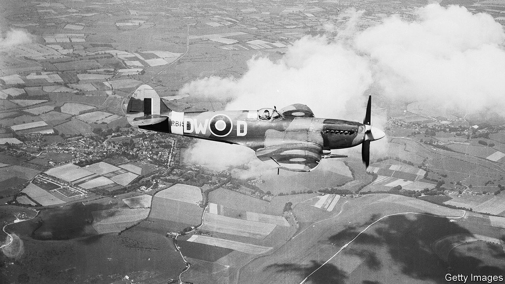

## The press

# How the pandemic revived the newspaper stunt

> Patriotism is fertile ground for an ancient form of journalism

> May 7th 2020

AFTER WEEKS of criticism of the government’s failure to organise enough personal protective equipment for health workers, a plane from China touched down at Heathrow Airport on April 28th with 20 tons of the stuff. But these were not government-ordered supplies; the consignment had been arranged by the Daily Mail, a newspaper that ministers have long credited as the authentic voice of Middle England. “Touchdown for Mail Force One,” roared the paper, above pictures of its precious cargo. More supplies will be procured thanks to donations from readers to a charity founded by the newspaper, Salesforce, a software firm, and Marshall Wace, a hedge fund.

The airlift is a classic example of journalism as spectacle. The Rothermere family’s publishing empire, which owns the Mail, started life with a 19th-century newspaper called Answers that promised to give away £1 a week for life to a reader who could guess the exact amount of bullion in the Bank of England’s vaults, points out Adrian Addison, author of “Mail Men”, a history of the paper. (Sapper C.D. Austin of the Ordnance Survey came within £2 and “married on the proceeds”.) Given the proud place of stunts in the firm’s history, it is no surprise that the current Lord Rothermere sits in on the daily video calls to co-ordinate the campaign.

Stunts have grown rarer lately, as circulations and budgets have dwindled, but they sit comfortably with the pandemic’s patriotic atmosphere. The Mail trumpeted the delivery of protective kit to a care home putting on an anniversary party for war veterans: “Mail Force saves VE Day for heroes”. The paper is also marking the 75th anniversary of the end of fighting in Europe, on May 8th, by chartering a Spitfire. Readers nominated a care home for the flypast. But tabloid stunts sometimes stray from patriotism to xenophobia. One such wheeze involved sending “a platoon” of models to Germany to protest at claims that English tourists hogged sun-loungers. “The Sun invades Germany,” ran the headline.

This latest spectacle is also in keeping with the emotive nature of the genre. The Mail orchestrated an airlift of 99 orphans from Vietnam in 1975. Cute animals are regular protagonists. In 2017, the Sun intervened to “rescue” two military dogs that were due to be put down. Perhaps the apex of the genre came in 1987, when the Sun paid a Spanish farmer for his donkey, which had attracted sympathy in Britain after reports that it would be crushed to death during a fiesta. A reporter from the Daily Star, another tabloid, tracked the animal down, paid the farmer again and shipped the donkey back to Britain. Reprising its rival’s most famous headline, the paper’s front-page splash read simply: “Gotcha!”