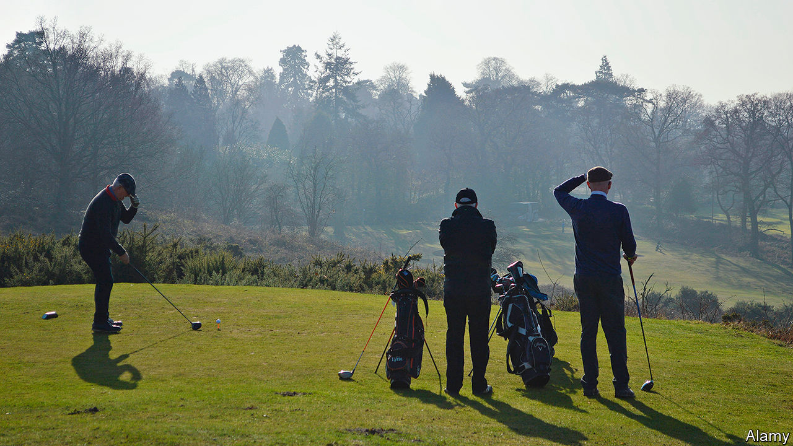

## Conservative Party

# Lockdown is making the Tory party restive

> MPs are climbing the walls

> May 9th 2020

Editor’s note: The Economist is making some of its most important coverage of the covid-19 pandemic freely available to readers of The Economist Today, our daily newsletter. To receive it, register [here](https://www.economist.com//newslettersignup). For our coronavirus tracker and more coverage, see our [hub](https://www.economist.com//coronavirus)

IF A COMMITTEE were to design a policy with the aim of offending the Conservative Party, it might come up with something resembling Britain’s lockdown. In its bones the party believes that law-abiding Britons should be free to go for an evening walk without explaining themselves to a police constable, or downloading a surveillance app on their mobiles. Public health is a matter for citizens’ good judgment, not bossy officials. The state should not, as a rule, negotiate with trade unions to pay wage subsidies, or hand grants to stricken businesses. “All the wrong people are cheering,” says a Tory MP, noting the Labour Party’s support for the lockdown.

The party’s most loyal supporters are feeling the pain. Small businesses’ revenues are collapsing. Healthy over-70s with busy social calendars are classified as “clinically vulnerable”, and may face a longer period of social distancing. Golf courses and garden centres are shut.

On May 4th MPs got the chance to air their grievances in a House of Commons debate called to approve lockdown legislation retrospectively. Marcus Fysh, dialling in on Zoom, a video-conferencing app, argued that the government must not set a precedent that health trumps liberty, which he insisted was “fundamental to our very souls”. Sir Charles Walker warned of mass unemployment that would “unleash a tidal wave of human misery”. Many are concerned about the toll from delaying treatment for other diseases. Iain Duncan Smith, a former party leader, urged Boris Johnson not to delay opening up until a contact-tracing app is ready.

But the prime minister, who is expected to outline plans to end lockdown on May 10th, worries that moving too fast will cause a surge in infections. He is in a powerful position. He has a majority of 80, seeks a Brexit to backbenchers’ liking and is popular with the party. Polls suggest voters approve of his performance in the crisis and think it too early to lift restrictions.

It is not the first time Mr Johnson has found himself at odds with large sections of his party. Since he became leader last summer, he has sought to reinvent the party after a decade in government and infighting over Brexit. He has purged pro-European MPs and adopted a big-spending, communitarian agenda. The scale of his victory in the general election last December suggests that voters approve of the makeover. But internal dissent remains. Mr Johnson’s decision in January to allow Huawei, a Chinese telecoms company, a role in building Britain’s 5G network prompted a small rebellion of MPs who want to ban the company over national-security concerns. In February he approved the High Speed 2 railway, which plenty of Tories think is wasteful and will spoil the countryside.

The longer parties stay in power, the less pliant they become, notes Philip Cowley, a politics professor at Queen Mary, University of London; and a mere change in prime minister does not overcome that tendency. “You have all the resentments and the grumbles, and just the tiredness building up of being in office.” There is some overlap between critics of the lockdown, the veteran Eurosceptics who ousted Mrs May and the Huawei rebels. Some are old foes of Dominic Cummings, Mr Johnson’s combative aide. The backbenches are home to many unconstrained by ambition because they know their time in ministerial office has been and gone, or will never come.

The virtual parliament makes party management still trickier. Tea-room chats allow ministers to counsel dissenters and detect trouble. Some think the government risks losing votes if businesses are still shuttered by June. “It will take longer for a rebellion to come into being, but it will be harder to suppress, if the whip’s not there to grab you by the elbow,” says an MP.■

Dig deeper:For our latest coverage of the covid-19 pandemic, register for The Economist Today, our daily [newsletter](https://www.economist.com//newslettersignup), or visit our [coronavirus tracker and story hub](https://www.economist.com//coronavirus)

## URL

https://www.economist.com/britain/2020/05/09/lockdown-is-making-the-tory-party-restive
