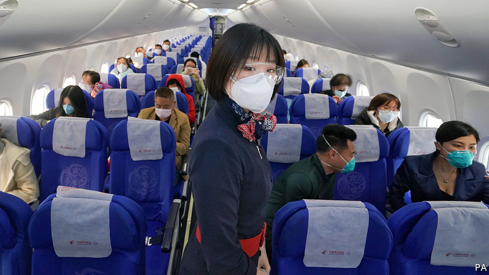

## Eyeing the sky

# Chinese carriers restart their engines

> If they recover at home, they could threaten the world’s sickly legacy carriers on international routes

> May 7th 2020

Editor’s note: The Economist is making some of its most important coverage of the covid-19 pandemic freely available to readers of The Economist Today, our daily newsletter. To receive it, register [here](https://www.economist.com//newslettersignup). For our coronavirus tracker and more coverage, see our [hub](https://www.economist.com//coronavirus)

NEWS FOR the world’s airlines goes from bad to worse. In April the International Air Transport Association, their trade body, forecast the industry’s global revenues would fall by $314bn in 2020, down by 55% from last year, owing to pandemic-related travel disruptions. Carriers are laying off thousands of workers. In a vote of no-confidence on their future, on May 2nd Warren Buffett said Berkshire Hathaway, the venerated investor’s conglomerate, had dumped all the shares it owned in American airline firms. Skies in one part of the world, though, look a bit less bleak. The aviation industry in China, where covid-19 was first detected, may have the worst behind it.

The pandemic curve began to flatten in China weeks before the rest of the world entered lockdown. As curbs on internal travel ease and offices reopen, domestic flights are regaining lost ground (see chart). In the first week of May, a holiday in China, capacity was scheduled to be only 10% lower than in the same period a year ago, estimates the CAPA Centre for Aviation, a consultancy. In America, meanwhile, it was 73% lower. As Western rivals slash flights, China Eastern this month claimed the title of the world’s biggest airline by current seat capacity, according to OAG, an aviation-data firm.

Doubters allege that Chinese firms are flying empty planes to boost stated capacity artificially. Yet (self-reported) data from China’s three biggest firms—Air China, China Southern and China Eastern—indicate that the “passenger load factor”, a measure of efficiency, averaged 68% in the first quarter, down from 80-85% in 2019 but still respectable. Spring Airlines, a private low-cost carrier from Shanghai, reported a load factor of 73% in the first three months of 2020. In a sign of bullishness Spring added or restored 47 domestic routes on May 3rd.

To be sure, Chinese carriers have taken a big hit. Revenues at the big three plunged by 46% in the first quarter, year on year, to 54bn yuan ($7.7bn). They suffered a combined net loss of 14bn yuan. Their share prices remain 25% or so below the level in January, when covid-19 began to spread fast in the city of Wuhan. But that is positively perky next to rivals elsewhere. The Bloomberg world airlines index, which tracks two dozen global airlines, has fallen by half in the same period.

Kelvin Lau of Daiwa Capital Markets, a broker, reckons that travel bans and lockdowns will cut the big three’s revenues by less than a third this year, to 286bn yuan. None has resorted to mass lay-offs. The trio serve the world’s second-biggest domestic market after America and, being state-controlled, can tap government support with fewer strings attached than American firms (whose $58bn bail-out is conditional on suspending payouts to shareholders).

How quickly Chinese air travel returns to pre-pandemic health remains up in the air. A second wave of infections could ground them again. But one thing seems assured: the big three, which accounted for 41% of domestic capacity in 2019, down from 59% in 2010, according to Cirium, a data provider, will reassert their dominance. As firms rush to boost capacity to protect market share, load factors may stay depressed, putting pressure on weaker ones such as Hainan Airlines, China’s fourth-biggest (which last month sought to delay payment on 750m yuan in maturing bonds). And if, as seems likely, a strong recovery at home coincides with continued deterioration of the world’s legacy carriers, the Chinese state-run giants could grab a bigger slice of international routes, too. ■

Dig deeper:

For our latest coverage of the covid-19 pandemic, register for The Economist Today, our daily [newsletter](https://www.economist.com//newslettersignup), or visit our [coronavirus tracker and story hub](https://www.economist.com//coronavirus)

## URL

https://www.economist.com/business/2020/05/07/chinese-carriers-restart-their-engines
