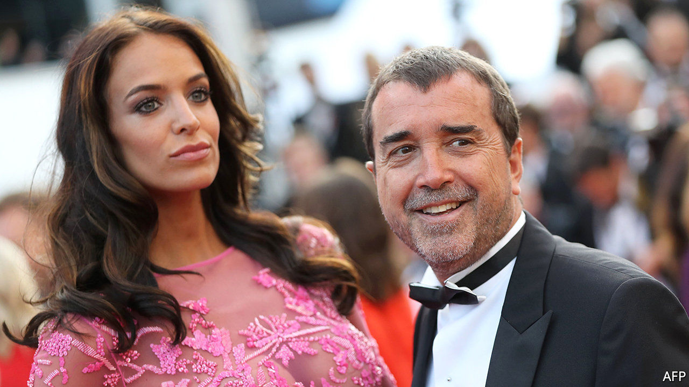

## Reargardère action

# The French establishment closes ranks to help Lagardère

> A fallen star of corporate France survives an Anglo-Saxon assault—for now

> May 9th 2020

SHAREHOLDER BATTLES pit managers against investors at crowded annual meetings. Amid covid-19 the one between the bosses of Lagardère, an ailing conglomerate, and a few irate owners happened largely behind closed doors. On May 5th an activist hedge fund’s bid to topple the scion running the erstwhile blue chip was foiled by l’establishment. The reprieve may prove short-lived.

Not even hardened habitués of Parisian society galas can defend the track record of Arnaud Lagardère. His father, Jean-Luc, an industrialist of the old school, deftly navigated the couloirs of power to build an empire spanning media, publishing and defence. His death in 2003 left the group in the hands of his only son. Now 59, and having married a Belgian model, Arnaud is more frequently seen in gossip pages than the business ones.

Lagardère fils lacks his father’s touch. Some units, like the Hachette publishing arm, have fared decently. But his big idea was to sell the group’s 15% stake in what is now Airbus (created in part with Lagardère assets) in 2006 and 2013, and reinvest the proceeds in glamorous ventures like sports. The Airbus stake alone would now be worth over €6bn ($6.8bn), three times Lagardère’s market value. The group crashed out of the CAC 40 index of leading French firms a decade ago. 

A London hedge fund argued fresh leadership could boost returns. Amber Capital built an 18% stake, bigger than the 7% owned by Mr Lagardère, whose grip is aided by an antiquated corporate structure that blends a partnership with limited liability. The besieged heir called on some powerful pals, even co-opting Nicolas Sarkozy, a former French president, to the board. A state-run fund with a 3% holding also backed him.

Mr Lagardère’s position may not be safe for long. A firm controlled by Vincent Bolloré, a French tycoon, last month took an 11% stake in the group. Mr Bolloré has a knack for coming in as a white knight before turning hostile. Mr Lagardère has won his battle against Amber. He may lose the war for control.