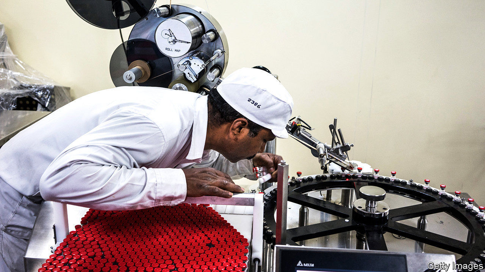

## Convalescent

# The pandemic is a chance to revamp India’s pharmaceutical industry

> Companies could switch from primarily making generics to producing higher-margin licensed drugs

> May 9th 2020DELHI

Editor’s note: The Economist is making some of its most important coverage of the covid-19 pandemic freely available to readers of The Economist Today, our daily newsletter. To receive it, register [here](https://www.economist.com//newslettersignup). For our coronavirus tracker and more coverage, see our [hub](https://www.economist.com//coronavirus)

NOTHING IN YUSUF HAMIED’S 60 years at Cipla, an Indian drugmaker where he is chairman, prepared him for covid-19. Production at its 30 plants fell by 70% nearly overnight in March as India’s government ordered a lockdown that made it hard for its 23,000 employees to work. Critical inputs, from packaging to active ingredients, became scarce. The price of some sourced from China shot up five-fold.

A month on things are looking up. Cipla’s output is still half its pre-crisis levels; operations in hard-hit Mumbai remain curtailed. But a factory in the north-eastern state of Sikkim is fully staffed. The firm ferries employees to work in sanitised (and uncrowded) buses. Basic supplies are available again, and the premium charged by Chinese sellers has narrowed to 10-20%.

That is good news—and not just for Mr Hamied’s firm, or indeed his country, which has largely avoided drug shortages thanks to Cipla and its fellow pharma firms. The world relies on their health. Their revenues amounted to $40bn in 2019, half of it from exports. They produce one-tenth of all pharmaceuticals by volume, including 50% of the world’s vaccines, 40% of generics sold in America and a quarter of all medicine bought in Britain. Visitors from Africa leave India with suitcases stuffed with cheap pills.

Indian pharma was not in great shape going into the pandemic. Revenue at big firms is expected to grow by 5% this year, down from 18% in 2016, shortly after their share prices peaked as Western countries swallowed their cheap me-too pills by the millions. Since then fierce competition has eroded the already-slim margins firms could earn on generics. Prices of drugs sold by Indian firms declined by 8% in 2018 and 5% in 2019, estimates McKinsey, a consultancy. Quality concerns led America’s Food and Drug Administration to issue “import alerts”, which block products’ distribution, for 15 Indian firms in 2019 and 2020.

Fears of rising costs and depressed sales, as patients and hospitals everywhere limited non-covid treatments, have added to the existing concerns. Yet the coronavirus may be an inflection point for the industry, if it shows it can rapidly produce huge volumes of coronavirus drugs.

There is evidence that it can. Indian firms, including Cipla, have begun making favipiravir, an antiviral drug developed by the drugs arm of Japan’s Fujifilm, which has shown promise in treating covid-19. Last month Serum Institute of India, the world’s biggest vaccine-maker, broke with standard practice and announced it was producing 40m-50m doses of a vaccine developed by researchers at Oxford University before human efficacy trials have even started. On May 5th the Indian press reported that Gilead, an American firm whose drug called remdesivir has received emergency approval in America for treating coronavirus infections, was in advanced talks with four domestic firms—Cipla, Dr Reddy’s Laboratories, Jubilant Life Sciences and Strides Pharmaceuticals—to produce it.

Mr Hamied expects more tie-ups as the merits of co-operation become evident. So, it seems, do investors—who also predict collaboration might prove lucrative. Indian drugmakers’ share prices have gone on a tear. An index of big ones is up by 43% since the lockdown began in mid-March amid a stockmarket meltdown in India.■

Dig deeper:For our latest coverage of the covid-19 pandemic, register for The Economist Today, our daily [newsletter](https://www.economist.com//newslettersignup), or visit our [coronavirus tracker and story hub](https://www.economist.com//coronavirus)

## URL

https://www.economist.com/business/2020/05/09/the-pandemic-is-a-chance-to-revamp-indias-pharmaceutical-industry
