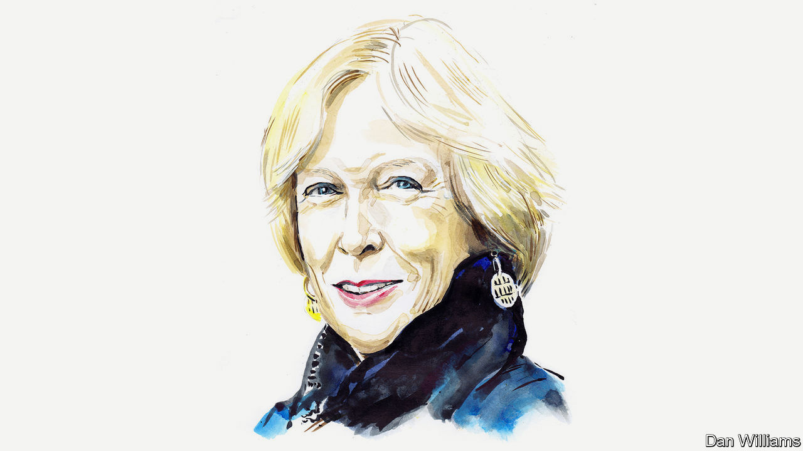

## The world after covid-19

# Margaret MacMillan on covid-19 as a turning point in history

> The pandemic exposes our weaknesses and strengths. How the story unfolds will depend on leaders

> May 9th 2020

Editor’s note: The Economist is making some of its most important coverage of the covid-19 pandemic freely available to readers of The Economist Today, our daily newsletter. To receive it, register [here](https://www.economist.com//newslettersignup). For our coronavirus tracker and more coverage, see our [hub](https://www.economist.com//coronavirus)

IN THE WINTER of 1788-89, the desperate government of Louis XVI asked the French people to send in lists of their grievances. It was a fatal mistake. The cahiers de doléances served to articulate the public’s unspoken discontent and, equally important, its hopes for a better world. A crucial psychological barrier had fallen: it became possible to imagine a very different France. And the times—the moral and actual bankruptcy of the Ancien Régime, widespread crop failures and hopeless leadership—gave shape to the public’s aspirations. The fuse was lit for revolution.

France in 1789. Russia in 1917. The Europe of the 1930s. The pandemic of 2020. They are all junctures where the river of history changes direction. The covid-19 crisis may be a pivotal rather than a revolutionary moment but it, too, is challenging the old order. Like France’s cahiers, the coronavirus forces questions about what sort of future we want, what the proper role of government is and what makes a healthy society. We face a choice: to build better ways of dealing domestically and internationally with this challenge (and prepare for inevitable future ones) or let our world become meaner and more selfish, divided and suspicious.

Long before covid-19, popular thinkers like Thomas Piketty, the late Tony Judt and Paul Krugman were warning about deep social inequalities and the shortcomings of globalisation. There were sporadic protests like Occupy Wall Street or France’s gilets jaunes. Most of us (such is human nature) carried on living. We worried from time to time about climate change, that our children couldn’t afford houses and that there seemed to be more obscenely rich people along with more homeless ones. Covid-19 has turned a spotlight on the dark sides of our world. We have become aware of the fragility of international supply lines, the disadvantages of offshore sources for critical goods and the limits of international bodies. The chaotic responses and blame games of certain governments have exacerbated divisions in and among societies, perhaps permanently. America has withdrawn from moral and material leadership of the world. It and China have grown more hostile to one another, not less. Rogue states such as Russia gleefully make more trouble and the UN is increasingly marginalised.

When you name things—grievances, say, as the French did—you give them form and make it harder to ignore them. We are doing that now with the flaws in our world and spelling out our hopes for something better. As the French looked at Britain and America as models, we can see that South Korea, Denmark and New Zealand have controlled the pandemic more effectively than other countries, in part because their peoples have faith in the authorities and each other. Without trust—that the water is clean, medicines are safe, or thugs won’t get away with it—societies are vulnerable. Covid-19 has caused fewer deaths proportionately in Germany than elsewhere because of the country’s well-funded health system and its competent state and federal governments. As history shows, those societies that survive and adapt best to catastrophes are already strong. Britain rose to the challenge of the Nazis because it was united; France was not and did not.

Much also depended then, and depends now, on leaders. As weaknesses are exposed, do leaders fix or exploit them? While Franklin Roosevelt was promising Americans a better tomorrow in the 1930s, Adolf Hitler was destroying the Weimar Republic and intoxicating Germans with promises of revenge for the Treaty of Versailles. As we know, that ended in a world war.

For every Jacinda Ardern or Angela Merkel, the leaders of New Zealand and Germany who are talking to their citizens about the difficult road ahead, there is an illiberal, populist demagogue playing to baser fears and fantasies. In Brazil President Jair Bolsonaro dismisses covid-19 as “the sniffles”; in India the ruling Bharatiya Janata Party blames it on the Muslims. President Donald Trump claimed he had “total” authority, demonstrating something about his instincts if not his knowledge of the American constitution.

Wise leaders in the past have been able to steer away from danger. In 1830 Britain was coping with unrest in Ireland, violent strikes at home and demands for more power from the growing commercial and industrial middle classes. The enlightened aristocrats of the new Whig government believed that they had a choice between revolution and reform, even if the latter was at the expense of their own power and privilege. In 1832 their Great Reform Act widened the franchise for Parliament. The Whigs did not remove all grievances, but they muted them. A century later another child of privilege, Roosevelt, brought in the New Deal which helped to save American society and capitalism.

The present crisis could be the opportunity for strategies to produce essential public goods and ensure that citizens have safe, decent and fulfilled lives. People coming out of a calamity are open to sweeping changes. Governments will find it hard to resist demands for improved social programmes now that they are spending as though John Maynard Keynes were in the room. Will the British again accept an underfunded National Health Service? And countries could invest in key organisations like the World Health Organisation and give it greater power to protect the world from disease. Perhaps, just perhaps, bodies such as the G7 and G20 could become forums for unity and not dissent.

Future historians, if there are any who can still research and speak freely, will analyse the choices that individual countries and the world made. Let us hope the story shows the better angels of our nature, in Abraham Lincoln’s words: enlightened leaders and publics creating together sane and inclusive policies, and strengthening our vital institutions at home and abroad. The alternative story will not have a happy ending. ■

Margaret MacMillan is a historian at the University of Toronto. This article is part of a series on the world after covid-19. For more coverage of the pandemic visit [Economist.com/coronavirus](https://www.economist.com/http://Economist.com/coronavirus)

Dig deeper:For our latest coverage of the covid-19 pandemic, register for The Economist Today, our daily [newsletter](https://www.economist.com//newslettersignup), or visit our [coronavirus tracker and story hub](https://www.economist.com//coronavirus)

## URL

https://www.economist.com/by-invitation/2020/05/09/margaret-macmillan-on-covid-19-as-a-turning-point-in-history
