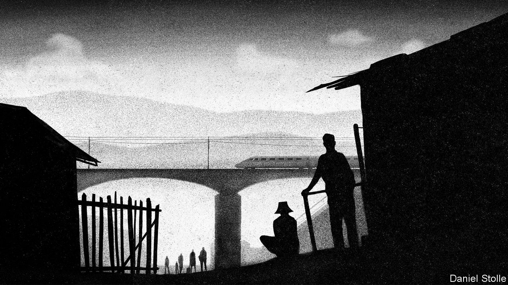

## Socialism’s precariat

# A slump exposes holes in China’s welfare state

> Amid the pandemic, the country’s poor are getting little help

> May 7th 2020SHANGHAI

CHINA OR AMERICA: which is the land of rugged self-reliance and which of the government handout? Judging by support for people on low incomes amid the coronavirus crisis, the answer is surprising. America has dramatically scaled up benefits for those out of work. Its federal stimulus has allocated an extra $600 a week to each jobless person—enough, on average, to replace 100% of lost income. The Chinese government, meanwhile, has given an extra 12 yuan ($1.70) a week to its poor. That is enough for a daily bowl of noodles.

Those on the margins in China have no choice but to fend for themselves. Lei Yankun was stuck for three months in Hubei province, where the coronavirus outbreak began. Unable to return to his job at an electronics factory, he topped up his savings by harvesting bamboo shoots in the mountains. Li Quanyou, a grey-haired construction worker, went to Shanghai in search of work, but after three fruitless weeks took a 16-hour train ride home, carrying his clothes in a large plastic bucket, to wait out the downturn. Miao Wenjiang, a driver in Anhui province, eliminated his one luxury—weekly meals for his family at KFC—as his earnings dwindled.

The economic pain that China is suffering as a result of covid-19 is common to many countries. What makes it unusual is the contrast between China’s world-class physical infrastructure—featuring, among other things, the longest high-speed rail network—and its badly lagging soft infrastructure, with a social safety-net akin to those of much poorer countries.

Analysts often point out that China’s official unemployment rate (currently 5.9%, up just slightly from last year) understates the problem, since it only captures full-time urban residents. Economists from UBS and Société Générale think that, by broader measures, as many as 80m might have been out of work in March. That is nearly 20% of the urban workforce. Yet the more salient point is how few of the unemployed receive any help from the government. According to the human-resources ministry, just 2.3m people are on the dole. There are, in other words, upwards of 78m people who are out of a job and are receiving no benefits.

To be eligible for unemployment insurance, applicants must have worked under contract for a company that pays all required fees and taxes. That only describes about a quarter of China’s total workforce of 800m, according to government data. The rest typically work for small, private businesses without any formal contract, or on their family farms. For the lucky few who can get unemployment insurance, the payouts are meagre. Benefits are, by law, set at levels below already-paltry minimum wages. Those with nothing can apply for a guaranteed minimum income known as dibao. But this offers even less—about 600 yuan a month on average.

That Chinese welfare and unemployment benefits are so threadbare might seem odd for a country that prides itself on how well its poor have fared during the past four decades. The reason is partly historical. Before 1986 unemployment did not officially exist in China. Officials, schooled in Marxism, viewed joblessness as a defect of capitalism and were reluctant to accept that China might have such a problem. In more recent years, the government’s main strategy has been to stop unemployment before it occurs, by ensuring that enough jobs are created. Officials have unreservedly primed the pump whenever growth slows. This approach has been helped by the readiness of workers to adapt to changing demands for their labour. Mr Lei, the Hubei resident, has had stints in factories, as a salesman and as a security guard.

But China has refrained from stoking growth in response to the covid slump. It wants people to stay closer to home until the virus is vanquished. So the government is relying on its ultimate safety net, the countryside. Many of China’s nearly 300m migrant workers—those most likely to find themselves unemployed without benefits—have some combination of rural land, savings and family to fall back on. “I suppose the government expects migrants to rescue themselves. They can do so in the short term, but if this goes on much longer, many will fall into poverty,” says Li Shi, an economist at Zhejiang University. In surveys of villagers in seven provinces, researchers from Stanford University found that most had already started to reduce their spending on basic food items.

Calls are growing for more government action. Gan Li of Southwestern University of Finance and Economics, an expert on income inequality, has proposed, as a start, one-off cash transfers of 2,300 yuan to needy households. Mr Li of Zhejiang University would prefer an outright expansion of the dibao income guarantee, to cover more people and provide more cash. Fully replacing wages for the 80m unemployed for three months would amount to less than 1% of GDP—highly affordable. The State Council said last month that it would increase both unemployment and dibao benefits, but it has not given details.

The lack of support for the jobless is just one element of a social-security system that is lacking in nearly every dimension. Public spending on health care is, for instance, only about 2% of GDP, roughly half the average of other countries at China’s income level, according to the World Bank. Government expenditure on education and social assistance is also lower than the average among China’s peers.

One reason to help the needy is moral. But there are also economic arguments for greater social spending. It would deliver an immediate boost to growth. Returns on capital have declined steadily in China over the past decade. So the government is reluctant to stimulate growth by splurging on yet more railways and airports. The IMF reckons that well-designed investments in social security could have a similar effect.

It would also be consistent with what the government itself wants: growth driven more by consumption and less by pouring concrete. The lowest tenth of income earners in most countries often have no savings. In China they put aside roughly 20% of their earnings, an exceptionally high rate. One reason is that Chinese worry about having to provide for themselves in bad times. A stronger social safety-net would free people to spend more.

If the economic arguments are simple, the politics are more complicated—much as they are in the West’s debates about welfare for immigrants. The only difference is that in China, the migrants are not from abroad. Officials in China’s big cities worry that if they were required to deliver the full gamut of social services to all residents, including migrant workers, the fiscal burden would be crippling. Local authorities also fear that the promise of full benefits would attract more people from elsewhere.

For now they have ways to keep them at bay. On a sunny afternoon in late April, a graphic designer whose firm was in trouble visited a social-security office in Shanghai’s Hongkou district to ask about unemployment insurance. He had worked in the city for several years and his company had paid his payroll tax. But an official told him that he would have to go to his birth city in Jiangsu province, a couple of hours away by train, to apply and, if successful, collect his benefits. In Jiangsu, however, the payout would be lower than in Shanghai. “I might not bother,” he said. ■

## URL

https://www.economist.com/china/2020/05/07/a-slump-exposes-holes-in-chinas-welfare-state
