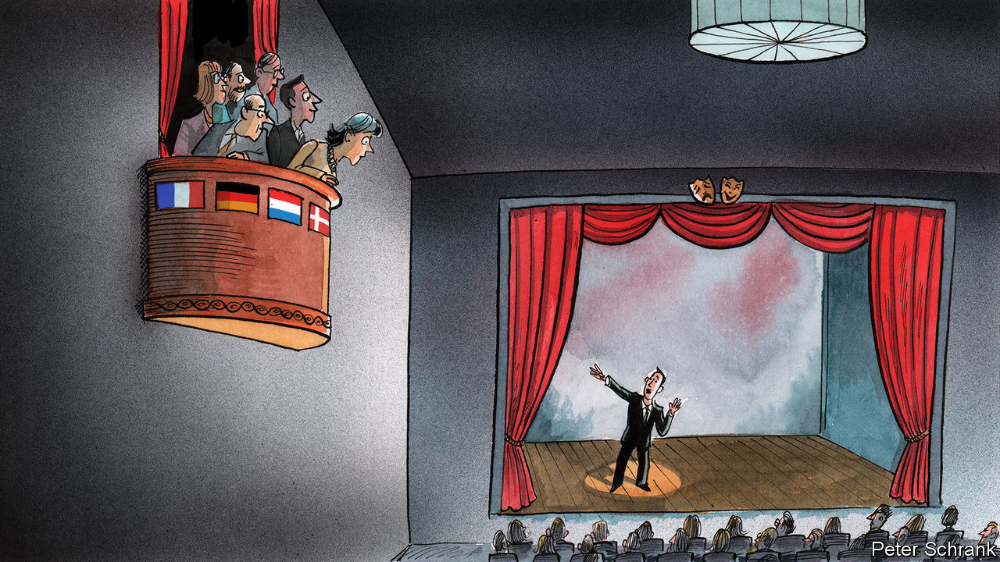

## Charlemagne

# European leaders are appealing directly to voters in other countries

> A bold attempt to create a pan-European conversation

> May 7th 2020

IN THE NASTY, brutish and short life of an Italian prime minister, an interview with a mid-market Dutch newspaper is not usually a high priority. Yet when faced with the worst health crisis in a century and the prospect of economic meltdown, Giuseppe Conte took time to speak to De Telegraaf about the crisis. In it, Mr Conte addressed the Dutch prime minister, Mark Rutte, in front of his voters: “Mark, help us now.”

European leaders are attempting to burst out of the corset of national politics. Increasingly, politicians across the EU are going over the heads of their peers and speaking to each other’s voters directly instead. A group of Italian mayors recently bought an advert in the Frankfurter Allgemeine Zeitung, calling for debt relief, with a punchy reference to Germany benefiting from similar leniency in the wake of the second world war. Pedro Sánchez, Spain’s socialist prime minister, writes op-eds in major European newspapers. Mr Conte also took time to address readers of the Süddeutsche Zeitung, a national newspaper based in Munich. Emmanuel Macron, the French president, deploys rhetorical hand grenades when speaking to the English-language press, in the hope the explosion will be heard beyond Francophone borders.

It is a potential solution to a long-running problem for the EU. The bloc suffers from the conundrum identified by Massimo d’Azeglio, one of the architects of Italian unification: “We have made Italy; now we must make Italians.” Increasingly, the EU is in a similar position. It is a de facto state without a nation. It is a top-down project, taking a bigger role when it comes to protecting borders, defence and foreign policy to go with its common currency and myriad regulations. What it lacks, like 19th-century Italy, is a coherent sense of citizenship. Instead, 27 sets of national politics collide with a half-built European political system.

If European leaders want to alter European public opinion, they must first create some kind of pan-European conversation. This is easier said than done. With 24 official languages, Europe does not speak with one voice. Public opinion, meanwhile, is siloed on a national basis. The decisions that matter most to European voters, whether tax or health or their children’s schooling, are still taken in national capitals. It is understandable that the bulk of attention of voters and journalists alike goes to matters at home. Even European elections to determine the make-up of the European Parliament are domestic politics by other means.

Some of the barriers to a truly European public opinion are falling. Google Translate is the closest mankind has come to a “Babel fish”, a leech-like creature invented by Douglas Adams in “The Hitchhikers’ Guide to the Galaxy” which translates all the universe’s languages if shoved in one’s ear. Even Estonian, the peculiar cousin of Finnish, is relatively well covered. With language barriers crumbling, the hurdle becomes persuading someone to read about European politics in the first place.

A Babel fish comes with downsides in Mr Adams’s telling: “By effectively removing all barriers to communication between different races and cultures, [it] has caused more and bloodier wars than anything else in the history of creation.” If anything, though, European politics could do with more metaphorical bloodshed. Although the critique of Vivien Schmidt, an academic at Boston University, that the EU offers “policies without politics” is unfair, the machinations of national leaders when in Brussels are often a little bloodless. The EU should arouse political passions. Decisions over the make-up of a €1trn ($1.1trn) recovery fund for those hit hardest by the covid crash will determine the fate of southern Europe’s economies. In such circumstances, an honest knife-fight in the press is surely better than a quiet stitch-up in Brussels.

Appealing to an embryonic European point of view is far from foolproof. During the Greek crisis such tactics were at the heart of Syriza’s attempt in 2015 to renegotiate a bail-out with its euro-zone partners. Rather than wooing the grey-suited men who dominated the club of euro-zone finance ministers, the left-wing leadership opted to fight a public-opinion war. Some journalists lapped up the narrative of a rebellion against an unfeeling empire, particularly when one of the main characters, Yanis Varoufakis, was a motorbike-riding skinhead who talked about economics in refreshingly plain English. There was no fairytale ending. Appeals to a sense of European rather than national democracy failed to move public opinion in, for instance, Germany. Syriza capitulated to the empire’s demands. Mr Varoufakis appearing in Paris Match, a celebrity gossip-sheet, was in retrospect not much help.

This time, the strategy has a better chance. Politicians in southern Europe have found a more sympathetic audience in foreign media than previously. A pandemic comes without the moral baggage of the euro crisis. The German press, which once revelled in caricatures of inflation-addicted Italians and siesta-taking Spaniards, has been more open to the ideas for getting out of the economic crisis put forward by their southern cousins. Both Der Spiegel, a centre-left news weekly, and Süddeutsche Zeitung have written in favour of some form of mutualised debt, which is a no-no for much of the German establishment and the holy grail for southern Europe. A genuinely European political debate is emerging.

Whether it will last is another matter. Interest in the life of the EU has peaks and troughs. When the EU appears on the edge, it dominates headlines. (An irony of Brexit was that the actions of the EU dominated British journalism in a way they seldom had before Britain decided to leave.) But when the EU sails through serene waters, journalists look for drama elsewhere. After this crisis passes, the audience may narrow again. Public opinion will keep its national boundaries while true power resides far from Brussels. The discourse may be increasingly European, but the voters who count are still as national as ever. ■