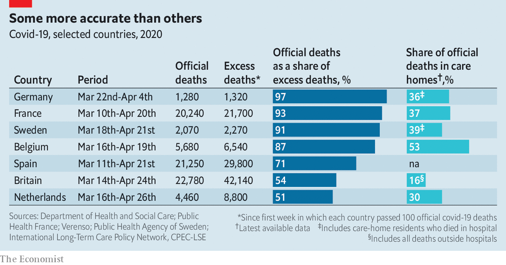

## Uncounted, unseen

# Many covid deaths in care homes are unrecorded

> Governments are waking up to a hidden calamity

> May 9th 2020PARIS

Editor’s note: The Economist is making some of its most important coverage of the covid-19 pandemic freely available to readers of The Economist Today, our daily newsletter. To receive it, register [here](https://www.economist.com//newslettersignup). For our coronavirus tracker and more coverage, see our [hub](https://www.economist.com//coronavirus)

AT A CARE home high in the hills above Cannes, on the French Riviera, the first report at the end of March was of 12 deaths. A week later, the toll had surged to 24. The town’s undertaker was overwhelmed. Families began to panic. By April 30th, 38 of the original 109 residents at the care home were dead, from confirmed or suspected covid-19. In care homes across France 9,471 deaths had been recorded by May 5th—nearly two-fifths of the country’s official covid-19 death toll.

This grim situation became apparent in France when it started publishing statistics for care-home deaths on April 1st. Britain, which began to do this four weeks later, is only now uncovering a similar calamity. When it first added care-home casualties, the official death toll jumped by almost 4,000 in a day. On May 5th the total in Britain, at 29,427, overtook Italy’s tally (which does not yet include them) to become Europe’s highest.

How many sinister, underreported aspects of the covid-19 outbreak might yet emerge in Europe? Due to reporting lags and varying death-certification procedures, all official data tend to undercount covid deaths. The best way to get a more accurate picture is to look at excess mortality, the gap between the number of overall recorded deaths and the historic average for the same period. The Economist has calculated excess mortality for some of Europe’s worst-hit countries, using, where possible, a five-year average (see chart). We also use this to calculate how well different countries are capturing the effect of covid-19 in their official data.

France, Sweden and Belgium seem to do the best job. (German numbers are not recent enough to make valid comparisons, and may be exaggerated by unusually low flu-related deaths earlier this year.) Their official covid-19 death tolls are picking up 87-93% of excess mortality. This partly reflects reporting protocols. Belgium includes suspected as well as confirmed covid-19 deaths. Indeed, three-quarters of covid-19-related deaths in its care homes have not actually been tested, according to Yves Coppieters, an epidemiologist at the Free University of Brussels. This gives tiny Belgium a big total relative to its population. Belgian officials were miffed when Donald Trump recently used a chart showing Belgium as the worst-affected country. A “vile” insinuation, commented Denis Ducarme, a Belgian minister. Even in Belgium, some criticise this approach as too speculative, but it may mean fewer nasty surprises later on.

“France and Belgium have been pretty exemplary in publishing data on suspected or probable deaths from covid-19 in care homes,” says Adelina Comas-Herrera, at the Care Policy and Evaluation Centre of the London School of Economics. From early April the French health ministry began to push testing into care homes, even if the roll-out has been uneven and painfully slow in places. This has helped to uncover a pattern that fairly well matches excess mortality as recorded by INSEE, the statistics body. Thanks to a fall during lockdown in other deaths, notably on the roads, total mortality in France has now dropped back to normal levels.

Contrast such relative transparency with official figures in the Netherlands. Its statistics on covid-19 deaths capture only 51% of estimated excess mortality. This is partly a measure of more restrictive recording. The national public-health institute includes in its tally only those who have tested positive. But Dutch figures also seem to capture poorly what is happening in its care homes. It has no systematic policy of testing there, and unco-ordinated data collection. According to a paper by Florien Kruse, Toine Remers and Patrick Jeurissen of the Radboud University Medical Centre, “deaths are underreported in nursing homes.”

As Europe begins to emerge from lockdown, those countries with a low or unreported share of covid-19 deaths in their care homes could well be in for a shock. Besides the Netherlands, Spain and Britain look particularly exposed. Spain in theory requires regional governments to provide figures. But, say Ms Comas-Herrera and her LSE colleagues, methodological problems mean that the health ministry has not yet released any national data on care-home deaths. As for Britain, the daily death toll in care homes is still rising, even as that in hospitals falls. Angela McLean, deputy chief scientific adviser, this week stated bluntly: “We need to get to grips with what is happening in care homes.” ■

Dig deeper:For our latest coverage of the covid-19 pandemic, register for The Economist Today, our daily [newsletter](https://www.economist.com//newslettersignup), or visit our [coronavirus tracker and story hub](https://www.economist.com//coronavirus)