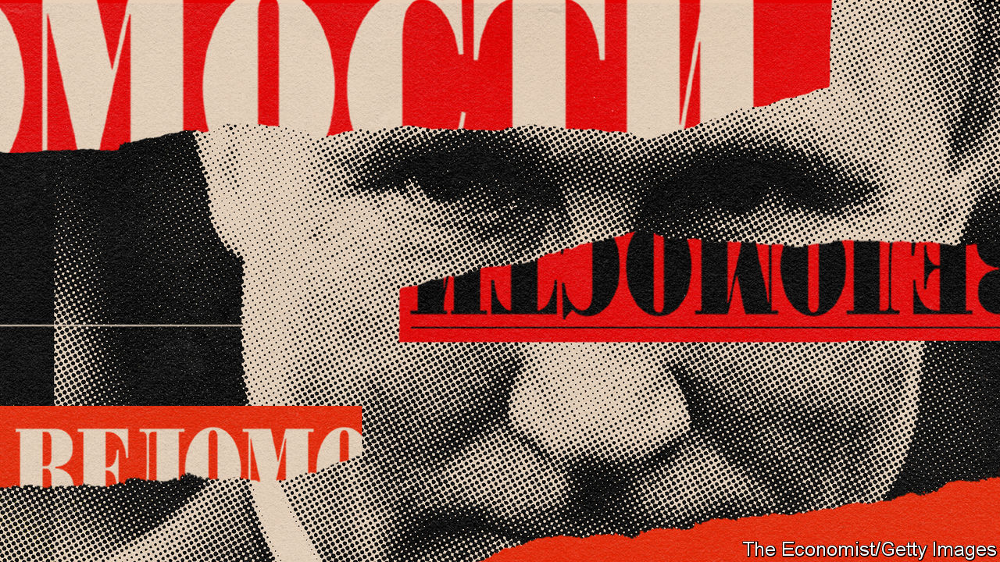

## Stop the press

# Russia’s leading business paper is being gagged

> Vedomosti wasn’t very political, but it was independent

> May 7th 2020

THEY ARRIVED together. The first issue of Vedomosti, Russia’s leading business newspaper, appeared in September 1999, a month after Vladimir Putin was appointed prime minister and anointed as future president. It was half pink and half white, a tribute to its foreign co-founders and shareholders: the Financial Times and the Wall Street Journal.

The timing of the new venture was brave. Russia was reeling from its financial crisis of 1998 and heading into a brutal war in Chechnya. But the economy started to grow, private businesses sprang up and Vedomosti was there to write about them. Its journalists and editors, most of them in their 20s, embodied the aspiration to integrate with the world and prove that business in Russia need not be the exclusive domain of the mafia and oligarchs.

“Our journalists know…that honest competition and honest success are no rarity in Russian business,” Vedomosti said in its first editorial. It took to the principles of its Anglo-Saxon shareholders with the zeal of the convert. Its code of conduct stated that “A journalist must treat all events, firms and people with equal scepticism. Nobody is entitled to special treatment—least of all the shareholders, advertisers and the so-called oligarchs.”

Over the past two decades, the paper has largely stayed true to its code, protected first by its foreign owners and later by its own reputation. But in the past few weeks a revolt by its staff has begun against the new acting editor, Andrei Shmarov, an old-style journalist from the 1990s, who was imposed on the paper by its prospective buyers as part of a murky and yet to be completed takeover. The staff, and many observers, believe that their paper is being distorted to suit the interests of the Kremlin and Rosneft, the state-controlled oil giant.

Vedomosti journalists have warned in the columns of their organ that it could become a controlled outlet, serving the interests of officials and its secret owners. Mr Shmarov began by changing a headline on an already-published story about Rosneft, and removed from its website a column by a prominent economist that scolded Igor Sechin, Rosneft’s boss and one of the most powerful men in Mr Putin’s entourage. A few days later, Mr Shmarov banned his writers from mentioning Levada, Russia’s most reputable pollster, whose latest findings show Mr Putin’s approval rating at 59%, its lowest level since 1999.

Paradoxically, investigative journalism and critical analysis have been thriving in Russia, mostly online. But as Maxim Trudolyubov, a Vedomosti columnist and editor-at-large, argues, what is going on at his paper is an attack on an institution that embodied the values of fair, rules-based market competition and transparency.

Vedomosti was critical, but never an opposition newspaper. It shunned activism because it believed business had to be separate from politics, just as opinion and reporting were on its pages. Vedomosti readers, including most of Russia’s business and political elite, subscribed to the initial contract of Mr Putin’s presidency, where people were free to make and spend money as long as they stayed out of politics.

That deal started to unravel after mass urban protests in 2011-2012. In 2013 Vedomosti splashed with a letter from 35 businessmen who openly supported Alexei Navalny, the leader of the protests, as he ran to be mayor of Moscow. As Tatyana Lysova, its former editor, recalls, this infuriated the Kremlin and solidified its mistrust of private business and the non-state media.

But attacking Vedomosti too openly risked conflict with two of the world’s most influential business newspapers, something that the Kremlin was still wary of in 2013. A year later, following the annexation of Crimea, that inhibition was gone. The Kremlin passed a law barring foreign control of Russian media, and forced the FT and Dow Jones (the Wall Street Journal’s parent company) to sell their stakes. The paper’s new Russian proprietors kept the paper afloat for a few more years, but this year quickly caved in when the Kremlin piled on the pressure, and decided to sell.

The timing of the current attempts to bring the paper to heel is not so much a sign of Vedomosti’s outspokenness (it recently attracted Mr Navalny’s ire for being too conformist), but of the Kremlin’s intolerance of any criticism. Mr Putin great fear is that a consensus may start to emerge among Russia’s political and economic elite that it is time for him to go. The front page of an elite newspaper could provide encouragement for such a consensus—but not if Mr Putin’s friends can censor it.

So just as the birth of Vedomosti coincided with Mr Putin’s arrival, its current afflictions coincide with his refusal to leave. But the journalists’ revolt demonstrates that Vedomosti has bred a generation of writers, and readers, who see Mr Putin as an anachronism and will not quietly accept his experiments in absolutism. ■

## URL

https://www.economist.com/europe/2020/05/07/russias-leading-business-paper-is-being-gagged
