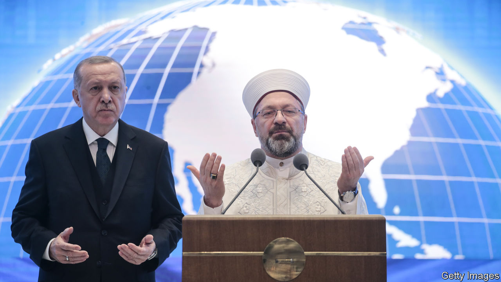

## Istanbully

# Turkey investigates those who object to homophobia

> For Islamophobia, of course

> May 9th 2020ISTANBUL

STUCK AT HOME during Ramadan because of covid-19, Turks at least have something new to argue about. In a sermon marking the start of the holy month on April 24th, Ali Erbas, the country’s top religious official, proclaimed that Islam condemned homosexuality “because it brought illnesses and generational decay”.

After human-rights groups, some opposition politicians and the Ankara Bar Association accused Mr Erbas of inciting hatred, Turkey’s President Recep Tayyip Erdogan and his supporters rushed to the cleric’s defence. One of his flacks said Mr Erbas could not be faulted for voicing “divine judgment”. Another accused his critics of Islamophobia. “An attack against the head of the Diyanet is an attack on the state,” Mr Erdogan himself warned, referring to the institution Mr Erbas has headed since 2017. “What he said was completely true.” The same day, state prosecutors launched an investigation—against the Ankara Bar.

Scripturally speaking, Mr Erbas had a point. The Koran takes a dim view of homosexuals (not to mention atheists, drinkers and women who disobey their husbands). But though homosexuality is outlawed in most other Muslim countries and punished by death in a few, it is not a crime in constitutionally secular Turkey. The Diyanet, which runs the country’s 90,000 mosques, provides religious guidance, but has no power to impose its prescriptions.

LGBT groups have never had it easy in Turkey, though prejudice seems to be on the wane. As recently as 2012, a whopping 85% of Turks said they did not want to have a gay neighbour. In a new poll, that had fallen to 47%. But while public attitudes have softened, official ones have hardened.

Only a decade ago, when it still enjoyed good relations with Europe, Mr Erdogan’s government signed a convention banning discrimination on the basis of sexual orientation or gender identity. Tens of thousands marched in the Pride Parade on Istanbul’s main street under police escort. Today, very little of that spirit remains. The pride march has been banned; rubber bullets and tear-gas await those who turn up. The Diyanet, set up nearly a century ago to reconcile Islamic teachings with secular values, has turned into the voice of political Islam and an arm of the government. Nuanced interpretations of the Koran have given way to a more restrictive approach. Gay celebrities are still feted, even in government circles, but only as long as they do not discuss their sexuality in public.

Mr Erdogan’s attempts to raise what he calls “a pious generation” have not had the desired impact, however. Studies show young people are turning away from religion. That may be why the ruling Justice and Development (AK) party and the Diyanet have decided to double down. “They’re increasingly insecure politically and culturally and they don’t want to give an inch to those who take other interpretations of Islam,” says Omer Taspinar of the Brookings Institution, a think-tank. “Now there’s a spirit of defensive jihad against moral laxity and relativism.”

In the row over Mr Erbas, Mr Erdogan and his surrogates are suggesting that there is only one immutable Islam, which should not accommodate changing norms. Turkey’s history suggests that is not true. But anyone who still thinks moderate Islam and AK belong in the same sentence might want to take note. ■