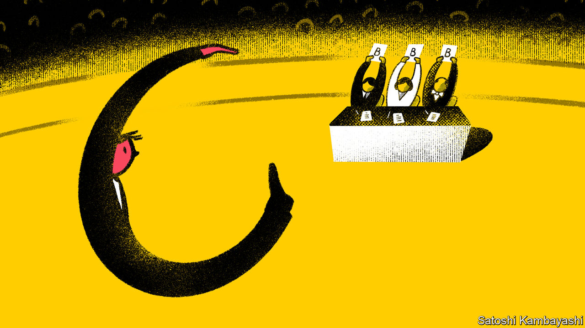
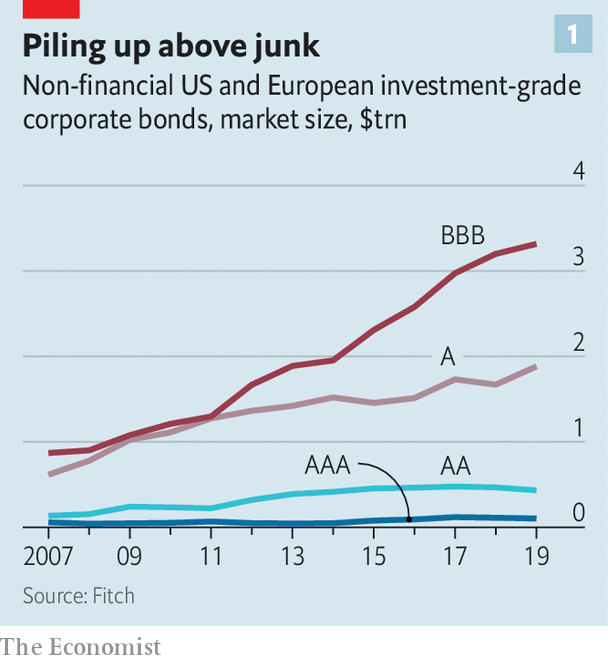
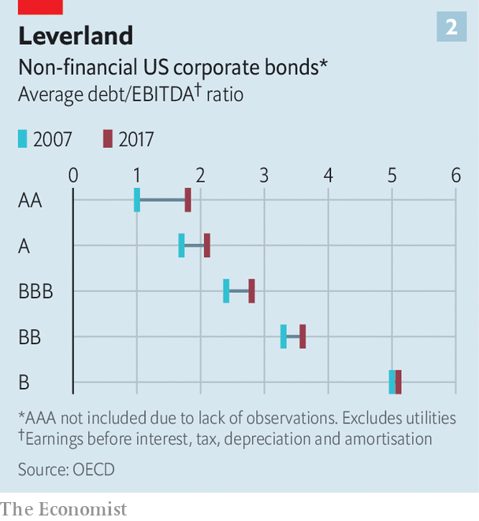
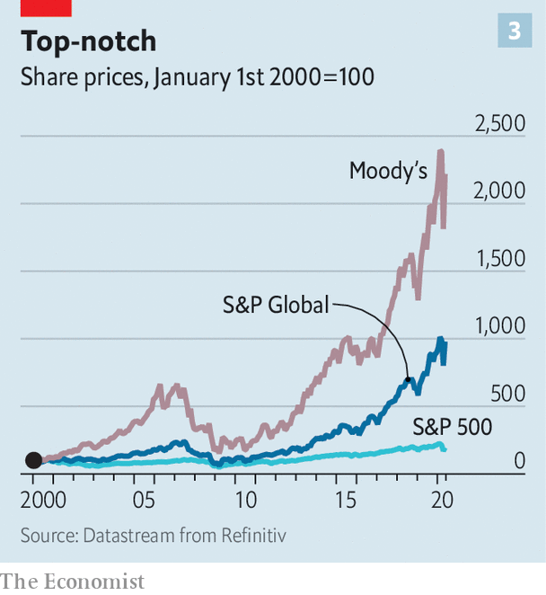

## Markers marked

# Credit-rating agencies are back under the spotlight

> This time is different from the financial crisis—sort of

> May 7th 2020

IN TIMES OF financial plenty credit ratings go largely unnoticed. In downturns, though, they attract more scrutiny—and are often found wanting. The dotcom crash of 2000-01 exposed ratings of some erstwhile corporate stars, including Enron, as nonsense. Worse was to come in the financial crisis of 2007-09, which the three big rating agencies—Moody’s, S&P and Fitch—helped cause by trading reputation for profit and giving implausibly high marks to securitised mortgages. An official report on the crisis branded the agencies “essential cogs in the wheel of financial destruction”.

It is, then, no surprise that the ratings oligopoly faces another potential backlash, now that an even bigger pile of debt threatens to go sour, thanks to covid-19. Eyebrows have been raised as the agencies have rushed to mark down bonds and loans of all types. The pace of downgrading in March was the fastest recorded. As of May 5th, S&P had downgraded or put on negative watch a fifth of the corporate and sovereign issuers that it rates, in response to the virus and a tumbling oil price—and over three-fifths in the worst-hit industries, such as cars and entertainment. This burst of activity is stoking a familiar suspicion: that the rating firms let their standards slip in the go-go years, only to scramble belatedly to make amends once markets turned.

The accuracy of ratings matters, because the licensed firms that issue them wield great power over capital markets. A downgrade can cause a company’s funding costs to rocket, or a run on a bank. It can also force a corporate or sovereign borrower out of an index, draining the pool of investors willing or permitted to lend to it.

Far from having their wings clipped after messing up prior to 2007, the rating agencies cashed in on the past decade’s debt bonanza (see chart 1). At the end of 2019 global corporate-bond debt was $13.5trn, double the level of 2008 in real terms. With central banks using ratings to sift potential fodder for their asset-buying programmes, these grades have become even more crucial determinants of who can hold what.

The agencies argue that their ratings hold up well when viewed “through the cycle”, rather than over short periods of time. They also point to changes, imposed on them after the financial crisis, that have strengthened the walls between their analysts and sales teams. Ratings are paid for by the issuer; in the run-up to the financial crisis it was largely the fear that big clients, often banks, would take their business elsewhere that led the agencies to award overly generous marks to toxic loan pools.

It is also true that much of the lower-quality debt raised in recent years has received poor marks from the start. At the end of 2019 almost two-thirds of American leveraged loans rated by S&P were single-B (the mid-band of high-yield, or “junk”) or lower; at the end of 2007 just over a third were. The rating firms point to a plethora of reports they issued as debt built up, warning that things could get messy when sentiment soured. And for years they have highlighted the evisceration of “covenants”, or legal protections for creditors in the event that a borrower’s finances spin out of control.

James Grant, editor of Grant’s Interest Rate Observer, a newsletter, and a longstanding watcher of credit markets, is no great fan of the rating agencies, which he has described as “not customarily the market’s thought leaders”. Even so, in a recent note he acknowledges that they “noticed termites in the house of credit” well before the pandemic. Central banks deserve more of the blame this time, he reckons, for “corrupting” credit with price-distorting ultra-loose monetary policy.

There is, though, still plenty for critics to chew on. A study in 2013 found an inverse relationship between ratings quality and the state of markets: agencies are more likely to issue less-accurate ratings when fee income is high, hiring top-quality analysts is pricier and default probabilities low. In 2019 a Wall Street Journal investigation found that the six largest agencies had in the previous seven years all made changes to ratings criteria that led, at least briefly, to a rise in market share—particularly in the securitised-loan market.

Two more recent studies have found evidence of post-financial-crisis ratings inflation. A report by the OECD in February found that agencies gave borrowers more leeway on leverage, relative to earnings, in 2017 than a decade earlier (see chart 2). The agencies say that factors such as lower interest rates and increased corporate diversification, rather than sloppy ratings, explain the gap. “There’s no doubt some companies are over-levered for their rating,” says Colin Reedie of Legal & General Investment Management. “We’ve seen it before at the same stage of the cycle, when [rating agencies] give managements too much benefit of the doubt on promises to get back on an even keel.”

In a working paper, Edward Altman of New York University finds what he calls “an over-rating problem” just above junk. Based on analysis of a batch of metrics including leverage, liquidity and sales, he concludes that over one-third of corporate debt that was on the bottom investment-grade rung going into the pandemic should have been at least one grade lower. In other words, it was junk in all but name.

This bears on the most pressing question facing rating agencies today: what to do about the more than $3trn of corporate debt rated triple-B, on the precipice above junk. In 2010, 45% of all investment-grade debt was in this bottom tier; now it is just shy of 60%.

The OECD study found that downgrades from triple-B to junk are rarer than those elsewhere on the ratings spectrum, suggesting that agencies may be reluctant to force borrowers across that Rubicon. An alternative explanation is that firms make particularly strenuous efforts to avoid such a demotion, to so-called “fallen angel” status, aware that it can mean a sudden spike in borrowing costs.

In March and April, some $193bn of triple-B bonds fell to earth. Rating firms’ credibility rests on dealing rigorously with the rest in that band if there is no quick recovery. But that requires clear information, and fog abounds: 114 firms in the S&P 500 index have suspended earnings guidance.

Another test will be their handling of collateralised loan obligations (CLOs), packages of loans to junk-rated firms. The CLO market has more than doubled since 2010 to $600bn. Analysts at UBS, a bank, foresee default rates of up to 22%, with as much as half of the loan pools slipping to triple-C, the lowest tier. The big risk for rating agencies is the top, triple-A, band. Were that to suffer losses—as happened to mortgage securities known as CDOs in 2008—their reputation would take a hammering.

A third challenge will be to get sovereign ratings right as public finances come under heavy strain. What, for instance, to make of America’s Treasury borrowing a record $3trn this quarter? And what would justify cutting Italy’s rating to junk? (Moody’s and Fitch have it one notch above; S&P, two.) That would send the country’s bonds out of key indices, forcing many investors to sell them. A decade ago the rating agencies were accused of accelerating the euro-zone sovereign-debt crisis by downgrading some of the bloc’s big economies, including France.

How the agencies handle these tests will determine whether the crisis brings more calls for root-and-branch reform of the ratings market. The financial crisis produced just such a clamour, but regulators merely tinkered. The issuer-pays model has proved resilient, despite the potential for conflicts of interest, because the alternatives are flawed, too. Were investors to pay for ratings, for instance, access to them would be restricted to those who could afford to subscribe instead of being available to all, as they are now.

A more fertile area for reform concerns over-reliance on ratings. They are hard-wired into all manner of regulations and investment mandates, often in a mechanistic way that discourages investors from doing their own homework. They help determine everything from banks’ capital requirements to what mutual funds are allowed to buy. Here too, though, change has proved elusive. A study in 2018 found that references to ratings in American bond funds’ investment mandates had actually increased since 2010.

As for competition, several upstarts are hustling for business. Kroll Bond Rating Agency, founded in 2010, chalked up $140m in revenue last year. But Moody’s, S&P and the smaller Fitch still have a combined global market share of almost 95%.

The reluctance of many bond issuers to stray from the big rating firms has helped put “moats” around them and allowed them to raise prices by 3-4% a year, says Craig Huber of Huber Research Partners. Moody’s and S&P have operating margins of an eye-watering 50%. Both stocks have been a shrewd long-term investment, propelled by both the ratings boom and a broader push into data analytics (see chart 3); their combined market capitalisation is $117bn. One happy long-term shareholder is Warren Buffett, whose Berkshire Hathaway owns 13% of Moody’s.

Even the coronavirus may fail to knock them far off course. Moody’s and S&P both posted record first-quarter revenue—$1.3bn and $1.8bn respectively—in part thanks to a fresh burst of bond issuance as companies dashed for cash. Their latest guidance, issued in late April, foresees earnings for 2020 around, or possibly exceeding, last year’s record haul. A triple-A from shareholders seems likely, then, if not from almost everyone else.■