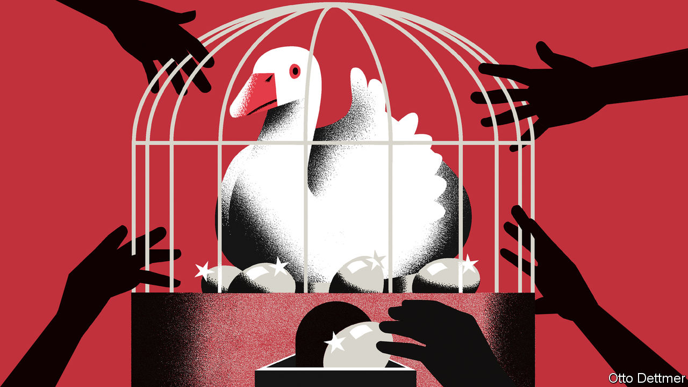

## Free exchange

# Losses by central banks are nothing to fear

> They do not reflect financial doom. But they expose the fragility of independence

> May 7th 2020

IF MONEY-LOSING banks are a source of concern, then surely losses by central banks—the bankers for banks—must be especially disconcerting. The tumbling value of assets held by the Bank of Japan and the Swiss National Bank seems a sure sign that central bankers have behaved recklessly and put their economies at risk. Anxiety about bond-buying in Germany, where on May 5th the constitutional court suggested that it might block the Bundesbank from participating in the European Central Bank’s asset-purchase programmes (see [article](https://www.economist.com//europe/2020/05/07/germanys-highest-court-takes-issue-with-the-european-central-bank)), partly reflects such concerns. Central banks are not like private banks, though. Rather than reflecting financial weakness, their losses are a reminder of their odd institutional position.

How does a central bank incur a loss? Like private banks, they have balance-sheets. These consist of assets—such as government bonds—and liabilities, which include the interest-bearing reserve balances of private financial institutions, analogous to current accounts at high-street banks. A central bank makes a loss if the income it earns on its assets falls below the interest it pays out on its liabilities. A decline in the value of its assets can also place it in a hole, and in need of funds to repair its balance-sheet. (Profits tend to be distributed to the government; in 2019, for instance, the Federal Reserve’s net income of $55bn flowed into public coffers.)

The scope for losses has grown considerably. As the global financial crisis took hold in 2007, many central banks cut their main policy rates to zero in order to revive collapsing economies. To inject further stimulus, most then turned to quantitative easing (QE): using newly created money to buy riskier assets like long-term government bonds, mortgage-backed securities and, in some cases, equities. Asset purchases in response to the covid-19 pandemic mean that balance-sheets have ballooned further. Since late February, for instance, the Fed’s assets have swollen by about 60%. Both central-bank action and a broader appetite for relatively safe assets have inflated government-bond prices across the rich world. If bond prices fall as economies heal, for instance, then central banks might make a loss when they come to shrink their balance-sheets by selling bonds. New forms of emergency lending increase the outright credit risk to which central banks are exposed as well. The ECB is hoovering up large quantities of public- and private-sector bonds. The Fed is gobbling up corporate bonds, municipal paper and bank loans to firms of all sizes. A recently enacted economic-rescue bill in America protects it against losses of up to $454bn. Indeed, losses have already materialised elsewhere. The Bank of Japan suffered a large hit to its ¥30trn ($270bn) portfolio of equity funds when stocks plunged earlier in the year. The large holdings of foreign exchange and equity accumulated by the Swiss National Bank, as part of its efforts to limit appreciation of the Swiss franc, have likewise slumped in value.

Losses at central banks, though, are very different from those at private ones. A commercial bank that is in the red might lose the confidence of its creditors, including its depositors, which could place it at risk of bankruptcy. Central-bank depositors, by contrast, have nowhere to go: they have little choice but to park their reserves with central banks. Nor, in most cases, can central banks run out of cash to pay what they owe, since they are able to create new money at will. (There are exceptions: in Lebanon, the central bank has accumulated large foreign-currency liabilities that cannot be met through the operation of the printing press.)

Generally speaking, central banks cannot go bust, and economists largely agree that negative net worth is no impediment to setting monetary policy. In practice, however, a central bank with negative capital would invite much scrutiny. A central bank is ultimately part of the government, and in some respects its liabilities resemble government debt. Paying the bills by printing money is not a good look—especially as newly created reserves themselves incur interest. A solvent central bank could be necessary for the monetary and fiscal regime to look credible. If so, taxpayers must eventually cover the central bank’s losses by, in effect, allowing it to extinguish some of the government’s reserves, undoing some of the expansionary effect of QE on the money supply. Britain’s Treasury has already promised to compensate the Bank of England for any losses that result from today’s bond-buying.

Losses therefore expose the fragility of central-bank independence. After the inflationary years of the 1970s and 1980s, economists began to view central banks’ freedom from political influence as crucial—it allowed them to establish their credibility with the public and so to hit their policy goals. But monetary policies bleed into fiscal ones when the government’s interest bills are determined by how much bond-buying takes place. Were recapitalisation seen as necessary, the central bank would be at the mercy of politicians. Central bankers appear to take this political risk seriously. Research by Igor Goncharov and Vasso Ioannidou of Lancaster University and Martin Schmalz, now of the University of Oxford, suggests that central banks are more likely to report small profits than small losses. This tendency increases when central bankers are better able to control their reported income, and when they face greater political scrutiny (because, say, they can be reappointed to their positions). Central banks face a dilemma: make policy independently and invite government interference, or pre-empt political meddling by minimising losses.

Perhaps the solution is to acknowledge that central banks now work more closely with governments. Years of financial tumult and falling interest rates have forced them to do more, and to co-operate with fiscal authorities. Rather than fret that losses erode their independence and enable reckless fiscal policy, it may be time to recognise that governments have a role to play in stabilising the economy too—and to demand that they do it properly. ■