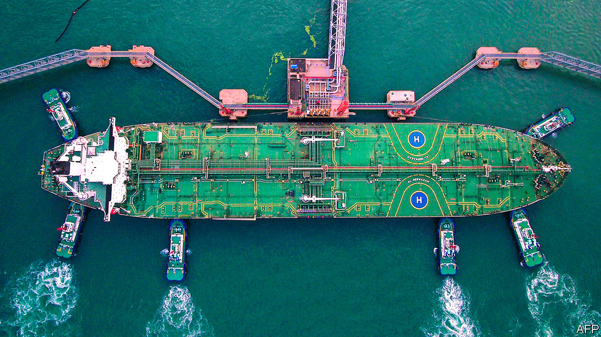

## Custom of the country

# With oil prices depressed, China presides over a buyer’s market

> Oil and gas suppliers are toiling to secure Chinese demand

> May 7th 2020NEW YORK

WHEN OIL supply threatened to overwhelm storage tanks in Cushing, Oklahoma, in April, the pain was felt as far as Chongqing. Retail investors in the Bank of China’s oil bao, or “treasure”, a speculative vehicle linked to crude futures, took a hit as the May contract for West Texas Intermediate settled at an astonishing -$37.63 a barrel on April 20th. The market’s gyrations have led to consternation in China—regulators have reportedly called for an investigation—and revealed unexpected victims. In general, though, plunging prices have served Chinese buyers rather well.

In 2017 China became the world’s biggest importer of crude, surpassing America, and the second-largest importer of liquefied natural gas (LNG), behind Japan. Dependence on foreign fuels has long been deemed a strategic vulnerability. But now oil and gas suppliers are toiling to secure Chinese buyers, not the other way round.

China’s heft was set to grow even before covid-19 kept cars parked and planes grounded. In the long term the growth of China’s population and economy make it a likely source of rising demand, even if climate change clouds prospects for oil and gas elsewhere. Companies and petrostates have worked to secure their share of China’s market: Russia’s Power of Siberia gas pipeline opened in December; ExxonMobil’s efforts include a 20-year deal to supply LNG to Zhejiang Provincial Energy Group.

As the pandemic obliterates energy demand, China is revelling in a buyer’s market. It has not been shy about squeezing suppliers. In March Kazakhstan’s energy minister said the country had reduced gas exports to China by 20-25%, at China’s request. China National Offshore Oil Corp reportedly invoked force majeure to halt LNG shipments from BP, Royal Dutch Shell and Total, three European supermajors.

Chinese buyers have also been opportunistic. Although car, freight and plane travel dropped in the first quarter, crude imports rose by 5%. Neil Beveridge of Bernstein, a research firm, estimates that about 200m barrels of oil went into storage in China in the first three months of the year, as the government, refiners and other buyers stocked up on inexpensive oil. Refineries lifted run rates in March, benefiting from the gap between cheap imported crude and the state-mandated domestic-price floor of $40 a barrel, which in turn ensured a higher margin for refined products.

Oil suppliers continue to look to China, which has eased its lockdown before other markets. “China is leading demand at the moment, so everyone is trying to sell into that market,” says Ben Luckock of Trafigura, a trading group. Even as covid-19 depressed global energy demand, seaborne oil exports to China in April reached a record level, according to Kpler, a market-data firm, and were 25% higher than last year’s average. On May 1st independent refineries, known as “teapots”, were processing more crude oil than in December. In April the Shanghai International Energy Exchange approved new storage capacity for Sinopec and PetroChina, national energy giants.

It is unclear if China will remain a bright spot. Despite analysts’ best efforts—by, say, using satellite images to track outlines on storage tanks—no one knows precisely when China’s oil stocks may near its capacity to store it, says Mr Beveridge. The International Energy Agency expects Chinese demand to be tepid in the second half of the year, as the global economy remains weak. “Crude imports are going to have to slow down a bit to run down some of the stocks,” argues Chris Midgley of S&P Platts Analytics, a price-reporting firm.

Meanwhile competition to sell to China continues. Saudi Arabia posted steep discounts for crude heading to Asia in May; rivals are nervously awaiting Saudi prices posted for June. Complicating the outlook for gas exporters to China, the government is keen to support domestic gas and the cost of Chinese wells has dropped. The American Petroleum Institute (API), a lobby group, is urging officials to lean on China to import more American oil and gas, as agreed in a recent trade deal. “China has a growing demand for energy,” says Frank Macchiarola of the API, “and we have a growing need for markets.” Join the club. ■

## URL

https://www.economist.com/finance-and-economics/2020/05/07/with-oil-prices-depressed-china-presides-over-a-buyers-market
