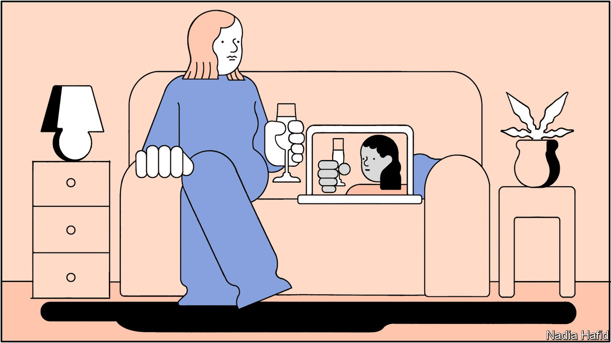

## Fever when you hold me tight

# Casual sex is out, companionship is in

> Lockdowns are forcing singletons to embrace emotional intimacy

> May 9th 2020

Editor’s note: The Economist is making some of its most important coverage of the covid-19 pandemic freely available to readers of The Economist Today, our daily newsletter. To receive it, register [here](https://www.economist.com//newslettersignup). For our coronavirus tracker and more coverage, see our [hub](https://www.economist.com//coronavirus)

ON A SMARTPHONE screen Rob (not his real name) looked good. Twenty-four years old, classically handsome, with a job on Wall Street, he was an attractive prospect on dating apps. Shepherding women from bar to bedroom was easy. Sex was on tap. Then in March covid-19 struck New York City and shut off the mains.

It is a frustrating time to be single. Social distancing makes meeting in the flesh hard. Some people are still trying. In socially conservative Bangladesh, where cohabitation is rare, couples rushed to get married before lockdown started. In Italy lovers rendezvous in supermarket queues.

But many more are looking for love on the internet. Some people are trying to recreate old formats online. In Lagos professionals host virtual games nights for the unattached. In China people dance the night away at “internet discos”, before peeling off into message boards to chat privately. But others are embracing a new set-up: the virtual date. And the solitude of lockdown is making them reconsider what they want from romantic relationships.

Nearly 240m people use dating apps and websites. Even before the pandemic American couples were more likely to meet each other through online-dating services than through personal contacts, according to a study published in 2019 by sociologists from Stanford University and the University of New Mexico. Such apps are increasingly popular in poor countries, too, especially where dating is frowned upon. In Bangladesh and Egypt singletons have flocked to apps such as Tinder.

Dating apps are designed to push users off their phones and into bars, a less-than-ideal model in the middle of a pandemic. But user numbers for the five most popular online dating services have held steady this year, according to App Annie, a market-research firm. And would-be Romeos and Juliets are using them more intensely than they were before covid-19 struck. In April the average number of messages sent daily across Match products, including OkCupid, PlentyOfFish, Tinder, Hinge and Match.com, was up by 27% compared with the last week of February. During the worst week of China’s epidemic, in late February, the average user of TanTan, a Chinese app, spent 30% longer on the app than normal.

Before the pandemic, online daters complained about the fickleness of their peers. Many failed to initiate conversations with those they were matched with; if they did, the other party soon disappeared, according to Dawoon Kang of Coffee Meets Bagel, an app. The ease with which users could make connections encouraged them to treat matches as if they were “replaceable”, argues Rachel DeAlto, a relationships expert from Match, one of the first dating websites. This stoked frustration; last October 45% of American users told Pew that online dating was a vexing experience.

But covid-19 has rendered users less flighty. Between late February and late March, the average length of a conversation on Tinder, one of the most popular apps, surged by 25%. “People are taking the time to get to know each other more,” says Ms Kang, who has seen a similar shift on Coffee Meets Bagel. In Bangladesh the daily video calls Shenaz has with her boyfriend, whom she met on Tinder five months ago, last for hours. She was worried they would drift apart during lockdown, but knowing that she cannot meet someone new “has made me commit to this relationship” more than she did before. (She is luckier than some. Saeda Bani of BRAC, a Bangladeshi NGO, says men from poor families are commandeering the mobile phones of female relatives, younger ones in particular, to stop them from spending money on phone credit or talking to strange men.)

The pandemic has also made singletons more willing to show their faces. Before it, they rarely turned on the webcam. Video-conferencing was “a business thing”, says Mike, a 28-year-old Bumble user from Perth; using it for dating seemed creepy. Just 6% of American singles said they were likely to have used video to meet people before the pandemic, according to a poll of Match users conducted in mid-April.

But Zoom chats with friends and family have become routine in the age of covid-19. Some 70% of American singles surveyed by Match said they would now use video. Bumble, which introduced video chat last July, reported an 84% increase in the number of video calls between the third and fourth weeks of March. Hinge, the League and Match added video last month. Facebook Dating and Tinder plan to do so, too.

And people are surprisingly willing to bare their souls on video dates. At home there are fewer distractions to nudge along a dull conversation than there would be at a restaurant enlivened by a bickering couple. Mike realised that the only way to avoid the dreaded “awkward pause” during his virtual dates was to “really listen, really react and go deep into what we’re talking about.” The result is that “you end up really investing in each other.” And such dates weed out those unable to make conversation, points out Abigail Arunga, a journalist in Nairobi.

These shifts reveal a desire for companionship, argues Ms DeAlto. They also highlight the unease felt by some with the rush of romance pre-covid. Merav Gur, a psychologist in Manhattan, says that before the pandemic her millennial patients felt pressure to have casual sex. The more anxious shunned dating altogether. More confident millennials like Rob, the banker, threw themselves headlong into hook-up culture but it left them dissatisfied.

Isolation has improved their emotional lives, says Dr Gur. Those who felt hurt by the casualness of dating apps say the people they are meeting now are kinder and more responsive than before the pandemic. App users surveyed in March by the Kinsey Institute at the University of Indiana “were more likely to say that they found other users to be friendlier than usual, more willing to have video chats, and more willing to have deep conversations” than before the pandemic, says Justin Lehmiller, one of the study’s authors.

Where lockdowns lift, the old ways are returning. In Beijing, which is slowly reopening, parks are filling up with strolling couples and restaurants are busy serving tables for two. In Iran, which has allowed cars back on the streets, a teacher says that he has registered as a driver on one of the country’s ride-hailing apps, hoping to meet women. But Ms DeAlto predicts that until people need no longer worry about covid-19, most singletons will be wary of close contact with potential mates. Almost all OkCupid users, polled since March, say they plan to continue using video. The virtual date may outlast the pandemic. ■

Dig deeper:For our latest coverage of the covid-19 pandemic, register for The Economist Today, our daily [newsletter](https://www.economist.com//newslettersignup), or visit our [coronavirus tracker and story hub](https://www.economist.com//coronavirus)

## URL

https://www.economist.com/international/2020/05/09/casual-sex-is-out-companionship-is-in
