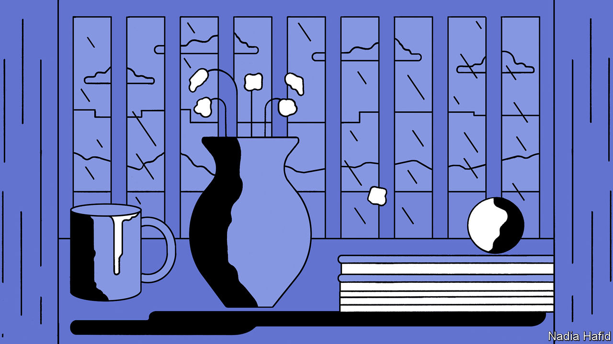

## No safe haven

# The pandemic may be making domestic abuse worse

> It is also forcing people to find new ways to curb it

> May 9th 2020

Editor’s note: The Economist is making some of its most important coverage of the covid-19 pandemic freely available to readers of The Economist Today, our daily newsletter. To receive it, register [here](https://www.economist.com//newslettersignup). For our coronavirus tracker and more coverage, see our [hub](https://www.economist.com//coronavirus)

EVEN BEFORE covid-19 began to spread, domestic abusers often tried to isolate their victims so as to exert physical and psychological control over them. Lockdowns have magnified their ability to do that. Those at risk—be they partners, children or parents—can no longer escape, even briefly, to school or work. To help them, policymakers, social workers and campaigners are having to innovate.

The pandemic has probably made domestic violence worse, but proving it is hard. Some rich countries are reporting more calls for help, says Claudia Garcia-Moreno, who leads the World Health Organisation’s (WHO) efforts against violence against women. In France reports to police of domestic violence rose by at least 30% in the first week of the lockdown imposed in mid-March. Other places are noting steep declines. Reports of domestic violence in New York City in April dropped by 35% compared with the same month last year. Overall crime, by comparison, fell by 29% over the same period.

Even in normal times domestic violence is underreported. The UN estimates that less than 40% of women who are physically abused at home seek any kind of help. In lockdown victims may be scared to call the police or a helpline if their tormentor can overhear them. Victims may stay in their homes for fear of infection. Those who have lost their jobs may find it even more difficult to leave. The pandemic is making it harder to get help to the vulnerable—social workers fear infection, too.

Domestic-abuse hotlines say that growing numbers of callers refer to covid-19—and the related economic fallout. Katie Ray-Jones, head of America’s national hotline, says the lockdown is prompting some already abusive men to become more so; some of those who were verbally abusive before are becoming physically violent. Others are lying to their victims about lockdown rules, telling them that they are not allowed to leave the house under any circumstances, for instance.

Lockdowns are forcing those who help to be more innovative. Technology has long been useful. Refuge, a British charity, has an online-chat tool that shows survivors how to set up strict privacy features on their mobile phones. Many shelters and hotlines already have a button on their website that takes those looking for help to Google’s home-page and floods their search history with unremarkable sites in case their abuser walks into the room.

Online tools are especially useful now. A Dutch helpline is seeing increased numbers of children asking for advice on community forums and using their online chat tool to talk to experts. And the pandemic is prompting fresh thinking. Courts in New York state have started issuing orders of protection virtually. If the scheme remains in place after the pandemic, it would remove the obstacle of having to go physically to a court to gain legal protection from an abuser. Staff at the Sexual Assault and Violence Intervention Programme at Mount Sinai Hospital in New York are now doing Zoom therapy sessions.

Where internet access is limited and legal protections are weaker technology may be less help. In Latin America mobile-data charges are unaffordable for many, so the WHO is trying to spread information about the help available through adverts on television and radio. Domestic abuse will outlive the pandemic. With luck, so will new tools to combat it. ■

Dig deeper:For our latest coverage of the covid-19 pandemic, register for The Economist Today, our daily [newsletter](https://www.economist.com//newslettersignup), or visit our [coronavirus tracker and story hub](https://www.economist.com//coronavirus)