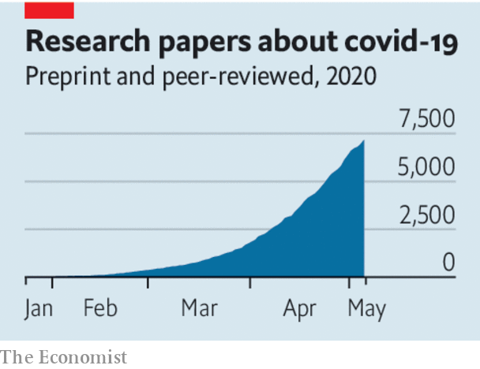

## High-speed science

# Speeding up science during the pandemic

> Things ought not to go back to the way they were before

> May 9th 2020

Editor’s note: The Economist is making some of its most important coverage of the covid-19 pandemic freely available to readers of The Economist Today, our daily newsletter. To receive it, register [here](https://www.economist.com//newslettersignup). For our coronavirus tracker and more coverage, see our [hub](https://www.economist.com//coronavirus)

IT IS A testament to the machinery of science that so much has been learned about covid-19 so rapidly. Since January the number of publications has been doubling every 14 days, reaching 1,363 in the past week alone. They have covered everything from the genetics of the virus that causes the disease to computer models of its spread and the scope for vaccines and treatments.

What explains the speed? Much as in other areas of life, covid-19 has burnt away encrusted traditions. Scientific journals have done their best to assess and publish research in days rather than their customary months or years. But a bigger factor behind the breakneck pace of publication is the willingness of biomedical scientists to bypass journals altogether and share their work quickly in the form of preprints—research manuscripts that are posted freely online and which have not been peer-reviewed.

Preprints are not a new idea. They have been an important method of communication in physical sciences and mathematics for decades. Biologists and medical scientists, however, have long resisted them. Unlike number theory or astrophysics, biologists have argued, their findings often directly affect individuals and companies (see Science [article](https://www.economist.com//science-and-technology/2020/05/07/scientific-research-on-the-coronavirus-is-being-released-in-a-torrent)). Incomplete or unchecked studies could do them harm.

Arguments against preprints sound reasonable. Unless you are an expert in the field, it is hard to know whether a preprinted study is any good. Without peer-review before posting, the risk of shoddy science may well rise. The research contained in freely available preprints could be misinterpreted or abused by those hunting for scientific cover for their actions.

The evidence, however, suggests such worries are overdone. A recent study found that an impressive 67% of the preprints posted on the bioRxiv server before 2017 were eventually picked up and published in scientific journals. A separate study showed that the difference in scientific value, as measured by other researchers, between a preprint and the final version of the same study in a journal was, on average, less than 5%.

Preprints do not avoid peer-review; it just happens after publication (informally and often in public) instead of beforehand (organised by editors and mostly in secret). Manuscripts attract the scrutiny of independent experts, who relish tearing apart bad work. Dissent is easily visible next to the original preprint or just a link away. Authors can update their manuscripts as comments come in or even withdraw them if they conclude they have big flaws. With traditional scientific journals retractions can take months or years, if they happen at all.

In the long run, exposing the messy, argumentative guts of the scientific process could bolster public trust in science itself. Researchers do not follow a straight road to the truth. Rather, they meander, disagree and fumble towards an understanding of the world. In this way all findings are provisional, standing only until later work modifies or overturns them.

Preprints are not perfect. As they grow more common, there may be unpleasant side-effects. If the recent history of other social media is a guide, some people will find ways to game preprint servers and spread disinformation through them. Hosts and users of preprints should prepare for that. To get the most out of them, non-expert users need to step up their scepticism. Policy or journalism based on their contents should identify the source and its limitations.

As the deluge of work on covid-19 has shown, fast, free-flowing scientific information is vital for progress. The virus has changed the way scientists do their work and talk to each other, we hope for good.■

Dig deeper:For our latest coverage of the covid-19 pandemic, register for The Economist Today, our daily [newsletter](https://www.economist.com//newslettersignup), or visit our [coronavirus tracker and story hub](https://www.economist.com//coronavirus)

## URL

https://www.economist.com/leaders/2020/05/09/speeding-up-science-during-the-pandemic
